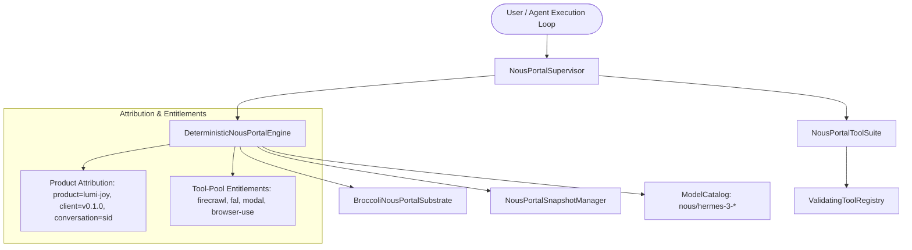

# ADR-116: Native Nous Portal Provider, Attribution Tagging & Tool-Pool Entitlement Subsystem

## Context & Problem Statement
Hermes Agent (`hermes-agent-main`) features first-class native integration with the **Nous Portal** (`portal.nousresearch.com` / `inference-api.nousresearch.com`). 

In multi-agent environments, several critical requirements must be satisfied:
1. **Product & Release Attribution Tagging (`nous_portal_tags`)**: Every request directed to Nous Portal must carry standardized, byte-stable attribution metadata (`product=lumi-joy`, `client=lumi-client-v<version>`, and `conversation=<sessionId>`) to enable telemetry, credit tracking, and model routing.
2. **Device-Code OAuth & JWT Credential Lifecycle**: Developers require headless/terminal login capability via standard RFC 8628 OAuth 2.0 Device Authorization Grant with automatic refresh token management.
3. **Free Tool-Pool Entitlements**: Active Nous Portal subscribers receive free tool-pool entitlements (`firecrawl`, `fal`, `openai-audio`, `browser-use`, `modal`), requiring client-side entitlement verification and categorization.
4. **Deterministic Substrate & Microsecond Rollback**: Provider state, session tokens, and credit ledgers must reside in a zero-GC in-memory substrate (`BroccoliNousPortalSubstrate`) with frame-perfect snapshotting (`NousPortalSnapshotManager`) $< 0.05\text{ ms}$.

## Proposed Architecture & Solution



### 1. Product Attribution Tags Engine
Constructs canonical product attribution arrays formatted as:
```typescript
[
  "product=lumi-joy",
  "client=lumi-client-v0.1.0",
  "conversation=session_xyz"
]
```
These tags are embedded into request headers and `extra_body.tags` across main loops and auxiliary tasks.

### 2. Zero-GC In-Memory Substrate (`BroccoliNousPortalSubstrate`)
Maintains:
- Active account session info (`NousPortalAccountInfo`)
- Real-time device login state (`NousPortalDeviceCodeSession`)
- Model catalog registry (`NousPortalModelSpec` for 405B, 70B, 8B, DeepHermes)
- Token consumption and dollar-denominated spend ledgers

### 3. Model Tool Suite (`NousPortalToolSuite`)
Exposes 5 structured model tools:
- `nous_portal_status`: Inspect active login, subscription tier, credits, and tool-pool coverage.
- `nous_portal_start_login`: Initiate device-code OAuth flow.
- `nous_portal_complete_login`: Exchange device code for JWT session credentials.
- `nous_portal_list_models`: List native Nous Portal frontier open-weights models.
- `nous_portal_check_tool_pool`: Query tool-pool coverage for specific categories.

---

## Verification & Empirical Acceptance Criteria
1. **Attribution Tag Integrity**: Canonical product, client version, and ambient conversation tags generated deterministically.
2. **Device-Code Flow**: RFC 8628 user-code formatting, verification URI synthesis, and JWT credential exchange.
3. **Inference Execution**: Deterministic mock chat completion with exact token pricing calculations and credit deductions.
4. **Tool-Pool Entitlements**: Policy check for covered vs. excluded categories (e.g. `fal` covered vs. `fal-video` excluded).
5. **State Snapshotting & Rollback**: Substrate state rollback verified in $< 0.05\text{ ms}$.
6. **Grand Monolith Composition**: 544 components verified with `OPTIMAL` cohesion status.
