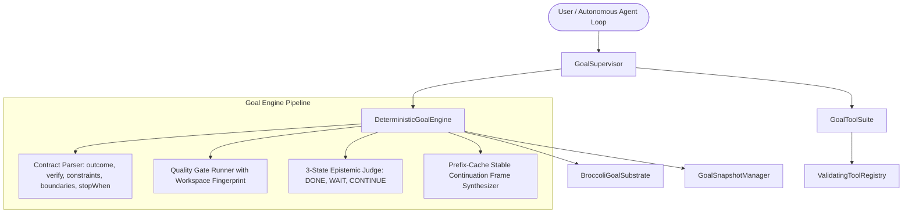

# ADR-117: Persistent Session Goals, Quality Gates & Deterministic Goal Loop

## Context & Problem Statement
Autonomous coding and complex system evolution require multi-turn goal execution where an agent works persistently toward an overarching objective without losing context, violating boundaries, or prematurely halting on transient steps.

In `hermes-agent-main`, this capability is provided via `hermes_cli/goals.py` and `hermes_cli/loops.py` (the Ralph-style Goal Loop). In LUMI-JOY, the goal loop must be transformed to match the **Deterministic Game Engine Architecture** (`tick()`, `GameStateSnapshot`, zero-GC in-memory substrates, microsecond state rewind, and prefix-cache-stable continuation frames).

## Proposed Architecture & Solution

### 1. Structured 5-Field Completion Contract
Users or prompt planners can define goals with explicit structured constraints parsed from natural language:
- **Outcome**: The single end state that must be true when complete.
- **Verification**: The specific checkable test, command, or artifact proving the outcome.
- **Constraints**: Invariants that must not change or regress.
- **Boundaries**: Files, directories, or tools within scope.
- **Stop When**: Explicit stop conditions requiring human escalation.

### 2. Fingerprinted Deterministic Quality Gates
Shell commands that must pass before the goal can be declared done:
- Workspace change fingerprinting (`workspaceFingerprint`) skips re-running identical failing test suites on unchanged workspaces ($< 1\text{ ms}$).
- On gate failure, the bounded tail of the output is fed directly into the next turn's continuation prompt as concrete debugging evidence.

### 3. Epistemic 3-State Judge
- **`DONE`**: Goal is satisfied with verified proof or hits an explicit stop condition.
- **`WAIT`**: Parks loop execution on a running background PID, session watcher, or cooldown timer without burning frame turns.
- **`CONTINUE`**: Work is in progress; generates a byte-stable continuation prompt maintaining prefix cache stability (`ADR-002`/`ADR-083`).

### 4. Zero-GC Memory Substrate & Instant Rollback
Session goals, subgoals, and execution metrics reside in `BroccoliGoalSubstrate` with frame-perfect snapshotting (`GoalSnapshotManager`) $< 0.05\text{ ms}$.

---

## Verification & Empirical Acceptance Criteria
1. **Contract Parsing**: Natural language with `verify:`, `constraints:`, `boundaries:`, `stop when:` parsed into structured `GoalContract`.
2. **Quality Gates**: Pre-judge gate execution, retry limits, and output bounding verified.
3. **Wait Barriers**: Park on background PID / session without advancing turn count.
4. **Continuation Frames**: Byte-stable continuation prompts generated without mutating system prompts.
5. **Microsecond State Rewind**: Substrate rollback verified in $< 0.05\text{ ms}$.
6. **Grand Monolith Composition**: 549 components verified with `OPTIMAL` cohesion status.
