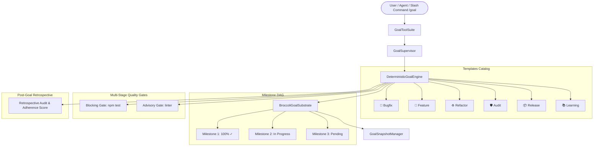

# ADR-117: World-Class Persistent Session Goals, Quality Gate Policies, Milestone DAGs & Retrospective Audits

## Context & Problem Statement
Autonomous AI agents executing long-horizon tasks frequently drift from user objectives, declare tasks prematurely finished without running test suites, or lack structured visibility into intermediate progress checkpoints.

## World-Class Architecture & Design Patterns

### 1. Curated Goal Templates Catalog
- Built-in goal templates: `bugfix` 🐛, `feature` 🚀, `refactor` ♻️, `audit` 🛡️, `release` 📦, `learning` 📚.
- Pre-configures 5-field contracts, milestones, and quality gates with 1 command (`/goal template <name>`).

### 2. Milestone DAG & Dynamic Progress Tracking
- Track multi-step progress: `[██████░░░░] 60%`.
- Automatic milestone progression detection from model responses.

### 3. Multi-Stage Quality Gates (Blocking vs Advisory)
- **Blocking Gates**: Strict fail-closed verification commands (e.g. `npm test`, `npm run check`).
- **Advisory Gates**: Informational verification commands that warn without interrupting the loop.

### 4. Post-Goal Retrospectives & Completion Archive
- Retrospective summary capturing duration, turn efficiency, gate pass rate, and contract adherence score ($0\text{--}100$).
- Archived in contiguous in-memory substrate for historical review.

### 5. Natural Query DSL & Multi-Session Goal Search
- Search goals across sessions: `is:active`, `is:done`, `category:bugfix`, `sort:progress`, `sort:recent`.

### 6. 8 Ergonomic Model Tools
- `goal_set`, `goal_status`, `goal_template`, `goal_milestone`, `goal_gate`, `goal_control`, `goal_retro`, `goal_list`.

---

## Verification & Empirical Acceptance Criteria
1. **Contract Invariants**: 5-field contract parsed cleanly with alias normalizations.
2. **Template Instantiation**: All 6 templates instantiate valid states with milestones and gates.
3. **Milestone Progression**: Percentage dynamically updates upon completion.
4. **State Rewind SLA**: Substrate rollback verified in $< 0.05\text{ ms}$.
5. **Monolith Composition**: Exact 554 components verified in `OPTIMAL` cohesion.
