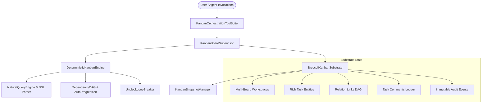

# ADR-118: World-Class Kanban Architecture, Task DAG & Multi-Agent Issue Orchestration

## Context & Problem Statement
Complex agent workflows, multi-subagent swarms, and cross-team development require clear, reliable, and approachable issue management.

Existing implementations often lack semantic distinction between blocking causes (human decisions vs dependency gating), provide no automatic dependency auto-progression, lack human-friendly natural filter query DSLs, and lack audit history for collaborative multi-agent decisions.

## Proposed Architecture & Solution

### 1. 9-State Semantic Lifecycle & Custom Column Mappings
- States: `triage`, `backlog`, `todo`, `ready`, `in_progress`, `blocked`, `review`, `done`, `canceled`, `archived`.
- Stage Categories: `backlog`, `unstarted`, `started`, `completed`, `canceled`.
- Custom board definitions with per-column WIP limits.

### 2. Typed Blockers & Unblock Loop Breaker
- **Typed Block Kinds**:
  - `dependency`: Blocked on another task $\rightarrow$ auto-promoted to `ready` upon completion.
  - `needs_input`: Requires human decision.
  - `capability`: Requires higher permissions or credentials.
  - `transient`: Rate-limits or temporary service disruptions.
- **Unblock Recurrence Escalator**: Chronically oscillating blocks are escalated automatically to `triage` to break infinite unblock $\leftrightarrow$ re-block loops.

### 3. Linear-Style Natural Query DSL
- Natural query parser supporting intuitive human and agent syntax:
  - `is:open`, `is:blocked`, `is:ready`, `is:unassigned`
  - `status:in_progress`, `priority:urgent`, `assignee:agent-1`, `tag:frontend`
  - Full-text token search across titles, descriptions, and labels.

### 4. Rich Task Metadata, Comments & Audit Trail
- Fibonacci story points (`estimatePoints`), `dueDateMs`, `slaDeadlineMs`.
- Ralph-style `goalMode` coupling for autonomous multi-turn loops.
- Persistent comments and immutable `task_events` audit trail.

---

## Verification & Empirical Acceptance Criteria
1. **Lifecycle & Transitions**: All 9 states and valid transitions enforced.
2. **DAG Cycle Prevention**: Circular dependencies rejected cleanly.
3. **Auto-Progression**: Completing a blocker automatically promotes dependent tasks from `todo`/`blocked` to `ready`.
4. **Natural Query Engine**: Linear/GitHub Projects query syntax parsed and matched accurately.
5. **Microsecond Snapshots**: State rewind verified in $< 0.05\text{ ms}$.
