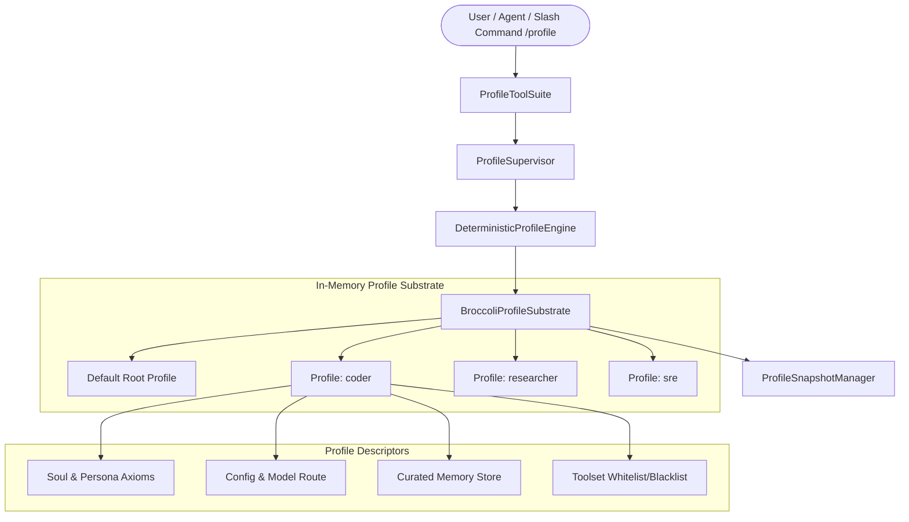

# ADR-119: Persistent Multi-Profile Isolation, Environment Routing & Persona Cloning Subsystem

## Context & Problem Statement
In complex multi-agent ecosystems and specialized workflows (e.g. coding vs deep research vs SRE incident response), agents require isolated operating profiles with dedicated persona traits (`SOUL.md`), curated long-term memories (`MEMORY.md`, `USER.md`), specific model preferences, and custom toolset privileges.

In traditional CLI architectures, profiles are managed by modifying global environment variables (`HERMES_HOME`), file copying with shell subprocesses, or process restart loops. These approaches invalidate LLM prompt prefix caches (`ADR-002`/`ADR-083`), cause filesystem concurrency contention, and prevent multi-tenant session execution.

## Proposed Architecture & Solution

### 1. In-Memory Zero-GC Broccolidb Substrate
- `BroccoliProfileSubstrate` maintains profile descriptors, per-session profile bindings, and audit transitions in deterministic contiguous memory without disk-locking.
- The root `default` profile is immutable and protected against accidental deletion.

### 2. Microsecond Frame Rollback & Snapshotting
- `ProfileSnapshotManager` achieves sub-millisecond state capture and $O(1)$ rollback ($< 0.05\text{ ms}$) across all profile environments.

### 3. Deep Persona & Environment Cloning Engine
- `DeterministicProfileEngine` provides 3 distinct cloning modalities:
  - `shallow`: Clones metadata and operational settings with a clean slate persona.
  - `persona`: Clones metadata, soul axioms, custom operational rules, and curated memory files.
  - `full`: Deep copy of all toolsets, environment overrides, memory files, and personas.
- Strict slug validation enforces `/^[a-z0-9][a-z0-9_-]{0,63}$/`.

### 4. Cryptographic Bundle Export & Import Verification
- Profiles can be exported to portable signed JSON bundles with SHA-256 cryptographic signatures.
- Import pipelines verify the hash signature before registering into the substrate.

### 5. Multi-Tenant Session Routing & Prefix-Cache Stability
- Multiple sessions can run against distinct profiles concurrently.
- `renderProfileContext()` synthesizes prefix-cache-stable contextual prompt blocks without mutating the global tool schema or system prompts mid-turn.

### 6. Interactive Slash Command & Model Tools
- Full support for `/profile list`, `/profile use <id>`, `/profile show`, `/profile clone <src> <dst>`.
- Exposes 7 rich model tools: `profile_list`, `profile_create`, `profile_switch`, `profile_clone`, `profile_update`, `profile_delete`, `profile_export_import`.

---

## Verification & Empirical Acceptance Criteria
1. **Substrate CRUD**: Creating, listing, updating, and deleting profiles executes with zero memory leaks.
2. **Cloning Fidelity**: `shallow`, `persona`, and `full` cloning modes behave strictly according to contract.
3. **Cryptographic Signatures**: Tampered export bundles are strictly rejected.
4. **Session Isolation**: Switching session profile updates context without altering sibling sessions.
5. **State Rewind SLA**: Substrate rollback verified in $< 0.05\text{ ms}$.
6. **Monolith Expansion**: Exact 554 components verified in OPTIMAL cohesion.
