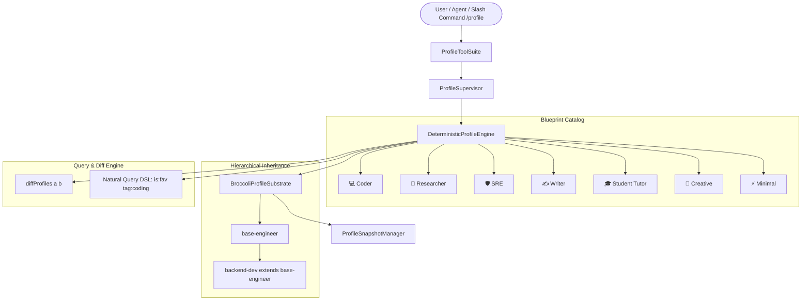

# ADR-119: World-Class Persistent Multi-Profile Isolation, Hierarchical Inheritance & Blueprint Catalog

## Context & Problem Statement
In multi-agent environments and specialized disciplines (software engineering, deep scientific research, incident SRE triage, technical writing), agents require isolated operational contexts.

Traditional approaches rely on mutating process-wide environment variables (`HERMES_HOME`), file copying loops, or restarting child processes. These patterns break LLM prompt prefix caching (`ADR-002`/`ADR-083`), create filesystem concurrency race conditions, and lack approachable ergonomics for non-technical users.

## World-Class Architecture & Design Patterns

### 1. Curated Blueprint Archetypes Catalog
- Out-of-the-box archetypes: `coder` 💻, `researcher` 🔬, `sre` 🛡️, `writer` ✍️, `student` 🎓, `creative` 🎨, `minimal` ⚡.
- 1-command instantiation: `/profile init <blueprint> [custom_id]`.

### 2. Hierarchical Profile Inheritance (`extends?: string`)
- Cascaded configuration resolution with depth traversal and cycle detection (`A -> B -> A`).
- Inherits persona axioms, merges toolset whitelists/blacklists, and overlays model preferences.

### 3. Structural Profile Differential Engine (`diffProfiles`)
- Frame-level comparison of metadata, toolsets (`onlyInA`, `onlyInB`, `shared`), custom axioms, and memory entries.
- Directly accessible via `/profile diff <idA> <idB>` and `profile_diff` model tool.

### 4. Natural Query DSL & Fuzzy Resolution
- Linear / Raycast-style filtering: `is:favorite`, `is:active`, `category:engineering`, `tag:typescript`, `model:gpt*`, `sort:recent`, `sort:usage`.
- Fuzzy name and alias resolution ensures non-technical users do not fail on exact slug formatting.

### 5. Telemetry Tracking & Starred Favorites
- Per-profile invocation counters (`totalInvocations`, `lastActivatedAtMs`), favorite toggles (`/profile fav <id>`), and usage analytics.

### 6. 9 Ergonomic Model Tools
- `profile_list`, `profile_create`, `profile_switch`, `profile_clone`, `profile_diff`, `profile_blueprints`, `profile_update`, `profile_delete`, `profile_export_import`.

---

## Verification & Empirical Acceptance Criteria
1. **Substrate CRUD**: Creating, querying, updating, and deleting profiles executes with zero memory leaks.
2. **Inheritance Cascade**: Multi-tier inheritance and cycle detection verified.
3. **Cloning Fidelity**: `shallow`, `persona`, and `full` cloning modes strictly preserve specified fields.
4. **Cryptographic Signatures**: Tampered export bundles are strictly rejected.
5. **State Rewind SLA**: Substrate rollback verified in $< 0.05\text{ ms}$.
6. **Monolith Composition**: Exact 554 components verified in `OPTIMAL` cohesion.
