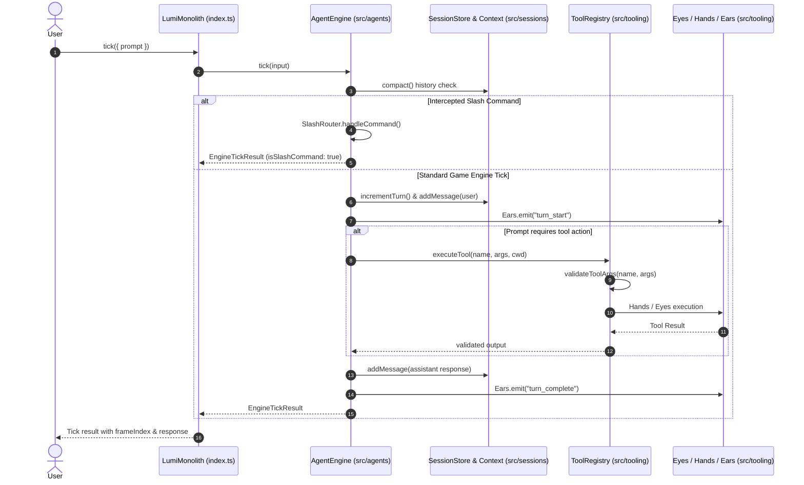

# Design Patterns & Workflows

Comprehensive overview of architectural design patterns and sequence workflows in `/Users/bozoegg/Desktop/LUMI-NEW`.

---

## 1. Deterministic Engine Tick Sequence

The following sequence diagram illustrates how an `EngineTickInput` prompt moves deterministically through the 3-tier architecture:



---

## 2. Key Enterprise Design Patterns

### Dependency Inversion Principle (DIP)
All high-level monolith subsystems depend on contracts and abstract base classes defined in `src/core/contracts/` and `src/core/abstracts/`:

- [IAgentEngine](file:///Users/bozoegg/Desktop/LUMI-NEW/src/core/contracts/agent.contracts.ts#L10) $\rightarrow$ [AbstractAgentEngine](file:///Users/bozoegg/Desktop/LUMI-NEW/src/core/abstracts/abstract-agent-engine.ts#L12)
- [ISessionStore](file:///Users/bozoegg/Desktop/LUMI-NEW/src/core/contracts/session.contracts.ts#L18) $\rightarrow$ [AbstractSessionStore](file:///Users/bozoegg/Desktop/LUMI-NEW/src/core/abstracts/abstract-session-store.ts#L7)
- [IHands](file:///Users/bozoegg/Desktop/LUMI-NEW/src/core/contracts/tooling.contracts.ts#L36), [IEars](file:///Users/bozoegg/Desktop/LUMI-NEW/src/core/contracts/tooling.contracts.ts#L41), [IToolRegistry](file:///Users/bozoegg/Desktop/LUMI-NEW/src/core/contracts/tooling.contracts.ts#L46)

### Template Method Pattern
The engine tick loop enforces an invariant execution sequence with overridable lifecycle hooks:

```typescript
async tick(input: EngineTickInput): Promise<EngineTickResult> {
  await this.preTick(input);            // Hook 1: Pre-tick compaction & validation
  const result = await this.executeTick(input); // Hook 2: Core tick execution
  await this.postTick(result);          // Hook 3: Post-tick telemetry emission
  return result;
}
```

### Immutable Snapshot & Time Travel Rewind Pattern
Captures complete state frames for zero-drift time travel:

```typescript
const snapshot = lumi.createSnapshot(); // Captures messages, VFS buffers, memory facts, metrics
lumi.rewindToSnapshot(snapshot);        // Rewinds frame index and store state frame-perfectly
```

---

## 3. Tool Execution via Sensory Classification

Tools are instantiated under their sensory classification ([Eyes](../../src/tooling/base/eyes.ts), [AnchoredHands](../../src/tooling/extensions/hashline/hands.ts), [ProtocolEars](../../src/tooling/extensions/telemetry/ears.ts)) and registered in [ValidatingToolRegistry](../../src/tooling/extensions/registry/tool-registry.ts):

```typescript
this.registerTool({
  name: "view_file",
  description: "Read contents of a file (Eyes)",
  parameters: {
    path: { type: "string", required: true }
  },
  execute: async (args) => this.eyes.readFile(String(args.path))
});
```

---

## 4. Protocol Telemetry & JSON-RPC Streaming

The `ProtocolEars` subsystem formats telemetry events into standard JSON-RPC 2.0 notifications:

```typescript
lumi.ears.listen("turn_complete", (event) => {
  const jsonRpcNotification = lumi.ears.formatJsonRpcEvent(event);
  console.log(`[JSON-RPC 2.0]`, jsonRpcNotification);
});
```

Protocol telemetry is an integration envelope for remote consumers. It is not the terminal activity model and must not be used as a substitute for provider lifecycle events.

---

## 5. Structured Agent Activity Lifecycle

Live model work follows an identity-based lifecycle instead of rewriting one spinner label:

```mermaid
sequenceDiagram
    autonumber
    actor User
    participant UI as InteractiveModeController
    participant Engine as AgentEngine
    participant SDK as Codex SDK
    participant Adapter as CodexProgressAdapter
    participant Timeline as AgentActivityTimeline

    User->>UI: Submit prompt
    UI->>Engine: tick({ prompt, signal, onProgress })
    Engine->>Adapter: start()
    Engine->>SDK: thread.runStreamed(prompt, { signal })
    SDK-->>Adapter: thread/turn/item events
    Adapter-->>Timeline: EngineProgressEvent
    Timeline->>Timeline: upsert activityId; reject stale sequence
    SDK-->>Engine: turn.completed or failure
    Adapter-->>Timeline: completed/failed/cancelled terminal
    Engine-->>UI: EngineTickResult
```

The reducer pattern is deliberately small:

```ts
function applyProgress(
  activities: Map<string, EngineProgressEvent>,
  event: EngineProgressEvent
): void {
  const current = activities.get(event.activityId);
  if (!current || event.sequence >= current.sequence) {
    activities.set(event.activityId, event);
  }
}
```

The important invariants are:

- Reuse the provider item ID across `started`, `in_progress`, and terminal updates.
- Treat provider completion as authoritative and settle every turn as `completed`, `failed`, or `cancelled`.
- Keep local controls such as `AbortSignal` and callbacks outside serialized remote payloads.
- Show only concise, sanitized activity summaries. Never place credentials, raw command output, tool payloads, complete model responses, or hidden reasoning in progress events.
- Preserve fidelity: Codex SDK turns expose detailed item activity; API-key HTTP routes may expose only coarse request states.

The provider activity stream, individual tool executor progress, and JSON-RPC protocol telemetry are related but separate layers. See the [Agent Activity Streaming Strategy](streaming-activity-strategy.md) and [ADR-082](../adr/ADR-082-structured-agent-activity-streaming.md).
