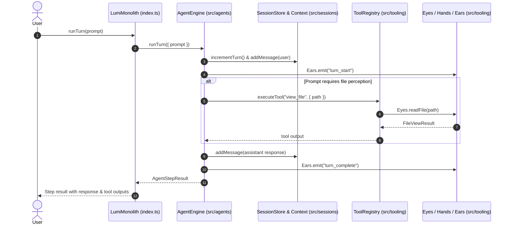

# Design Patterns & Workflows

## 1. Monolithic Tier Interaction Sequence

The following sequence diagram illustrates how a user prompt moves synchronously through the 3-tier architecture:



---

## 2. Tool Execution via Sensory Classification

Tools are instantiated under their sensory classification ([Eyes](file:///Users/bozoegg/Desktop/LUMI-NEW/src/tooling/eyes.ts#L14), [Hands](file:///Users/bozoegg/Desktop/LUMI-NEW/src/tooling/hands.ts#L13), [Ears](file:///Users/bozoegg/Desktop/LUMI-NEW/src/tooling/ears.ts#L12)) and registered in [ToolRegistry](file:///Users/bozoegg/Desktop/LUMI-NEW/src/tooling/tool-registry.ts#L11):

```typescript
this.registerTool({
  name: "view_file",
  description: "Read contents of a file (Eyes)",
  execute: async (args) => this.eyes.readFile(String(args.path))
});
```

---

## 3. Real-Time Telemetry via Ears

The `Ears` subsystem allows decouple observation of agent events without polluting engine state:

```typescript
lumi.ears.listen("turn_complete", (event) => {
  console.log(`[Turn ${event.payload.turnNumber} Done]`, event.payload.responseText);
});
```
