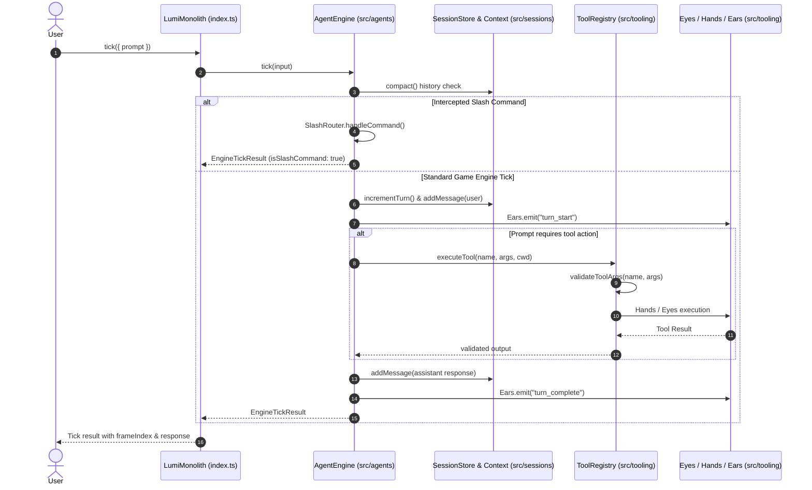

# Design Patterns & Workflows

Comprehensive overview of architectural design patterns and sequence workflows in `/Users/bozoegg/Desktop/LUMI-NEW`.

---

## 1. Deterministic Engine Tick Sequence

The following sequence diagram illustrates how an `EngineTickInput` prompt moves deterministically through the 3-tier architecture:



---

## 2. Key Enterprise Design Patterns

### Dependency Inversion Principle (DIP)
All high-level monolith subsystems depend on contracts and abstract base classes defined in `src/core/contracts/` and `src/core/abstracts/`:

- [IAgentEngine](file:///Users/bozoegg/Desktop/LUMI-NEW/src/core/contracts/agent.contracts.ts#L10) $\rightarrow$ [AbstractAgentEngine](file:///Users/bozoegg/Desktop/LUMI-NEW/src/core/abstracts/abstract-agent-engine.ts#L12)
- [ISessionStore](file:///Users/bozoegg/Desktop/LUMI-NEW/src/core/contracts/session.contracts.ts#L18) $\rightarrow$ [AbstractSessionStore](file:///Users/bozoegg/Desktop/LUMI-NEW/src/core/abstracts/abstract-session-store.ts#L7)
- [IHands](file:///Users/bozoegg/Desktop/LUMI-NEW/src/core/contracts/tooling.contracts.ts#L36), [IEars](file:///Users/bozoegg/Desktop/LUMI-NEW/src/core/contracts/tooling.contracts.ts#L41), [IToolRegistry](file:///Users/bozoegg/Desktop/LUMI-NEW/src/core/contracts/tooling.contracts.ts#L46)

### Template Method Pattern
The engine tick loop enforces an invariant execution sequence with overridable lifecycle hooks:

```typescript
async tick(input: EngineTickInput): Promise<EngineTickResult> {
  await this.preTick(input);            // Hook 1: Pre-tick compaction & validation
  const result = await this.executeTick(input); // Hook 2: Core tick execution
  await this.postTick(result);          // Hook 3: Post-tick telemetry emission
  return result;
}
```

### Immutable Snapshot & Time Travel Rewind Pattern
Captures complete state frames for zero-drift time travel:

```typescript
const snapshot = lumi.createSnapshot(); // Captures messages, VFS buffers, memory facts, metrics
lumi.rewindToSnapshot(snapshot);        // Rewinds frame index and store state frame-perfectly
```

---

## 3. Tool Execution via Sensory Classification

Tools are instantiated under their sensory classification ([Eyes](file:///Users/bozoegg/Desktop/LUMI-NEW/src/tooling/base/eyes.ts#L14), [AnchoredHands](file:///Users/bozoegg/Desktop/LUMI-NEW/src/tooling/extensions/hands.ts#L10), [ProtocolEars](file:///Users/bozoegg/Desktop/LUMI-NEW/src/tooling/extensions/ears.ts#L4)) and registered in [ValidatingToolRegistry](file:///Users/bozoegg/Desktop/LUMI-NEW/src/tooling/extensions/tool-registry.ts#L9):

```typescript
this.registerTool({
  name: "view_file",
  description: "Read contents of a file (Eyes)",
  parameters: {
    path: { type: "string", required: true }
  },
  execute: async (args) => this.eyes.readFile(String(args.path))
});
```

---

## 4. Real-Time Telemetry & JSON-RPC Streaming

The `ProtocolEars` subsystem formats telemetry events into standard JSON-RPC 2.0 notifications:

```typescript
lumi.ears.listen("turn_complete", (event) => {
  const jsonRpcNotification = lumi.ears.formatJsonRpcEvent(event);
  console.log(`[JSON-RPC 2.0]`, jsonRpcNotification);
});
```
