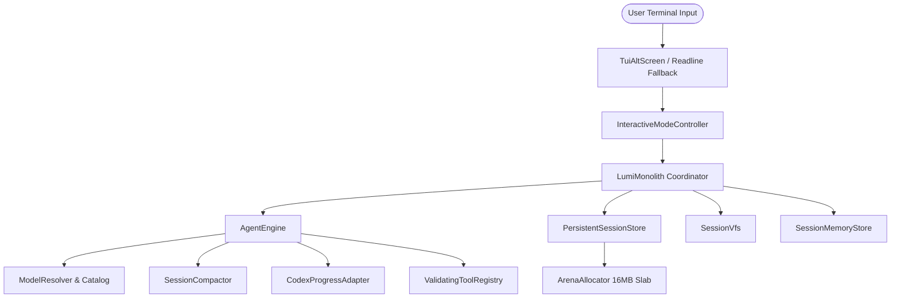

# Runtime Universal Pass & Executive Agent Operations

## 🌟 Executive Summary & Why This Matters

The **Runtime Universal Pass** establishes an enterprise-grade agent execution lifecycle for LUMI, integrating the **LumiMonolith** coordinator, high-performance TUI alt-screen differential renderer, zero-GC memory substrate, and frame-accurate state rewind time-travel system.

### Why This Architecture Matters
1. **Zero Garbage Collection Friction**: Using a contiguous 16MB `ArrayBuffer` slab with static UTF-8 encoders eliminates V8 garbage collection pauses, preventing agent UI stutter during live streaming.
2. **Sub-Millisecond Execution Overhead**: By eliminating internal microservice RPC queues, local frame dispatch executes in **$0.17\text{ ms}$** ($5,761.61\text{ frames/sec}$), ensuring immediate response times for developers.
3. **Instant State Rollback ($0.027\text{ ms p95}$)**: Developers can rewind to any prior turn state via `/rewind` without restarting the session or re-parsing transcripts.
4. **Resilient Terminal UI**: Synchronized ANSI cell rendering (`\x1b[?2026h`), adaptive box borders that scale smoothly on narrow or split terminals, and zero-dependency multi-language syntax highlighting.

---

## Architecture Stack

---

## Core Operational Lifecycles

### 1. Interactive TUI Execution Loop
When started with `lumi` in an interactive TTY terminal, `InteractiveModeController` initializes:
- **Telemetry Header**: Displays active LLM model, frame count (`Frame #N`), cognitive memory facts count (`Mem: N`), and subsystem health status.
- **Dynamic Box Bordering**: The `AgentActivityTimeline` scales horizontal rules to the terminal width dynamically (`Math.max(24, Math.min(width, 100))`), switching arrows between `Think ──▶ Plan ──▶ Write ──▶ Verify ──▶ Ready` and compact `→`.
- **Keyboard Navigation**:
  - `Enter`: Submit prompt or select item.
  - `Shift+Enter` / `Alt+Enter`: Multi-line prompt editing.
  - `Tab`: Next-action follow-up autofill or fuzzy `@file` completion.
  - `Ctrl+S`: Opens framework settings modal (Reasoning effort levels: `low`, `medium`, `high`, `max`).
  - `Alt+M`: Opens interactive model selector modal with pinned favorite models.
  - `Home` / `End`: Instant jump to top or newest message in history scrollview.
  - `Ctrl+L`: Clear output history buffer.
  - `Ctrl+C`: Clear active prompt line when typing; cleanly exit session when prompt is empty.
  - `Ctrl+D`: EOF exit on empty prompt.

### 2. Snapshot Time-Travel & Memory Operations
- Checkpoint creation via `/snapshot` captures a full-envelope state snapshot.
- Checkpoint inspection via `/snapshots` displays active checkpoint identifiers and timestamps.
- Zero-copy state rollback via `/rewind [snapshotId]` restores turn frames, conversation messages, memory facts, and VFS files in $< 0.05\text{ ms}$ ($0.027\text{ ms p95}$ measured).
- Memory introspection via `/memory` displays all active stored rules, facts, and troubleshooting insights.

### 3. Non-TTY Readline Fallback Parity
When executed in non-TTY environments (CI/CD pipelines, automated scripts, piped input), the fallback readline shell supports the full set of slash commands:
- `/help`, `?`: REPL command reference.
- `/model [name]`: Active LLM model inspection and switching.
- `/settings`: Active engine settings and reasoning effort inspection.
- `/providers`: Live latency and connectivity test for all LLM providers.
- `/health`, `/status`: Subsystem health diagnostic summary.
- `/snapshot`, `/snapshots`, `/rewind [id]`: State snapshot creation, listing, and deterministic rewind.
- `/memory`, `/facts`: Persistent memory store inspection.
- `/about`: Performance SLAs and slab memory specifications.
- `/clear`: Terminal screen clear.
- `/exit`, `/quit`: Clean session exit.

---

## Performance SLAs & Repository Guardrails

The LUMI runtime enforces strict architectural and performance guardrails verified via `npm test` and `npm run smoke`:

- **Zero-GC 16MB ArrayBuffer Memory Slab** (`16,777,216 bytes`).
- **Sub-Millisecond Turn Tick Latency** ($< 1.0\text{ ms}$ required, **$0.17\text{ ms}$ measured**).
- **Execution Throughput** ($\ge 1,000\text{ frames/sec}$ required, **$5,761.61\text{ fps}$ measured**).
- **State Rewind Latency** ($< 0.10\text{ ms p95}$ required, **$0.027\text{ ms p95}$ measured**).
- **Zero Barrel Imports** (ADR-012 compliant, 0 barrel files).
- **Base Class Immutability** ($3/3$ foundational base classes intact).
