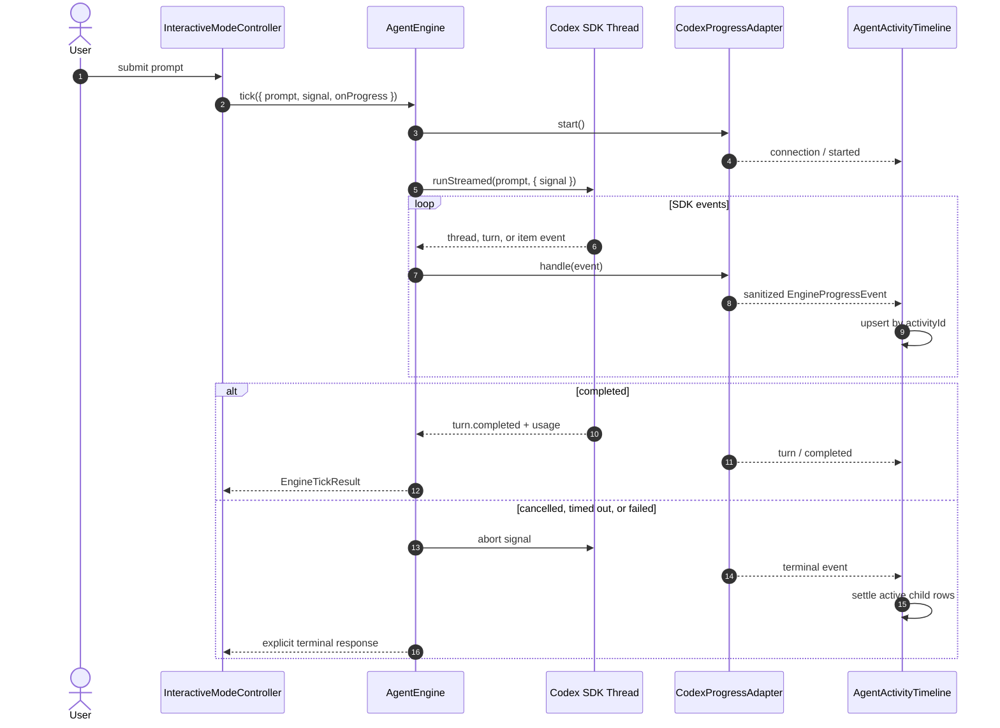

# Agent Activity Streaming Strategy

This guide defines how LUMI reports a live model request from provider dispatch through completion, failure, timeout, or user cancellation. It is the canonical reference for the progress contract, Codex SDK adapter, terminal presentation, security boundary, and verification expectations.

The implementation follows the item lifecycle described by the [official Codex SDK documentation](https://learn.chatgpt.com/docs/codex-sdk) and the richer event taxonomy documented for the [Codex App Server](https://learn.chatgpt.com/docs/app-server). LUMI consumes the events exposed by its pinned `@openai/codex-sdk` version and does not invent unavailable deltas.

## Goals

- Tell the user what the agent is doing without leaving the terminal on an ambiguous `Thinking...` screen.
- Preserve one stable activity as it moves through `started`, `in_progress`, and a terminal state.
- Keep the final turn summary and recent activity history visible after the response arrives.
- Make cancellation, timeout, transport failure, and missing credentials explicit.
- Expose safe operational context while withholding raw reasoning, tool output, credentials, and oversized payloads.
- Give programmatic clients a typed progress contract independent of the terminal UI.

## End-to-End Flow



## Public Progress Contract

`EngineTickInput.onProgress` receives `EngineProgressEvent` values. These types are exported from `src/index.ts` for package consumers.

```typescript
import type { EngineProgressEvent } from "lumi-new";

const result = await lumi.tick({
  prompt: "make a racing game",
  signal: abortController.signal,
  onProgress(event: EngineProgressEvent) {
    console.log(event.activityId, event.status, event.message, event.detail);
  },
});
```

| Field | Contract |
|---|---|
| `activityId` | Stable identity used to update an existing activity instead of appending duplicates. |
| `phase` | User-facing category: `connecting`, `thinking`, `planning`, `tool`, `writing`, `verifying`, `responding`, `completed`, `failed`, or `cancelled`. |
| `status` | Lifecycle state: `started`, `in_progress`, `completed`, `failed`, or `cancelled`. |
| `message` | Short, safe primary label. |
| `detail` | Optional bounded context such as a redacted command, relative file path, plan count, or model name. |
| `timestamp` | Event creation time in Unix milliseconds. |
| `elapsedMs` | Activity or overall-turn elapsed time when available. |
| `sequence` | Monotonically increasing ordering value within the turn. |
| `metadata` | Optional structured values such as item type, file list, exit code, plan totals, and token usage. |

Consumers must upsert by `activityId` and ignore an event whose `sequence` is older than the currently stored event. `item.completed` is the authoritative item state; a renderer should not retain a running icon after the corresponding terminal event.

## Codex Event Mapping

`CodexProgressAdapter` translates provider events into the public contract.

| Codex SDK event or item | LUMI presentation |
|---|---|
| `thread.started` | Connected to Codex and active model. |
| `turn.started` | Analyzing the request and workspace context. |
| `reasoning` | A bounded readable reasoning summary supplied by the SDK. Raw chain-of-thought is never displayed. |
| `todo_list` | Completed/total plan steps and the next incomplete step. |
| `command_execution` | Redacted command, lifecycle status, elapsed time, and exit code metadata. Aggregated output is never placed in progress events. |
| `file_change` | Add/update/delete summary using workspace-relative paths; paths outside the workspace collapse to a basename. |
| `mcp_tool_call` | MCP server and tool name without arguments or result payloads. |
| `web_search` | Bounded, sanitized search query. |
| `agent_message` | Drafting or response-ready state and response character count, not response contents. |
| `turn.completed` | Commands, tool calls, changed files, input/output tokens, and total elapsed time. |
| `turn.failed` or `error` | Explicit failure state with a sanitized, bounded explanation. |

Duplicate payloads for the same activity are dropped. Commands and tool calls are counted by item ID so an `item.updated` event received without a preceding visible `item.started` event is still represented correctly.

## Terminal Presentation

The fullscreen terminal adds an `Agent activity` card immediately after the user prompt. It includes:

- A working/completed/failed/cancelled header with elapsed time and model.
- Animated active rows and conventional success, failure, and cancellation icons.
- At most eight visible activities; older rows collapse behind an `earlier activities` count.
- A pinned overall-turn summary so it cannot scroll out of the compact card.
- A footer containing the current activity, elapsed time, and `Esc/Ctrl+C` cancellation hint.
- A persistent audit trail next to the final response.

The fallback readline interface prints deduplicated lifecycle lines to stderr and prints the final answer to stdout.

## Cancellation, Timeout, and Failure Semantics

- The TUI creates one `AbortController` per turn. `Esc` or `Ctrl+C` aborts only the active turn.
- Codex turns use the caller signal combined with a ten-minute timeout signal.
- Direct API-key requests combine the caller signal with the configured endpoint timeout.
- A cancelled or failed Codex thread is discarded and never reused for the next turn.
- Terminal turn states settle remaining active child rows as `stopped` or `interrupted`.
- Duplicate prompt submission is rejected while a turn is active.
- `LumiMonolith.tick()` restores the loop phase to `idle` in `finally`, including errors and cancellation.
- Local-only `AbortSignal` and callback values are not serialized by `RemoteSessionHandle`.

## Security and Privacy Boundary

Progress is an observability surface and is treated like a log sink. `sanitizeProgressText()` is applied in both the provider adapter and terminal renderer.

The sanitizer normalizes control characters, bounds text, and redacts common credential forms including Bearer/Basic authorization headers, OpenAI-style API keys, Google API keys, GitHub tokens, JWTs, credential-bearing URLs, query parameters, environment assignments, and command-line secret flags.

Never add any of the following to a progress event:

- Aggregated stdout/stderr or full tool result payloads.
- MCP arguments or returned content.
- OAuth access/refresh tokens, API keys, cookies, or authorization codes.
- Raw chain-of-thought or hidden model reasoning.
- Full assistant-response text; it belongs in `EngineTickResult.response`.
- Absolute paths outside the workspace.

## Provider Behavior

| Provider route | Progress fidelity |
|---|---|
| Codex OAuth | Full SDK thread/turn/item lifecycle through `runStreamed()`. |
| OpenAI-compatible API key | Request started, response received, timeout, cancellation, or provider failure. The current endpoint returns a completed response rather than item-level agent events. |
| No credentials | Immediate terminal `Live model is not connected` activity and setup guidance in the response. |

Do not label a non-streaming API response as item-level streaming. The public contract can represent coarse and rich providers without pretending they have equal event fidelity.

## Verification Checklist

Run these checks after changing the contract, adapter, provider dispatch, cancellation, or terminal renderer:

```bash
npm run check
npm run build
npm test
git diff --check
```

Also perform proportional interactive verification:

1. Authenticated completion: confirm connection, analysis, response-ready, usage summary, and final answer.
2. Tool execution: confirm one command row updates in place and never prints aggregated output.
3. Cancellation: start a long command, press `Esc`, confirm the turn and child row become terminal, then confirm no child process remains.
4. Redaction: exercise representative header, key, token, URL, query-string, environment, and CLI-flag credentials.
5. Failure: verify provider, timeout, missing-auth, and empty-final-response paths remain explicit.

## Implementation Map

| Responsibility | Source |
|---|---|
| Public types and callback | `src/core/contracts/agent.contracts.ts` |
| Shared progress sanitizer | `src/core/utilities/progress-sanitizer.ts` |
| Codex lifecycle translation | `src/agents/extensions/execution/codex-progress-adapter.ts` |
| Provider dispatch and abort handling | `src/agents/extensions/execution/agent-engine.ts` |
| Persistent terminal activity card | `src/tui/components/agent-activity-timeline.ts` |
| Fullscreen/fallback integration | `src/agents/extensions/execution/interactive-mode-controller.ts` |
| Remote serialization boundary | `src/sessions/extensions/persistence/remote-session-handle.ts` |

See [ADR-082](../adr/ADR-082-structured-agent-activity-streaming.md) for the decision record and [Troubleshooting](troubleshooting.md) for user-facing diagnostics.
