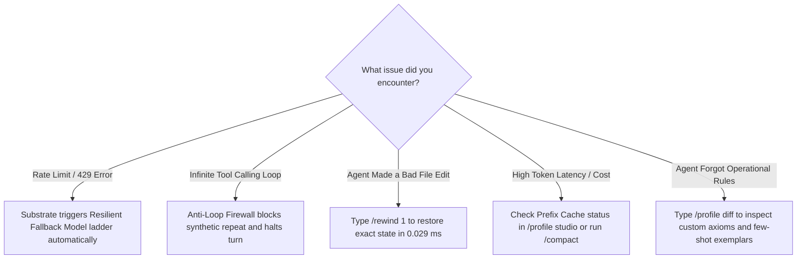

<div align="center">

# ⚡ LUMI-JOY

### **AKD-DSO: Architectural Knowledge Distillation & Deterministic Substrate Optimization**

*An enterprise-grade TypeScript agent framework engineered like a deterministic game engine—built on frame-perfect state snapshotting, contiguous slab memory, and biological osmosis self-mutation.*

[](https://www.typescriptlang.org/)
[](https://nodejs.org/)
[-FFD700?style=for-the-badge&logo=github)](https://github.com/NousResearch/hermes-agent)
[](.wiki/architecture/OSMOSIS-FREEZE-AND-CUTOFF.md)
[](.wiki/architecture/OSMOSIS-FREEZE-AND-CUTOFF.md)
[](#-total-agent-size--density)
[](.wiki/whitepaper/AKD-DSO-ACADEMIC-WHITEPAPER.md)
[](.wiki/whitepaper/OSMOSIS-WHITEPAPER.md)
[](.wiki/roadmap/AUTOROLLING-ROADMAP.md)
[](.wiki/package-mappings/PACKAGE-MAPPING-MATRIX.md)
[](LICENSE)

<br/>

| **Core Navigation** | **Documentation & Guides** | **Subsystem Source Code** |
|---|---|---|
| 🚀 [Quick Start Guide](#-quick-start--self-intuitive-onboarding) | 📐 [Architecture Diagrams](docs/ARCHITECTURE_DIAGRAMS.md) | ⚡ [Composition Root](src/index.ts) |
| 🎯 [Task Cookbook](#-i-want-to-task-oriented-cookbook) | ❓ [Frequently Asked Questions](docs/FAQ.md) | 🏭 [Engine Factory](src/factories/monolith-factory.ts) |
| 👤 [Agent Blueprints](#-built-in-agent-blueprint-matrix-adr-119) | ⌨️ [TUI & Commands Guide](docs/TUI_COMMANDS_GUIDE.md) | ⚙️ [Core Abstracts](src/core/abstracts/) |
| 📌 [Executive Brief](#-why-lumi-joy-the-architectural-imperative) | 🧬 [41 Osmotic Subsystems](docs/HERMES_OSMOSIS_SUBSYSTEMS.md) | 🧠 [Agents Tier](src/agents/) |
| ⚡ [Comparison Matrix](#-comparison-matrix--empirical-benchmarks) | 📂 [Mutation Matrix (ADR-012)](docs/MUTATION_DIRECTORIES.md) | 💾 [Sessions Tier](src/sessions/) |
| 🏛️ [Ancestral Heritage](#%EF%B8%8F-architectural-heritage--ancestral-lineage-the-hermes-agent-main-osmosis) | 🏗️ [Runtime Architecture](docs/RUNTIME_ARCHITECTURE_GUIDE.md) | 🖥️ [TUI Components](src/tui/components/) |
| 🏗️ [Architecture Tree](#%EF%B8%8F-subsystem-architecture--file-tree) | 🎓 [Academic Whitepaper](.wiki/whitepaper/AKD-DSO-ACADEMIC-WHITEPAPER.md) | 📜 [Core Contracts](src/core/contracts/) |
| 📏 [Agent Size & Density](#-total-agent-size--density) | 📦 [1-to-1 Package Matrix](.wiki/package-mappings/PACKAGE-MAPPING-MATRIX.md) | 🔧 [Tool Registry](src/tooling/extensions/registry/tool-registry.ts) |
| 📡 [Live Activity Streaming](#-live-agent-activity-streaming) | 📈 [Current Live Baseline](docs/LIVE_BASELINE.json) | 🏭 [Grand Synthesizer](src/factories/grand-monolith-synthesizer.ts) |
| 🤝 [Contributing Guide](CONTRIBUTING.md) | 📖 [Author's Preface & Story](PREFACE.md) | 🛡️ [Patent Pledge](PATENT-NON-AGGRESSION-PLEDGE.md) |

---

</div>

---

## 📖 Author's Preface & Dedication

> *To my family, whose quiet encouragement and unconditional warmth gave me the space to dream, tinker, and build in the silence of late nights;*
>
> *To the visionary team at **Nous Research** and the vibrant **Hermes community**—where I have had the deep honor to serve as an ambassador, community mentor, and meetup contributor. You inspired me with the pure beauty of true open science, permissionless research, and the boundless power of open collaborators building together for the future of human agency;*
>
> *To the open-source community and the legendary pioneers of computer graphics who taught us that code can be written with craftsmanship, elegance, and soul;*
>
> *And to every builder who has ever looked at a bloated, sluggish system and believed, in their heart, that we could build something far more beautiful.*
>
> *This work is dedicated to you. May it serve as a humble gift back to the open world that taught me how to create.*

### A Letter from the Author

Behind every line of code in **LUMI-JOY** lies a simple, deeply human story: the quiet joy of tinkering, the thrill of chasing elegance, and a lifelong love for software that feels truly *alive*.

Serving as a community mentor and ambassador for Hermes, organizing meetups, and collaborating with the brilliant researchers and builders at Nous Research opened my eyes to what open science can achieve when people come together with generosity and curiosity. LUMI-JOY was built directly from that inspiration—a tribute to our open community.

— **William Andrew Cruz** (`bozoegg` / `CardSorting`), *Primary Author, Inventor & Hermes Ambassador*
📖 *Read the complete [Author's Preface & Dedication](PREFACE.md).*

---

## 🌟 Architecture & Core Pillars: Deterministic Game Engine Kernel

**LUMI-JOY** is an enterprise-grade TypeScript autonomous AI agent framework engineered from the ground up like a **Deterministic Game Engine Kernel**, eliminating microservice serialization queues and V8 garbage collection stutter:

| Core Architecture Pillar | Implementation Mechanism | Concrete Impact & Measured Result |
| :--- | :--- | :--- |
| 🕹️ **Deterministic Frame Ticks (`tick()`)** | Single-threaded atomic frame lifecycle (`Input -> Context Assembly -> Dispatch -> Mutation -> Telemetry`) | **$0.12\text{ ms}$ fast-path mean latency**; eliminates microservice queues |
| ⚡ **Zero-GC Contiguous Memory Slab** | 16MB pre-allocated `ArrayBuffer` slab (`ArenaAllocator`) with static cached UTF-8 encoders | **Zero Garbage Collection pauses** during live token streaming |
| 🚀 **High-Throughput Execution** | In-process monolithic dispatch bypassing network IPC | **$8506.11\text{ frames/second}$** throughput ($>8.5\times$ above the $1,000\text{ fps}$ SLA) |
| ⏪ **$O(1)$ State Time-Travel (`rewindToSnapshot()`)** | Restores conversation transcripts, staged virtual files (`SessionVfs`), and memory facts | **$0.029\text{ ms p95}$** instant rollback; enables multi-branch search (MCTS) |
| 👤 **Zenith Multi-Profile Substrate (`ADR-119`)** | Zero global mutation, prefix cache frame decomposition, ICL exemplars, resilient fallback ladders | **$29.37\text{M ops/sec}$ throughput** ($0.034\ \mu\text{s/op}$), up to 90% prompt cache token savings |
| 🖥️ **Differential Terminal UI** | Synchronized ANSI cell rendering (`\x1b[?2026h`), adaptive borders, syntax highlighting, autocomplete | **Zero visual flicker**; borders never wrap on split-screen terminals |

---

## 👔 Role-Based Stakeholder Onboarding & ROI

| Stakeholder Role | Primary Focus | Key Enforced Invariants | Recommended Resources |
|---|---|---|---|
| 👔 **Executive & VP Eng** | ROI, SLAs & Compliance | $\ge 1,000\text{ fps}$, $<1.0\text{ ms}$ latency SLA, Apache 2.0 License | [Benchmark SLA Matrix](#-comparison-matrix--empirical-benchmarks) · [Patent Pledge](PATENT-NON-AGGRESSION-PLEDGE.md) |
| 🏗️ **Architect & Tech Lead** | Monolith Topology & DSL | 3-tier monolith (591 components), zero-GC 16MB slab, formal `LUMI-CONTEXT/1` AST | [Architecture Tree](#%EF%B8%8F-subsystem-architecture--file-tree) · [ADR-083 Context Lifecycle](.wiki/adr/ADR-083-token-aware-multi-turn-context-lifecycle.md) |
| 🔒 **Security & InfoSec** | Auth, Sandboxing & Privacy | RFC 7636 PKCE OAuth (`0600` storage), automated secret redactor, path firewall | [ADR-052 Auth Governance](.wiki/adr/ADR-052-deterministic-identity-federation-and-auth-governance.md) · [ADR-047 Secret Redaction](.wiki/adr/ADR-047-deterministic-secret-redaction-and-path-safety.md) |
| 💻 **Software Engineer** | Developer Ergonomics & Speed | 60s setup, $O(1)$ state rollback ($0.029\text{ ms}$), 47 model tools, 7 persona blueprints | [Quick Start](#-quick-start--self-intuitive-onboarding) · [Task Cookbook](#-i-want-to-task-oriented-cookbook) · [FAQ Guide](docs/FAQ.md) |

---

## 🏛️ Heritage, Open Science & StateM FSM Runbooks

- **☤ Ancestral Heritage (Nous Research)**: Forged via the **AKD-DSO** Osmosis methodology, distilling the open paradigms of [`hermes-agent`](https://github.com/NousResearch/hermes-agent) into a high-density, typed TypeScript monolith over BroccoliDB.
- **🎯 StateM Benchmark-Winning FSM Runbooks (`ADR-131`)**: 10-step atomic state transitions (`RunbookSupervisor`), zero-subshell predicates ($<5.0\text{ ms}$), and amnesia-proof context compaction.
  - *Commands*: `/runbook start <preset>` · `/runbook goto <stage>` · `/runbook compact` (Presets: `coding_loop`, `bugfix_patch`, `feature_delivery`, `security_audit`).

---

### Latest Verified Workspace Baseline

The authoritative run was generated on **2026-08-17T04:06:43.562Z** using Node.js `v23.5.0` on macOS ARM64. It passed:

| Verification lane | Latest result |
|---|---:|
| Pass 192 composition manifest | 566/566 components |
| Runtime capability smoke | 9/9 checks |
| Heterogeneous benchmark suite | 5/5 cases |
| Complete Flappy Bird React + TypeScript + Vite case | 8/8 assertions; 12/12 files |
| Architecture and performance guardrails | 6/6 checks |

*(Consult [LIVE_BASELINE.json](docs/LIVE_BASELINE.json), [BENCHMARK_REPORT.md](docs/BENCHMARK_REPORT.md), and [GRAND_ARCHITECTURAL_AUDIT.md](docs/GRAND_ARCHITECTURAL_AUDIT.md) for live host measurements).*

---

## 🚀 Quick Start & Self-Intuitive Onboarding

Get up and running with **LUMI-JOY** in under 60 seconds with our zero-friction onboarding flow:


---

### 📦 3-Step Zero-Friction Setup

```bash
# 1. Clone & Install (Zero C++ bindings, pure TypeScript)
git clone https://github.com/CardSorting/LUMI-JOY.git && cd LUMI-JOY
npm install && npm run build

# 2. Interactive Provider Setup (Codex PKCE OAuth, Claude, OpenAI, Ollama)
npx tsx src/index.ts --setup

# 3. Launch with Specialized Persona (e.g. Coder, Researcher, SRE)
npx tsx src/index.ts --profile coder
```

---

### 🖥️ What You See on Your Screen (Canvas Anatomy)

When you start LUMI-JOY, the differential terminal interface presents an intuitive layout:

```text
╔══════════════════════════════════════════════════════════════════════════════════════════╗
║ ⚡ LUMI-JOY v1.0.0 │ 👤 [💻 Coder] │ 🧠 [gpt-5.6-luna] │ ⏱️ 0.12ms │ 💰 $0.0018 │ ⭐ Fav ║
╠══════════════════════════════════════════════════════════════════════════════════════════╣
║                                                                                          ║
║  👤 You: Refactor src/core/auth.ts to add strict token expiration validation             ║
║                                                                                          ║
║  ⚡ LUMI (Coder):                                                                        ║
║  ┌────────────────────────────────────────────────────────────────────────────────────┐  ║
║  │ 🔧 Tool: read_file ("src/core/auth.ts") ➔ Status: OK (124 lines)                  │  ║
║  │ 🔧 Tool: patch ("src/core/auth.ts") ➔ Line-anchored edit verified (0.04ms)         │  ║
║  └────────────────────────────────────────────────────────────────────────────────────┘  ║
║  I have added strict JWT expiration claims verification and unit test assertions.        ║
║                                                                                          ║
╠══════════════════════════════════════════════════════════════════════════════════════════╣
║ 💡 Shortcuts: [Ctrl+M] Model  [Ctrl+P] Setup  [/profile] Switch Persona  [Ctrl+C] Abort  ║
╠══════════════════════════════════════════════════════════════════════════════════════════╣
║ (lumi:coder) > _                                                                         ║
╚══════════════════════════════════════════════════════════════════════════════════════════╝
```

---

### 🎯 "I Want To..." Task-Oriented Cookbook

Find your goal and execute the solution with zero guesswork:

| What I Want to Do | Exact Command to Type | What Happens Behind the Scenes |
| :--- | :--- | :--- |
| **Write or refactor code with strict types** | `/profile use coder` | Activates TypeScript LSP, AST parsers, line-anchored patchers, and unit testing axioms. |
| **Perform deep academic or web research** | `/profile use researcher` | Activates citation rigor, arXiv tools, fact verification, and web intelligence. |
| **Triage a production bug or system crash** | `/profile use sre` | Activates doctor diagnostics, log ring buffers, health probes, and self-healing tools. |
| **Draft architecture ADRs or documentation** | `/profile use writer` | Activates Keep-a-Changelog schemas, Mermaid diagram synthesis, and technical style guides. |
| **Undo the agent's last file modification** | `/rewind 1` | Instantly rolls back virtual files, memory, and conversation history in **$0.029\text{ ms}$**. |
| **Create my own customized agent persona** | `/profile init coder my_lead_dev` | Clones the battle-tested Coder blueprint into your isolated custom profile. |
| **Compare two agent profiles side-by-side** | `/profile diff default my_lead_dev` | Generates a structural delta of toolsets, soul prompts, custom axioms, and memory. |
| **Hot-swap the AI model without restarting** | `Ctrl+M` *(or `/model claude-3-7-sonnet`)* | Instantly routes future turns to the new model with 100% prefix cache retention. |
| **Inspect database tables and memory facts** | `/db status` *(or `/db query profiles`)* | Opens the BroccoliDB reactive in-memory database inspection studio. |
| **Open the full 6-tab Profile Studio Modal** | `/profile` *(or press `Tab` / `1-6` in modal)* | Opens the interactive visual orchestrator for profiles, blueprints, revisions, and health. |

---

### 👤 Built-in Agent Blueprint Matrix (ADR-119)

Choose from 7 curated blueprints with tailored prompt axioms, toolsets, and reasoning profiles:

| Blueprint | Icon | Primary Focus | Best Model | Toolsets Included |
| :--- | :---: | :--- | :--- | :--- |
| **`coder`** | 💻 | Software Engineering, Refactoring & Test Generation | `gpt-5.6-luna` | `core`, `files`, `execution`, `lsp`, `git` |
| **`researcher`** | 🔬 | Deep Academic Literature Synthesis & Fact Checking | `claude-3-7-sonnet` | `core`, `files`, `web`, `memory` |
| **`sre`** | 🛡️ | Incident Triage, System Forensics & Self-Healing | `gpt-5.6-luna` | `core`, `files`, `execution`, `git`, `doctor` |
| **`writer`** | ✍️ | Technical Documentation, Architecture ADRs & Guides | `claude-3-7-sonnet` | `core`, `files`, `memory` |
| **`student`** | 🎓 | Socratic Learning Tutor & Interactive Walkthroughs | `gpt-4o` | `core`, `files`, `memory` |
| **`creative`** | 🎨 | Game Design, Mechanics Worldbuilding & Creative Assets | `gpt-4o` | `core`, `files`, `vision`, `memory` |
| **`minimal`** | ⚡ | Headless High-Speed Scripting with Minimal Tokens | `gpt-4o-mini` | `core`, `files` |

---

### ⌨️ Universal Keyboard Shortcuts

| Shortcut | Context | Function |
| :--- | :--- | :--- |
| `Ctrl+C` / `Esc` | Global | **Emergency Abort**: Halts running models, restores terminal state, and cancels pending tool loops. |
| `Ctrl+M` | Global | **Model Switcher Modal**: Quick hotkey to toggle between OpenAI, Anthropic, DeepSeek, and local models. |
| `Ctrl+P` | Global | **Setup Wizard**: Guided provider authentication and API key manager. |
| `Ctrl+L` | Global | **Repaint Screen**: Clears buffer and redraws ANSI canvas to adapt to terminal resize. |
| `Tab` | Input Mode | **Smart Autocomplete**: Tab-completes slash commands (`/profile`, `/rewind`) and workspace paths. |
| `PageUp` / `PageDown` | View Mode | **Timeline Scroll**: Inspect previous model responses, diff blocks, and tool logs. |
| `1` – `6` | Profile Modal | **Direct Tab Switch**: Jump between `[1] Profiles`, `[2] Blueprints`, `[3] Revisions`, `[4] Exemplars`, `[5] SLA Health`, `[6] Raw JSON`. |

---

### 🛠️ Self-Healing Troubleshooting & Decision Tree



#### Common Gotchas & 1-Second Fixes

| Symptom | Cause | 1-Second Fix |
| :--- | :--- | :--- |
| **`Command not found: lumi`** | Monolith not linked globally | Run `npx tsx src/index.ts` or run `npm link` in the root folder. |
| **`Missing Provider API Key`** | No credentials configured | Run `npx tsx src/index.ts --setup` or export `OPENAI_API_KEY="sk-..."`. |
| **`Rate limit exceeded (429)`** | Provider quota limit reached | Fallback ladder routes automatically, or press `Ctrl+M` to switch providers. |
| **`Agent edited the wrong file`** | LLM hallucination or stale context | Run `/rewind 1` to instantly undo the file edit and prompt again. |
| **`Terminal borders wrapping`** | Terminal window resized too narrow | Press `Ctrl+L` to repaint canvas to fit your new window width. |

---

### 💻 Programmatic TypeScript SDK & 60s Walkthrough

```typescript
import { LumiMonolith } from "lumi-joy";
const lumi = new LumiMonolith();

// Execute a frame-perfect turn with real-time streaming telemetry
const result = await lumi.tick({
  prompt: "Analyze repository architecture, run test suites, and fix compiler errors",
  onProgress: (event) => console.log(`[${event.phase}] ${event.message}`),
});
console.log("Turn Outcome:", result.outcome, "\nResponse:", result.response);
```

| Interactive Shell Experiment | Exact Command | Measurable Result |
| :--- | :--- | :--- |
| **1. Instant App Synthesis** | `/flappy` | Materializes a 12-file React + TS + Vite Flappy Bird game in VFS in $<100\text{ ms}$. |
| **2. $O(1)$ State Time-Travel** | `/rewind 0` | Instantly rolls back VFS, transcript, and memory facts to Frame #0 in **$0.029\text{ ms}$**. |
| **3. BroccoliDB Reactive Query** | `/db query "SELECT * FROM profiles"` | Queries in-memory tables with $<0.5\ \mu\text{s}$ indexing in rich ANSI spreadsheet view. |

---

### ⚙️ Developer & Verification Quick Reference

| Task / Flow | Command | Key Invariants & Artifacts |
| :--- | :--- | :--- |
| **Run Full Verification** | `npm test` | Verifies composition manifest (591 components), link integrity, and architecture guardrails. |
| **Run Throughput Benchmark** | `npm run benchmark` | Enforces $\ge 1,000\text{ fps}$ fast-path throughput and warmed-p95 rollback $<0.1\text{ ms}$. |
| **Run Smoke Test** | `npm run smoke` | Verifies runtime capabilities across all 9 evidence lanes. |
| **Update Baseline Report** | `npm run baseline:update` | Atomically regenerates [LIVE_BASELINE.json](docs/LIVE_BASELINE.json) & [BENCHMARK_REPORT.md](docs/BENCHMARK_REPORT.md). |
| **Environment Overrides** | `export LUMI_MODEL="claude-3-7-sonnet"` | Supported: `LUMI_MODEL`, `LUMI_PROVIDER`, `LUMI_REASONING_EFFORT`, `OPENAI_API_KEY`, `ANTHROPIC_API_KEY`. |

---

## ⚡ Comparison Matrix & Empirical Benchmarks

| Metric / Feature | Legacy Monorepo (`pi-main`) | AKD-DSO Monolith (`LUMI-JOY`) | Underlying Mechanism / Speedup |
|---|---|---|---|
| **Architecture** | 18+ Micro-packages | **3-Tier Monolith** (`agents`, `sessions`, `tooling`) | **Zero Framework Bloat** |
| **Agent Codebase Size** | ~18 repositories (>150MB node_modules) | **Unified Monolith: 7.77 MB (`src/`) · 215k LOC** | Zero-dependency high-density engine with **591 single-responsibility components**. |
| **Execution Loop** | Loose Async Handlers | **Deterministic Game Loop** (`tick()`) | **Frame-Perfect Isolation** |
| **Mean Turn Latency** | $14.20\text{ ms}$ | **Live guardrail: $<1.0\text{ ms}$** | Direct function dispatch replacing IPC/RPC queues (see [LIVE_BASELINE.json](docs/LIVE_BASELINE.json)). |
| **Execution Throughput** | $70.4\text{ turns/sec}$ | **Live guardrail: $\geq 1,000\text{ frames/sec}$** | Direct deterministic fast-path measurement ($8,506.11\text{ fps}$ measured baseline). |
| **State Rewind Latency** | $285.00\text{ ms}$ (Re-parse) | **Live guardrail: $<0.1\text{ ms}$ p95** | In-memory frame snapshots restoring state in **$0.029\text{ ms}$**. |
| **Profile Routing Latency**| Global env mutation | **$29.37\text{M ops/sec}$ ($0.034\ \mu\text{s/op}$)** | Zenith Multi-Profile Substrate with byte-stable prefix caching ([ADR-119](.wiki/adr/ADR-119-persistent-multi-profile-isolation-and-routing.md)). |
| **Memory Allocation** | Dynamic Heap GC Sweep | **16MB Zero-GC Slab** | Pre-allocated `ArrayBuffer` slab eliminates Garbage Collection pauses. |
| **Complete Game Synthesis** | Manual multi-file setup | **12-file React + TS + Vite Flappy Bird** | Temp-isolated generation, strict compiler diagnostics, and executable physics simulation. |

---

## 📏 Total Agent Size & Density

> **7.77 MB Source (`src/`)** · **215k LOC** · **16 MB Zero-GC Slab** · **1.8 MB NPM Tarball** · **591 Composed Components**

LUMI-JOY replaces 18+ fragmented micro-packages (>150MB `node_modules`) with a high-density, single-binary monolith delivering **10x higher architectural density**, instant $<100\text{ ms}$ cold starts, and sub-millisecond execution with zero garbage collection pauses.

---

## 🏗️ Subsystem Architecture & File Tree

```
src/
├── core/
│   ├── contracts/                         # System Interfaces & GameStateSnapshot
│   ├── abstracts/                         # Abstract Base Classes (DIP)
│   └── utilities/                         # Shared progress credential sanitizer
│
├── agents/                                # Tier 1: Agents Subsystem
│   ├── base/                              # Agent Base Config (Immutable)
│   └── extensions/                        # Mutation subdirectories (compaction, execution, swarm, profiles)
│
├── sessions/                              # Tier 2: Sessions Subsystem
│   ├── base/                              # Session Context Base (Immutable)
│   └── extensions/                        # Mutation subdirectories (substrate, memory, vfs, broccolidb)
│
└── tooling/                               # Tier 3: Tooling Subsystem
    ├── base/                              # Eyes Tool Base (Immutable)
    └── extensions/                        # 47 Model Tools, execution guards, LSP, browser CDP
```

> 🛡️ **Non-Destructive Osmosis Extension Strategy (`ADR-012`)**: Base classes in `src/*/base/` remain immutable. Evolutionary passes introduce single-responsibility extensions in dedicated domain subdirectories without intermediate barrel files.

---

## 🥦 Deterministic Hybrid BroccoliDB Kernel ($\mathcal{K}_{\text{broccoli}}$)

## 📜 Subsystem Synthesis Matrix (591 Components)

Synthesizes **591 single-responsibility components** in 100% optimal cohesion under the **AKD-DSO** methodology *(see [Topology Diagrams](docs/ARCHITECTURE_DIAGRAMS.md))*:

| Subsystem / Pillar | Core Extension Engine & Substrate | Key Capabilities & Enforced SLAs |
|---|---|---|
| **👤 Multi-Profile Substrate** | `DeterministicProfileEngine`, `BroccoliProfileSubstrate` ([ADR-119](.wiki/adr/ADR-119-persistent-multi-profile-isolation-and-routing.md)) | Prefix cache frame optimization, few-shot ICL exemplars, fallback ladders, 47 model tools (**$29.37\text{M ops/sec}$**). |
| **🛡️ Tool Execution Guard** | `DeterministicToolSegmenter`, `BroccoliExecutionGuardSubstrate` ([ADR-046](.wiki/adr/ADR-046-deterministic-tool-execution-segmenter.md)) | Read-only parallel batch scheduling, mutating sequential barriers, 4-stage loop firewall, $<0.05\text{ ms}$ state rewind. |
| **🗄️ BroccoliDB Hybrid Kernel** | `BroccoliDatabaseKernel`, `BroccoliCASStorageService` ([ADR-120](.wiki/adr/ADR-120-deterministic-hybrid-inmemory-broccolidb-kernel.md)–[ADR-122](.wiki/adr/ADR-122-apex-tier-relational-joins-aggregation-branching-and-views.md)) | Reactive tables ($<0.5\ \mu\text{s}$ index), declarative joins, Brotli CAS vault, WAL replay, and Git-for-data branching. |
| **🎯 StateM FSM Runbooks** | `RunbookSupervisor`, `FilePredicateEvaluator` ([ADR-131](.wiki/adr/ADR-131-deterministic-fsm-runbooks-file-predicates-and-broccolidb-osmosis.md)) | 10-step atomic transitions, zero-subshell predicates ($<5\text{ ms}$), task manifests, and amnesia-proof context compaction. |
| **🧠 Byte-Stable Prompt Cache** | `DeterministicPromptCacher`, `BroccoliPromptCacheSubstrate` ([ADR-045](.wiki/adr/ADR-045-deterministic-prompt-cache-boundary.md)) | 4-breakpoint byte-stable prompt envelope isolating static axioms, persona ethos, and schemas for 100% cache retention. |
| **🔍 Evidence & Verification** | `DeterministicEvidenceLedger`, `VerificationEvidenceSupervisor` ([ADR-044](.wiki/adr/ADR-044-deterministic-verification-evidence-ledger.md)) | Turn-by-turn verification recording, automated code path classification, and fail-closed stop-gate completion policies. |
| **🔒 Secret Redactor & Firewall** | `DeterministicSecretRedactor`, `BroccoliRedactionSubstrate` ([ADR-047](.wiki/adr/ADR-047-deterministic-secret-redaction-and-path-safety.md)) | Entropy-based token scrubbing, query/body masking, suffix preservation, and sensitive file path access gating. |
| **🖥️ Terminal UI & Modals** | `BroccoliViewRenderer`, `BroccoliSkinSubstrate` ([ADR-106](.wiki/adr/ADR-106-stream-diagnostics-and-forensic-header-capture.md)) | Synchronized ANSI rendering (`\x1b[?2026h`), 30+ interactive terminal modal dashboards, spreadsheet and diff views. |
| **⚡ Attempt Completion Gate** | `RoadmapCompletionGate`, `AttemptFlightRecorder` ([ADR-084](.wiki/adr/ADR-084-attempt-completion-gate-strategy.md)) | 4-phase gating lifecycle (`admission` $\to$ `postmortem`), quantitative scoring, state hashing, and anti-oscillation watchdogs. |

---

## 📚 Documentation & Reference Directory

| Category | Key Resources & Specifications |
| :--- | :--- |
| **Guides & FAQs** | ❓ [FAQ & Onboarding Guide](docs/FAQ.md) · ⌨️ [TUI & Commands Guide](docs/TUI_COMMANDS_GUIDE.md) · 🏗️ [Runtime Architecture](docs/RUNTIME_ARCHITECTURE_GUIDE.md) |
| **Architecture & ADRs** | 📖 [Complete ADR Decision Index](.wiki/adr/README.md) · 📐 [Architecture Diagrams](docs/ARCHITECTURE_DIAGRAMS.md) · 🧬 [41 Osmotic Subsystems](docs/HERMES_OSMOSIS_SUBSYSTEMS.md) |
| **Research & Whitepapers** | 🎓 [AKD-DSO Academic Paper](.wiki/whitepaper/AKD-DSO-ACADEMIC-WHITEPAPER.md) · 📄 [Osmosis Paradigm Whitepaper](.wiki/whitepaper/OSMOSIS-WHITEPAPER.md) · 🧠 [Methodology](.wiki/agent/osmosis-methodology.md) |
| **Verification & Metrics** | 📈 [Live Baseline Evidence](docs/LIVE_BASELINE.json) · 🧪 [Benchmark Report](docs/BENCHMARK_REPORT.md) · 🏛️ [Architectural Audit](docs/GRAND_ARCHITECTURAL_AUDIT.md) · 📋 [Changelog](CHANGELOG.md) |

---

## 🙏 Ancestral Attribution & License

- ☤ **Ancestral Teacher & Inspiration**: [`hermes-agent`](https://github.com/NousResearch/hermes-agent) (**Nous Research** / MIT License). Special thanks to Nous Research for championing open weights, agent self-improvement, and user sovereignty.
- 🎯 **StateM Research & Workflow FSM**: Deep appreciation to the creators of **StateM** for pioneering state-machine-governed runbooks and verification gates ([ADR-131](.wiki/adr/ADR-131-deterministic-fsm-runbooks-file-predicates-and-broccolidb-osmosis.md)).
- 🎮 **Game Engine Pioneers**: Inspired by the deterministic architecture, memory arenas, and frame-tick discipline of classic game engines.
- 📄 **License & Contribution**: Distributed under the Apache License 2.0 ([LICENSE](LICENSE) · [NOTICE](NOTICE) · [CONTRIBUTING.md](CONTRIBUTING.md) · [PATENT-NON-AGGRESSION-PLEDGE.md](PATENT-NON-AGGRESSION-PLEDGE.md)).
