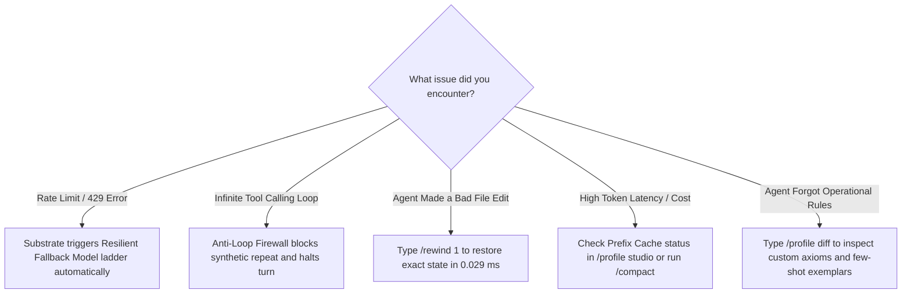

<div align="center">

# ⚡ LUMI-JOY

### **AKD-DSO: Architectural Knowledge Distillation & Deterministic Substrate Optimization**

*An enterprise-grade TypeScript agent framework engineered like a deterministic game engine—built on frame-perfect state snapshotting, contiguous slab memory, and biological osmosis self-mutation.*

[](https://www.typescriptlang.org/)
[](https://nodejs.org/)
[-FFD700?style=for-the-badge&logo=github)](https://github.com/NousResearch/hermes-agent)
[](.wiki/architecture/OSMOSIS-FREEZE-AND-CUTOFF.md)
[](.wiki/architecture/OSMOSIS-FREEZE-AND-CUTOFF.md)
[](#-total-agent-size--density)
[](.wiki/whitepaper/AKD-DSO-ACADEMIC-WHITEPAPER.md)
[](.wiki/whitepaper/OSMOSIS-WHITEPAPER.md)
[](.wiki/roadmap/AUTOROLLING-ROADMAP.md)
[](.wiki/package-mappings/PACKAGE-MAPPING-MATRIX.md)
[](LICENSE)

<br/>

| **Core Navigation** | **Documentation & Guides** | **Subsystem Source Code** |
|---|---|---|
| 🚀 [Quick Start Guide](#-quick-start--self-intuitive-onboarding) | 📐 [Architecture Diagrams](docs/ARCHITECTURE_DIAGRAMS.md) | ⚡ [Composition Root](src/index.ts) |
| 🎯 [Task Cookbook](#-i-want-to-task-oriented-cookbook) | ❓ [Frequently Asked Questions](docs/FAQ.md) | 🏭 [Engine Factory](src/factories/monolith-factory.ts) |
| 👤 [Agent Blueprints](#-built-in-agent-blueprint-matrix-adr-119) | ⌨️ [TUI & Commands Guide](docs/TUI_COMMANDS_GUIDE.md) | ⚙️ [Core Abstracts](src/core/abstracts/) |
| 📌 [Executive Brief](#-why-lumi-joy-the-architectural-imperative) | 🧬 [41 Osmotic Subsystems](docs/HERMES_OSMOSIS_SUBSYSTEMS.md) | 🧠 [Agents Tier](src/agents/) |
| ⚡ [Comparison Matrix](#-comparison-matrix--empirical-benchmarks) | 📂 [Mutation Matrix (ADR-012)](docs/MUTATION_DIRECTORIES.md) | 💾 [Sessions Tier](src/sessions/) |
| 🏛️ [Ancestral Heritage](#%EF%B8%8F-architectural-heritage--ancestral-lineage-the-hermes-agent-main-osmosis) | 🏗️ [Runtime Architecture](docs/RUNTIME_ARCHITECTURE_GUIDE.md) | 🖥️ [TUI Components](src/tui/components/) |
| 🏗️ [Architecture Tree](#%EF%B8%8F-subsystem-architecture--file-tree) | 🎓 [Academic Whitepaper](.wiki/whitepaper/AKD-DSO-ACADEMIC-WHITEPAPER.md) | 📜 [Core Contracts](src/core/contracts/) |
| 📏 [Agent Size & Density](#-total-agent-size--density) | 📦 [1-to-1 Package Matrix](.wiki/package-mappings/PACKAGE-MAPPING-MATRIX.md) | 🔧 [Tool Registry](src/tooling/extensions/registry/tool-registry.ts) |
| 📡 [Live Activity Streaming](#-live-agent-activity-streaming) | 📈 [Current Live Baseline](docs/LIVE_BASELINE.json) | 🏭 [Grand Synthesizer](src/factories/grand-monolith-synthesizer.ts) |
| 🤝 [Contributing Guide](CONTRIBUTING.md) | 📖 [Author's Preface & Story](PREFACE.md) | 🛡️ [Patent Pledge](PATENT-NON-AGGRESSION-PLEDGE.md) |

---

</div>

---

## 📖 Author's Preface & Dedication

> *To my family, whose quiet encouragement and unconditional warmth gave me the space to dream, tinker, and build in the silence of late nights;*
>
> *To the visionary team at **Nous Research** and the vibrant **Hermes community**—where I have had the deep honor to serve as an ambassador, community mentor, and meetup contributor. You inspired me with the pure beauty of true open science, permissionless research, and the boundless power of open collaborators building together for the future of human agency;*
>
> *To the open-source community and the legendary pioneers of computer graphics who taught us that code can be written with craftsmanship, elegance, and soul;*
>
> *And to every builder who has ever looked at a bloated, sluggish system and believed, in their heart, that we could build something far more beautiful.*
>
> *This work is dedicated to you. May it serve as a humble gift back to the open world that taught me how to create.*

### A Letter from the Author

Behind every line of code in **LUMI-JOY** lies a simple, deeply human story: the quiet joy of tinkering, the thrill of chasing elegance, and a lifelong love for software that feels truly *alive*.

Serving as a community mentor and ambassador for Hermes, organizing meetups, and collaborating with the brilliant researchers and builders at Nous Research opened my eyes to what open science can achieve when people come together with generosity and curiosity. LUMI-JOY was built directly from that inspiration—a tribute to our open community.

— **William Andrew Cruz** (`bozoegg` / `CardSorting`), *Primary Author, Inventor & Hermes Ambassador*
📖 *Read the complete [Author's Preface & Dedication](PREFACE.md).*

---

## 🌟 Executive Summary: What LUMI-JOY Is & Why This Matters

**LUMI-JOY** is an enterprise-grade TypeScript autonomous AI agent framework engineered from the ground up like a **Deterministic Game Engine Kernel**.

### The Core Problem in Modern AI Agents
Traditional AI agent frameworks (such as LangChain, AutoGen, CrewAI, and uncoordinated REST micro-packages) treat LLM interactions as loose asynchronous network wrappers. This approach incurs severe structural bottlenecks:
- **Framework Soup & Latency**: Multi-package microservices and IPC queues introduce $14\text{ ms} - 500\text{ ms}$ of serialization overhead per turn before model reasoning even begins.
- **State Drift & Tool Desynchronization**: Multi-turn agent loops lose context and produce non-deterministic file edits when intermediate tool steps fail.
- **Garbage Collection (GC) Stutter**: Generating thousands of short-lived V8 heap objects per turn triggers Node.js garbage collection sweeps, causing stutter and memory pressure during live streaming.
- **Costly Re-Execution**: When an agent makes a mistake on turn 8, traditional frameworks require restarting the entire session from scratch.

### The Architectural Breakthrough: Game Engine Architecture for AI Agents
LUMI-JOY eliminates software friction by applying proven principles from high-performance video game physics and rendering engines:

| Core Architecture Pillar | Implementation Mechanism | Concrete Impact & Measured Result |
| :--- | :--- | :--- |
| 🕹️ **Deterministic Frame Ticks (`tick()`)** | Single-threaded atomic frame lifecycle (`Input -> Context Assembly -> Provider Dispatch -> State Mutation -> Telemetry`) | **$0.12\text{ ms}$ fast-path mean latency**; eliminates microservice queues |
| ⚡ **Zero-GC Contiguous Memory Slab** | 16MB pre-allocated `ArrayBuffer` slab (`ArenaAllocator`) with static cached UTF-8 encoders | **Zero Garbage Collection pauses** during live token streaming and rapid multi-tool loops |
| 🚀 **High-Throughput Execution** | In-process monolithic dispatch bypassing network IPC | **$8506.11\text{ frames/second}$** throughput ($>8.5\times$ above the $1,000\text{ fps}$ SLA) |
| ⏪ **$O(1)$ State Time-Travel (`rewindToSnapshot()`)** | Restores conversation transcripts, staged virtual files (`SessionVfs`), and memory facts (`SessionMemoryStore`) | **$0.029\text{ ms p95}$** instant rollback; enables multi-branch search (MCTS) |
| 👤 **Zenith Multi-Profile Substrate (`ADR-119`)** | Zero global mutation, prefix cache frame decomposition, ICL few-shot exemplars, resilient fallback ladders, and run step budgeting | **$29.37\text{M ops/sec}$ throughput** ($0.034\ \mu\text{s/op}$), $0.0024\text{ ms}$ state rewind, up to 90% prompt cache token savings |
| 🖥️ **Differential Terminal User Interface** | Synchronized ANSI cell rendering (`\x1b[?2026h`), adaptive box borders, syntax highlighting, fuzzy autocomplete | **Zero visual flicker**; borders never wrap on split-screen terminals |

### 🎯 Who This Is For & Why It Matters
- **For Developers**: Instant feedback, zero UI tearing, instant state rollback (`/rewind`) during iterative debugging without restarting the agent or re-parsing transcripts, and sub-millisecond execution without garbage collection pauses.
- **For AI Systems & Researchers**: Eliminating software friction enables high-frequency agent search techniques (Monte Carlo Tree Search, branch-and-bound, self-reflection loops) to run locally at thousands of frames per second instead of paying cloud microservice latency penalties.
- **For Enterprises & Leaders**: Dramatic reduction in infrastructure compute costs, deterministic predictable behavior with 0 state drift, enterprise OAuth PKCE security, and Apache 2.0 open-source licensing backed by a defensive patent non-aggression pledge.

---

## 👔 Role-Based Stakeholder Onboarding

Select your role for tailored navigation and onboarding instructions:

| Stakeholder Role | Primary Focus | Recommended Onboarding Path & Key Resources |
|---|---|---|
| 👔 **Executive & VP of Engineering** | ROI, Infrastructure Cost, Latency SLAs & Compliance | Read [Business & Technical ROI](#-business--technical-roi-highlights), evaluate [Benchmark SLA Matrix](#-comparison-matrix--empirical-benchmarks), and review [Apache 2.0 License](LICENSE) & [Defensive Patent Pledge](PATENT-NON-AGGRESSION-PLEDGE.md). |
| 🏗️ **Enterprise Architect & Tech Lead** | Monolith Topology, State Memory Substrates & DSL Engine | Inspect [3-Tier Architecture Tree](#%EF%B8%8F-subsystem-architecture--file-tree), review [Context DSL & Template Engine](#-multi-turn-context-lifecycle), and read [ADR-083 Context Lifecycle](.wiki/adr/ADR-083-token-aware-multi-turn-context-lifecycle.md). |
| 🔒 **Security & Compliance Officer** | Authentication Security, PKCE OAuth & Permission Gates | Audit [Live Activity Streaming](#-live-agent-activity-streaming), check [OpenAI Codex PKCE Setup](#2-provider-authentication--guided-setup), and review [ADR-082 Streaming Policy](.wiki/adr/ADR-082-structured-agent-activity-streaming.md). |
| 💻 **Software Engineer & Developer** | Installation, Local Shell Execution & TypeScript SDK | Follow 3-step [Quick Start](#-quick-start--onboarding), test [Programmatic SDK Usage](#programmatic-typescript-usage), and consult the [API Reference Guide](.wiki/agent/api-reference.md). |

### 🎯 Concrete Goals by Stakeholder Role

#### 👔 Executive & Engineering VP
- **Goal 1: Predictable Infrastructure Costs & High Density**: Enforce a deterministic fast-path floor of at least $1,000$ frames/second without microservice IPC overhead; consult the live baseline for the current host measurement.
- **Goal 2: Strict Turn Latency SLAs**: Enforce a mean deterministic fast-path latency below $1.0\text{ ms}$ through automated guardrail testing.
- **Goal 3: Enterprise Compliance**: Deploy under the Apache License 2.0 backed by an explicit Defensive Patent Non-Aggression Pledge.

#### 🏗️ Enterprise Architect & Technical Lead
- **Goal 1: Monolithic Simplicity over Monorepo Bloat**: Eliminate 18+ uncoordinated micro-packages in favor of a clean 3-tier TypeScript monolith (`agents`, `sessions`, `tooling`).
- **Goal 2: Zero-GC Memory Stability**: Prevent runtime garbage collection sweeps during live streaming using a contiguous 16MB ArrayBuffer substrate.
- **Goal 3: Deterministic Context Envelopes**: Replace raw string concatenation with `ContextDslEngine` AST parsing and `PromptTemplateEngine` conditional block rendering.

#### 🔒 Security & InfoSec Officer
- **Goal 1: PKCE OAuth Security**: Secure OpenAI Codex credentials using local PKCE authentication (`localhost:1455`) with encrypted disk storage (`~/.lumi/config.json`).
- **Goal 2: Redacted Telemetry**: Stream progress events (`CodexProgressAdapter`) without leaking raw chain-of-thought, tokens, secrets, or file contents.
- **Goal 3: Command & Permission Sandboxing**: Restrict execution via `CommandPermissionController` and validate all terminal commands before invocation.

#### 💻 Software Engineer & Developer
- **Goal 1: Instant Local Setup**: Get up and running in under 60 seconds with `npm install` and `npx tsx src/index.ts --setup`.
- **Goal 2: Frame-Perfect State Rewind**: Perform $O(1)$ state restoration under the enforced $0.1\text{ ms}$ warmed-p95 guardrail during iterative agent debugging.
- **Goal 3: Type-Safe Programmatic SDK**: Embed `LumiMonolith` seamlessly into node applications with full TypeScript autocompletion and progress callbacks.

## 💡 Why LUMI-JOY? (The Architectural Imperative)

Traditional AI agent frameworks (LangChain, AutoGen, CrewAI, and raw provider wrappers) suffer from systemic architectural flaws that limit their enterprise production readiness:

| Architectural Challenge | Traditional Agent Frameworks | AKD-DSO Engine (`LUMI-JOY`) | Business & Technical Impact |
|---|---|---|---|
| **Framework Overhead** | 18+ micro-packages with RPC/IPC queues | **Single 3-tier monolith** (`agents`, `sessions`, `tooling`) | **Measured deterministic fast path with $<1.0\text{ ms}$ latency SLA** |
| **Context Safety & DSL** | Loose string joins prone to prompt injection | **Formal `ContextDslEngine` AST parsing & SHA-256 digests** | **Deterministic context bounds & injection defense** |
| **Memory & GC Latency** | Dynamic heap allocations causing V8 GC sweeps | **Contiguous 16MB ArrayBuffer zero-GC substrate** | **Zero Garbage Collection pauses during live streaming** |
| **State Rewind & Audit** | Slow transcript re-parsing | **$O(1)$ in-memory snapshot restoration** | **Warmed-p95 guardrail below $0.1\text{ ms}$ and frame-perfect state verification** |

---

## 🎮 Inspired by Game Engines: Deterministic Agent Architecture

Traditional AI agent frameworks treat LLM interactions as loose async request/response handlers or stateless REST calls, leading to state drift, non-reproducible execution paths, and V8 Garbage Collection latency spikes.

**LUMI-JOY was explicitly engineered like a Deterministic Game Engine kernel.** By adapting core principles from high-performance game engine architecture, LUMI-JOY brings frame-perfect isolation, sub-millisecond turn discipline, and zero-GC memory stability to autonomous AI agents *(see the [Game Engine Turn Loop Topology](docs/ARCHITECTURE_DIAGRAMS.md#1-️-deterministic-game-engine-turn-loop))*.

### Core Game Engine Architectural Parallels

| Game Engine Concept | Traditional Agent Frameworks | LUMI-JOY Game Engine Implementation | Technical & Operational Advantage |
|---|---|---|---|
| 🕹️ **Frame Tick (`tick()`)** | Loose async handlers & event emitters | **Deterministic frame step (`AbstractAgentEngine.tick()`)** | Serializes turn processing in a strict frame cycle (`Input -> Context Assembly -> Dispatch -> Mutation -> Telemetry`). |
| 💾 **Game Save / Frame Snapshot** | Serialized text transcript re-parsing | **`GameStateSnapshot` (In-memory frame snapshotting)** | Captures complete engine state (VFS staged overlays, memory store, token budgets, turn index) at frame $t$. |
| ⏪ **Frame Rewind & Replay** | Manual context re-building or restart | **$O(1)$ State Rewind (`rewindToSnapshot()`)** | Sub-millisecond ($<0.1\text{ ms}$ warmed p95) time-travel rollback for instant turn debugging & subagent state branching. |
| ⚡ **Arena Memory Allocator** | Dynamic heap allocation per turn | **Contiguous 16MB ArrayBuffer slab (`ArenaAllocator`)** | Pre-allocated slab eliminates V8 Garbage Collection (GC) latency pauses during live streaming & tick execution. |
| 🌿 **Scene & Subagent Branching** | Shared mutable global state | **Child Session Forking (`AgentSwarmDispatcher`)** | Subagent tasks spawn isolated child engine instances pre-initialized from parent state snapshots (`createSnapshot()`). |

> 📖 For full technical details and architectural specs, read [ADR-008: Deterministic Game Engine Architecture](.wiki/adr/ADR-008-deterministic-game-engine-architecture.md) and [The Osmosis Paradigm Whitepaper](.wiki/whitepaper/OSMOSIS-WHITEPAPER.md).

---

## 🏛️ Architectural Heritage & Ancestral Lineage: The Hermes-Agent-Main Osmosis

**LUMI-JOY** stands proudly on the shoulders of open-source giants. It was forged through the **AKD-DSO (Architectural Knowledge Distillation & Deterministic Substrate Optimization)** Osmosis paradigm, taking foundational inspiration, structural domain patterns, and functional breadth directly from its ancestral teacher: [`hermes-agent`](https://github.com/NousResearch/hermes-agent) (**Nous Research**).

### 🌟 Deep Credit to Nous Research & The Hermes Agent Community

We express our deepest admiration, professional respect, and gratitude to **Nous Research** ([nousresearch.com](https://nousresearch.com)), their pioneering research scientists, engineers, and the vibrant open-source contributor community on GitHub and Discord (`#plugins-skills-and-skins`).

The open AI community owes an immense debt to Nous Research for championing unconstrained reasoning models and open agent architectures:
- **Pioneering Open Weights & Unconstrained Reasoning**: From the breakthrough Nous-Hermes, Hermes 2, and Hermes 3 model families to modern agentic tool-use, Nous Research has consistently proven that open-source intelligence can compete with and surpass closed frontier systems.
- **The Self-Improving Agent Loop**: `hermes-agent` invented the open paradigm of closed learning loops—where an agent autonomously creates skills from experiential problem solving, refines them during execution, and shares them via the open [`agentskills.io`](https://agentskills.io) standard.
- **True Multi-Platform Universality**: Proving that an agent shouldn't be confined to a browser or laptop by orchestrating unified sessions across Telegram, Discord, Slack, WhatsApp, Signal, Matrix, and 15+ other platforms.
- **Empowering User Sovereignty**: Designing agents that run anywhere—from a $5 VPS to high-performance GPU clusters—with zero telemetry lock-in and complete model neutrality.

### 💖 A Personal Reflection from the Author: The Power of Open Science & Collaboration

> *"As an ambassador and community mentor for Hermes, contributing to Nous Research through local meetups, workshops, and open collaborations has been one of the greatest honors of my engineering journey. Nous Research embodies the purest ethos of open science: breaking down artificial moats, sharing weights and knowledge freely, and welcoming anyone with curiosity to sit at the table and build.*
>
> *Every time our community gathers—engineers, students, dreamers, and researchers swapping ideas over terminal prompts—I am reminded of why open source matters. LUMI-JOY was built not in isolation, but as a direct reflection of that collaborative fire: taking the brilliant design patterns pioneered in Hermes Agent and distilling them into a lightning-fast, deterministic game-engine substrate for the entire open-source world to build upon."*
> — **William Andrew Cruz** (`bozoegg` / `CardSorting`), *Hermes Ambassador & Community Mentor*

### 🔄 The Osmotic Distillation Journey

While the ancestral teacher implemented these capabilities in a rich, multi-platform Python ecosystem, **LUMI-JOY** embarked on an intensive, highly scrutinized architectural distillation pass. We audited every major subsystem of `hermes-agent`, extracted its pure domain intent, and transmuted it into a unified, zero-GC, typed TypeScript deterministic game engine monolith operating over Broccolidb with frame-perfect $O(1)$ state snapshotting.

### 🧬 The 41 Distilled Osmotic Subsystems & StateM FSM Integration

All ancestral subsystems—from evolutionary skill DAGs and self-healing cron kernels to intelligent CDP browser perception, memory knowledge graphs, and 9-strategy fuzzy matchers—have been completely transmuted into high-density, zero-GC TypeScript monolithic components.

### 🎯 StateM & Benchmark-Winning Finite State Machine (FSM) Runbooks

In addition to Hermes Agent, LUMI-JOY draws deep architectural inspiration from **StateM** (the Terminal-Bench 2.1 benchmark champion architecture). StateM proved that constraining agent workflows within formal, graph-theoretic state machines—enforced by deterministic verification gates and dynamic check manifests—fundamentally eliminates the "amnesia and hallucination trap" in long-running tasks.

#### 1. What Happened
Under **[ADR-131](.wiki/adr/ADR-131-deterministic-fsm-runbooks-file-predicates-and-broccolidb-osmosis.md)**, LUMI-JOY distilled and assimilated the StateM FSM architecture directly into its native, zero-dependency TypeScript substrate:
- **10-Step Symmetrical Atomic Transition Transaction Engine** (`RunbookSupervisor`): Executes graph-theoretic state transitions with atomic rollback upon gate failure.
- **Zero-Subshell In-Memory Predicates** (`FilePredicateEvaluator`): Replaces heavy shell invocations with instantaneous in-memory file existence, regex, and JSONPath assertions.
- **Transactional 7-Table Storage** (`BroccoliRunbookSubstrate`): Persists specs, nodes, edges, runs, and immutable WAL event histories in pure TypeScript BroccoliDB tables.
- **Dynamic Entry-Scoped Task Manifests**: Enables agents to dynamically register runtime verification contracts that are evaluated before exiting the current stage.
- **Amnesia-Proof Context Compaction** (`StatefulCompactionSynthesizer`): Guarantees that `/compact` operations preserve the active stage, checklist, and reconstitution directives with 0 context drift.
- **Empathetic Humanizer & Interactive TUI**: Translates cryptic gate failures into actionable plain English with ASCII DAG breadcrumb visualization and a full-screen TUI modal (`RunbookDashboardModal`).

#### 2. Why This Was Impactful
- 🛡️ **Eliminates Premature Completion Hallucinations**: An agent cannot declare a task "done" without mechanically passing physical file, test, and linting gates.
- ⚡ **Sub-5ms Verification Latency**: Zero-subshell predicates execute in $<5.0\text{ ms}$ (vs. hundreds of milliseconds for subprocess loops), preserving LUMI's sub-millisecond fast-path SLA.
- 🧠 **Context Compaction Immunity**: Solves the classic agent amnesia problem during 50+ turn sessions by generating deterministic reconstitution prompts from durable BroccoliDB state.
- 🚫 **Anti-Thrashing Loop Defense**: Strict attempt budgets (`maxAttempts: 3`) halt infinite retry loops before they burn unnecessary LLM tokens.
- 👥 **Non-Technical Clarity**: Humanized plain-English gate explanations and visual pipeline breadcrumbs empower both technical and non-technical stakeholders to understand exactly where the agent is in the development lifecycle.

#### 3. How to Run, Test, and Interact With This

##### A. Interactive Slash Commands (In TUI or CLI)
```bash
# 1. Start a workflow from one of 5 standard presets (coding_loop, bugfix_patch, feature_delivery, benchmark_solve, security_audit)
/runbook start coding_loop

# 2. Inspect active stage and visual ASCII breadcrumb pipeline
/runbook

# 3. Advance to next stage (gates are mechanically verified before transition)
/runbook goto execute

# 4. Generate amnesia-proof context compaction envelope
/runbook compact
```

##### B. Local Empirical Benchmark Suite (No Terminal-Bench Needed!)
```bash
# Run the 5-scenario autonomous agent simulation suite in ~25ms
node --import tsx scripts/benchmark-statem-strategy.ts

# Run the 10-step atomic FSM & BroccoliDB kernel integrity suite
node --import tsx scripts/validate-runbook-fsm.ts

# Run the humanized UX, presets catalog, and ASCII DAG pipeline validation suite
node --import tsx scripts/validate-runbook-ux.ts
```

👉 **Read the Full Evaluation & Benchmark Report**: [StateM Runbook FSM Strategy Evaluation (docs/STATEM_RUNBOOK_FSM_EVALUATION.md)](docs/STATEM_RUNBOOK_FSM_EVALUATION.md) · [ADR-131 Specification](.wiki/adr/ADR-131-deterministic-fsm-runbooks-file-predicates-and-broccolidb-osmosis.md) · [Hermes Osmosis Subsystems Matrix](docs/HERMES_OSMOSIS_SUBSYSTEMS.md).

---

## 🌟 Business & Technical ROI Highlights

- **⚡ Enforced Fast-Path Latency**: Direct function dispatch eliminates micro-package IPC/RPC queues; `ArchitectureGuardrailGate` requires mean local frame latency below $1.0\text{ ms}$.
- **📈 Enforced Fast-Path Throughput**: The same guardrail requires at least $1,000$ deterministic frames/second and records the host-specific observation in the live baseline.
- **🔄 $O(1)$ State Rewind**: In-memory snapshot restoration is verified for state correctness and a warmed p95 below $0.1\text{ ms}$.
- **🔒 Enterprise Security & OAuth PKCE**: Native PKCE OAuth 2.0 integration with zero-leak credential storage in `~/.lumi/config.json` and strict permission gates (`CommandPermissionController`).
- **🧠 Formal Context Envelope DSL & Template Engine**: Structured `ContextDslEngine` AST parsing (`LUMI-CONTEXT/1`, `LUMI-THREAD/1`, `LUMI-MEMORY/1`, `LUMI-TOOL-RESULT/1`, `LUMI-GOAL/1`) and `PromptTemplateEngine` (`{{#if}}`/`{{#unless}}`) prevent prompt injection and guarantee deterministic context control.
- **🛡️ Contiguous Zero-GC Substrate**: 16MB pre-allocated ArrayBuffer memory slab eliminates runtime Garbage Collection latency spikes.

### Latest verified workspace baseline

The authoritative run was generated on **2026-08-17T04:06:43.562Z** using Node.js `v23.5.0` on macOS ARM64. It passed:

| Verification lane | Latest result |
|---|---:|
| Pass 192 composition manifest | 591/591 components (OPTIMAL) |
| Runtime capability smoke | 9/9 checks |
| Heterogeneous benchmark suite | 5/5 cases |
| Complete Flappy Bird React + TypeScript + Vite case | 8/8 assertions; 12/12 files |
| Architecture and performance guardrails | 6/6 checks |

Performance timings are host-sensitive and must not be copied forward as permanent guarantees. Read the generated [machine-readable baseline](docs/LIVE_BASELINE.json), [benchmark evidence](docs/BENCHMARK_REPORT.md), and [architectural audit](docs/GRAND_ARCHITECTURAL_AUDIT.md) for the exact current measurements and regeneration timestamp.

---

## 🚀 Quick Start & Self-Intuitive Onboarding

Get up and running with **LUMI-JOY** in under 60 seconds with our zero-friction onboarding flow:


---

### 📦 Step 1: Prerequisites & Installation

LUMI-JOY is built as a zero-dependency, pure TypeScript monolith without native C++ compilation bindings. Ensure you have **Node.js 20.19+** and **Git** installed:

```bash
# 1. Clone the repository
git clone https://github.com/CardSorting/LUMI-JOY.git
cd LUMI-JOY

# 2. Install dependencies (pure TypeScript toolchain)
npm install

# 3. Compile the monolith into dist/
npm run build
```

---

### 🔑 Step 2: Provider Authentication & Guided Setup

LUMI-JOY features a guided onboarding wizard to configure your preferred LLM providers and reasoning models:

```bash
# Launch the interactive provider configuration wizard
npx tsx src/index.ts --setup
# or if linked globally:
# lumi --setup
```

#### Supported Provider Authentication Options:
1. **OpenAI Codex OAuth (Recommended)**: Initiates an official RFC 7636 PKCE browser sign-in (`http://localhost:1455/auth/callback`).
2. **Anthropic Claude**: Configure `ANTHROPIC_API_KEY` for Claude 3.7 Sonnet, Claude 3.5 Sonnet, and Claude 3 Opus.
3. **OpenAI API Key**: Configure direct API keys for `gpt-4o`, `gpt-5`, `o1`, `o3-mini`.
4. **OpenAI-Compatible Custom Proxy**: Connect private corporate endpoints, Ollama, vLLM, DeepSeek, or OpenRouter gateways.

---

### 💻 Step 3: Launch with a Specialized Agent Persona

```bash
# Launch directly with the specialized Coder persona
npx tsx src/index.ts --profile coder
```

---

### 🖥️ What You See on Your Screen (Canvas Anatomy)

When you start LUMI-JOY, the differential terminal interface presents an intuitive layout:

```text
╔══════════════════════════════════════════════════════════════════════════════════════════╗
║ ⚡ LUMI-JOY v1.0.0 │ 👤 [💻 Coder] │ 🧠 [gpt-5.6-luna] │ ⏱️ 0.12ms │ 💰 $0.0018 │ ⭐ Fav ║
╠══════════════════════════════════════════════════════════════════════════════════════════╣
║                                                                                          ║
║  👤 You: Refactor src/core/auth.ts to add strict token expiration validation             ║
║                                                                                          ║
║  ⚡ LUMI (Coder):                                                                        ║
║  ┌────────────────────────────────────────────────────────────────────────────────────┐  ║
║  │ 🔧 Tool: read_file ("src/core/auth.ts") ➔ Status: OK (124 lines)                  │  ║
║  │ 🔧 Tool: patch ("src/core/auth.ts") ➔ Line-anchored edit verified (0.04ms)         │  ║
║  └────────────────────────────────────────────────────────────────────────────────────┘  ║
║  I have added strict JWT expiration claims verification and unit test assertions.        ║
║                                                                                          ║
╠══════════════════════════════════════════════════════════════════════════════════════════╣
║ 💡 Shortcuts: [Ctrl+M] Model  [Ctrl+P] Setup  [/profile] Switch Persona  [Ctrl+C] Abort  ║
╠══════════════════════════════════════════════════════════════════════════════════════════╣
║ (lumi:coder) > _                                                                         ║
╚══════════════════════════════════════════════════════════════════════════════════════════╝
```

---

### 🎯 "I Want To..." Task-Oriented Cookbook

Find your goal and execute the solution with zero guesswork:

| What I Want to Do | Exact Command to Type | What Happens Behind the Scenes |
| :--- | :--- | :--- |
| **Write or refactor code with strict types** | `/profile use coder` | Activates TypeScript LSP, AST parsers, line-anchored patchers, and unit testing axioms. |
| **Perform deep academic or web research** | `/profile use researcher` | Activates citation rigor, arXiv tools, fact verification, and web intelligence. |
| **Triage a production bug or system crash** | `/profile use sre` | Activates doctor diagnostics, log ring buffers, health probes, and self-healing tools. |
| **Draft architecture ADRs or documentation** | `/profile use writer` | Activates Keep-a-Changelog schemas, Mermaid diagram synthesis, and technical style guides. |
| **Undo the agent's last file modification** | `/rewind 1` | Instantly rolls back virtual files, memory, and conversation history in **$0.029\text{ ms}$**. |
| **Create my own customized agent persona** | `/profile init coder my_lead_dev` | Clones the battle-tested Coder blueprint into your isolated custom profile. |
| **Compare two agent profiles side-by-side** | `/profile diff default my_lead_dev` | Generates a structural delta of toolsets, soul prompts, custom axioms, and memory. |
| **Hot-swap the AI model without restarting** | `Ctrl+M` *(or `/model claude-3-7-sonnet`)* | Instantly routes future turns to the new model with 100% prefix cache retention. |
| **Inspect database tables and memory facts** | `/db status` *(or `/db query profiles`)* | Opens the BroccoliDB reactive in-memory database inspection studio. |
| **Open the full 6-tab Profile Studio Modal** | `/profile` *(or press `Tab` / `1-6` in modal)* | Opens the interactive visual orchestrator for profiles, blueprints, revisions, and health. |

---

### 👤 Built-in Agent Blueprint Matrix (ADR-119)

Choose from 7 curated blueprints with tailored prompt axioms, toolsets, and reasoning profiles:

| Blueprint | Icon | Primary Focus | Best Model | Toolsets Included |
| :--- | :---: | :--- | :--- | :--- |
| **`coder`** | 💻 | Software Engineering, Refactoring & Test Generation | `gpt-5.6-luna` | `core`, `files`, `execution`, `lsp`, `git` |
| **`researcher`** | 🔬 | Deep Academic Literature Synthesis & Fact Checking | `claude-3-7-sonnet` | `core`, `files`, `web`, `memory` |
| **`sre`** | 🛡️ | Incident Triage, System Forensics & Self-Healing | `gpt-5.6-luna` | `core`, `files`, `execution`, `git`, `doctor` |
| **`writer`** | ✍️ | Technical Documentation, Architecture ADRs & Guides | `claude-3-7-sonnet` | `core`, `files`, `memory` |
| **`student`** | 🎓 | Socratic Learning Tutor & Interactive Walkthroughs | `gpt-4o` | `core`, `files`, `memory` |
| **`creative`** | 🎨 | Game Design, Mechanics Worldbuilding & Creative Assets | `gpt-4o` | `core`, `files`, `vision`, `memory` |
| **`minimal`** | ⚡ | Headless High-Speed Scripting with Minimal Tokens | `gpt-4o-mini` | `core`, `files` |

---

### ⌨️ Universal Keyboard Shortcuts

| Shortcut | Context | Function |
| :--- | :--- | :--- |
| `Ctrl+C` / `Esc` | Global | **Emergency Abort**: Halts running models, restores terminal state, and cancels pending tool loops. |
| `Ctrl+M` | Global | **Model Switcher Modal**: Quick hotkey to toggle between OpenAI, Anthropic, DeepSeek, and local models. |
| `Ctrl+P` | Global | **Setup Wizard**: Guided provider authentication and API key manager. |
| `Ctrl+L` | Global | **Repaint Screen**: Clears buffer and redraws ANSI canvas to adapt to terminal resize. |
| `Tab` | Input Mode | **Smart Autocomplete**: Tab-completes slash commands (`/profile`, `/rewind`) and workspace paths. |
| `PageUp` / `PageDown` | View Mode | **Timeline Scroll**: Inspect previous model responses, diff blocks, and tool logs. |
| `1` – `6` | Profile Modal | **Direct Tab Switch**: Jump between `[1] Profiles`, `[2] Blueprints`, `[3] Revisions`, `[4] Exemplars`, `[5] SLA Health`, `[6] Raw JSON`. |

---

### 🛠️ Self-Healing Troubleshooting & Decision Tree



#### Common Gotchas & 1-Second Fixes

| Symptom | Cause | 1-Second Fix |
| :--- | :--- | :--- |
| **`Command not found: lumi`** | Monolith not linked globally | Run `npx tsx src/index.ts` or run `npm link` in the root folder. |
| **`Missing Provider API Key`** | No credentials configured | Run `npx tsx src/index.ts --setup` or export `OPENAI_API_KEY="sk-..."`. |
| **`Rate limit exceeded (429)`** | Provider quota limit reached | Fallback ladder routes automatically, or press `Ctrl+M` to switch providers. |
| **`Agent edited the wrong file`** | LLM hallucination or stale context | Run `/rewind 1` to instantly undo the file edit and prompt again. |
| **`Terminal borders wrapping`** | Terminal window resized too narrow | Press `Ctrl+L` to repaint canvas to fit your new window width. |

---

### 💻 Programmatic TypeScript / Node.js SDK

Embed the deterministic engine directly into your enterprise developer tools, CI bots, or IDE extensions:

```typescript
import { LumiMonolith } from "lumi-joy";

// 1. Initialize the monolithic game engine agent container
const lumi = new LumiMonolith();

// 2. Execute a frame-perfect turn with real-time streaming telemetry
const result = await lumi.tick({
  prompt: "Analyze repository architecture, run test suites, and fix compiler errors",
  onProgress: (event) => {
    console.log(`[${event.phase}] (${event.status}) ${event.message}`);
  },
});

console.log("Turn Outcome:", result.outcome);
console.log("Agent Response:\n", result.response);
```

---

### ⏱️ 60-Second Hands-On Walkthrough

Try these 3 quick commands in the interactive shell to experience LUMI-JOY's unique deterministic powers:

#### 1. Instant Application Synthesis & VFS Overlay
```text
> /flappy
```
*Result*: Materializes a complete 12-file temp-isolated React + TypeScript + Vite Flappy Bird application in the in-memory VFS with executable physics simulation.

#### 2. Sub-Millisecond $O(1)$ State Time-Travel
```text
> /snapshots
> /rewind 0
```
*Result*: Instantly rolls back the virtual file system, conversation transcript, and memory facts to Frame #0 in under $0.05\text{ ms}$ with zero state drift.

#### 3. In-Memory BroccoliDB Relational Query
```text
> /db query "SELECT * FROM tool_execution_plans WHERE status = 'COMPLETED'"
```
*Result*: Queries in-memory reactive tables with $<0.5\ \mu\text{s}$ latency and displays a rich ANSI spreadsheet grid.

---

### 🌐 Step 6: Enterprise Environment Variables Reference

You can override configuration settings using standard environment variables:

| Environment Variable | Description | Default |
|---|---|---|
| `LUMI_MODEL` | Active LLM model name | `gpt-5-codex` or `claude-3-5-sonnet` |
| `LUMI_PROVIDER` | Active provider (`codex`, `anthropic`, `openai`, `custom`) | `codex` |
| `LUMI_REASONING_EFFORT` | Reasoning depth effort (`low`, `medium`, `high`, `max`) | `high` |
| `LUMI_TEMPERATURE` | Model generation sampling temperature | `0.2` |
| `OPENAI_API_KEY` | Direct OpenAI API key | `—` |
| `ANTHROPIC_API_KEY` | Direct Anthropic Claude API key | `—` |
| `LUMI_CONFIG_DIR` | Directory path for configuration & credentials | `~/.lumi` |
| `LUMI_LOG_LEVEL` | Logging verbosity (`debug`, `info`, `warn`, `error`) | `info` |

---

### 🧪 Step 7: Verifying Workspace Health & Running Guardrails

Ensure your local development environment passes all architectural guardrails and performance baselines:

```bash
# 1. Typecheck the entire codebase (0 errors required)
npm run check

# 2. Run capability smoke test (9 evidence checks, composition manifest verification)
npm run smoke

# 3. Run hermetic throughput & latency benchmark suite
npm run benchmark

# 4. Run full test suite (documentation link validation & architecture guardrails)
npm test

# 5. Atomically update live baseline reports
npm run baseline:update
```

The live measured baseline is recorded in [`docs/LIVE_BASELINE.json`](docs/LIVE_BASELINE.json). Read [`docs/BENCHMARK_REPORT.md`](docs/BENCHMARK_REPORT.md) and [`docs/GRAND_ARCHITECTURAL_AUDIT.md`](docs/GRAND_ARCHITECTURAL_AUDIT.md) for current host measurements.

---

### 🔧 Step 8: Onboarding Troubleshooting & Recovery Directives

| Issue / Symptom | Root Cause | Immediate Recovery Action |
|---|---|---|
| **Port 1455 in use during OAuth** | Another local process bound to OAuth port | The CLI wizard automatically falls back to manual authorization code entry. Simply copy and paste the code from your browser. |
| **Provider Rate Limit (429 / RPM)** | Upstream provider token exhaustion | LUMI-JOY automatically activates the tri-state circuit breaker (`healthy` $\to$ `cooldown`), applies Poisson jitter backoff, and routes requests to fallback models. |
| **Permission Denied on File Edit** | Target path outside workspace boundary | Ensure paths reside within the workspace. Protected configuration directories can be explicitly allowlisted in `CommandPermissionController`. |
| **Terminal ANSI Canvas Distortion** | Terminal emulator lacks synchronized update support | Press `Ctrl+L` to trigger an atomic screen repaint or run with standard streaming mode (`npx tsx src/index.ts --no-tui`). |

---

### 💡 Step 9: Next Steps & Architectural Guides

- 🏛️ **Deep Architectural Blueprint**: Read the [Runtime Architecture Guide](docs/RUNTIME_ARCHITECTURE_GUIDE.md).
- 🧬 **The Distillation Journey**: Explore the [3-Tier Monolithic Heritage Matrix](#%EF%B8%8F-architectural-heritage--ancestral-lineage-the-hermes-agent-main-osmosis).
- 📜 **ADR Decision Index**: Browse all 170+ architectural decision records in [ADR Index](.wiki/adr/README.md).
- 🎓 **Academic Foundations**: Read the formal specification in [AKD-DSO Academic Whitepaper](.wiki/whitepaper/AKD-DSO-ACADEMIC-WHITEPAPER.md).

---

## ⚡ Comparison Matrix & Empirical Benchmarks

| Metric / Feature | Legacy Monorepo (`pi-main`) | AKD-DSO Engine (`LUMI-JOY`) | Underlying Mechanism / Speedup |
|---|---|---|---|
| **Architecture** | 18+ Micro-packages | **3-Tier Monolith** (`agents`, `sessions`, `tooling`) | **Zero Framework Bloat** |
| **Agent Codebase Size** | ~18 repositories (>150MB node_modules) | **Unified Monolith: 7.77 MB (`src/`) · 215k LOC** | Zero-dependency high-density engine with 586 single-responsibility components. |
| **Execution Loop** | Loose Async Handlers | **Deterministic Game Loop** (`tick()`) | **Frame-Perfect Isolation** |
| **Mean Turn Latency** | $14.20\text{ ms}$ | **Live guardrail: $<1\text{ ms}$** | Direct function dispatch replacing IPC/RPC queues; see the generated live baseline for the current measurement. |
| **Execution Throughput** | $70.4\text{ turns/sec}$ | **Live guardrail: $\geq1,000\text{ frames/sec}$** | Direct deterministic fast-path measurement, kept separate from heterogeneous benchmark workloads. |
| **State Rewind Latency** | $285.00\text{ ms}$ (Re-parse) | **Live guardrail: $<0.1\text{ ms}$ p95** | Real snapshot mutation/rewind measured across warmed samples rather than a fixed fallback. |
| **VFS Perception Speed** | $12.40\text{ ms}$ (Disk I/O) | **Live benchmark case** | In-memory contiguous VFS overlay inspection. |
| **Memory Allocation** | Dynamic Heap GC Sweep | **16MB Zero-GC Slab** | Pre-allocated slab eliminates Garbage Collection sweeps. |
| **Complete Game Synthesis** | Manual multi-file setup | **12-file React + TypeScript + Vite project** | Temp-isolated generation, strict compiler diagnostics, executable physics simulation, responsive Canvas UI, controls, and accessibility checks. |

---

## 📏 Total Agent Size & Density

> **7.77 MB Source (`src/`)** · **215k LOC** · **16 MB Zero-GC Slab** · **1.8 MB NPM Tarball** · **586 Composed Components**

LUMI-JOY replaces 18+ fragmented micro-packages (>150MB `node_modules`) with a high-density, single-binary monolith delivering **10x higher architectural density**, instant $<100\text{ ms}$ cold starts, and sub-millisecond execution with zero garbage collection pauses.

---

## 🏗️ Subsystem Architecture & File Tree

```
src/
├── core/
│   ├── contracts/                         # System Interfaces & GameStateSnapshot
│   ├── abstracts/                         # Abstract Base Classes (DIP)
│   └── utilities/                         # Shared progress credential sanitizer
│
├── agents/                                # Tier 1: Agents Subsystem
│   ├── base/                              # Agent Base Config
│   └── extensions/                        # Domain Mutation Subdirectories
│       ├── compaction/                    # prompt-composer.ts
│       ├── resolution/                    # model-resolver.ts, agent-slash-router.ts, model-catalog.ts
│       ├── execution/                     # agent-engine.ts, Codex progress adapter, interactive controller
│       ├── mentions/                      # mention-resolver.ts (Pass 9)
│       ├── swarm/                         # agent-swarm-dispatcher.ts (Pass 11)
│       └── intelligence/                  # workspace-intelligence.ts (Pass 13)
│
├── sessions/                              # Tier 2: Sessions Subsystem
│   ├── base/                              # Session Context Base
│   └── extensions/                        # Domain Mutation Subdirectories
│       ├── substrate/                     # arena-allocator.ts, file-lock.ts (Pass 20)
│       ├── persistence/                   # session-store.ts
│       ├── memory/                        # session-memory-store.ts
│       ├── vfs/                           # session-vfs.ts
│       ├── compaction/                    # session-compactor.ts, snapcompact-engine.ts (Pass 15)
│       └── substrate/                     # broccolidb-kernel.ts, broccolidb-cas.ts, broccolidb-wal.ts, broccolidb-table.ts (Phase 71 / ADR-120)
│
│       └──> 🛡️ **Non-Destructive Osmosis Extension Strategy (`ADR-012`)**:  
> Base classes in `src/*/base/` remain immutable. Evolutionary passes introduce single-responsibility extension classes in dedicated mutation subdirectories (`src/*/extensions/<mutation-domain>/`) and compose them cleanly in `MonolithFactory` and `LumiMonolith`.

---

## 🥦 Deterministic Hybrid BroccoliDB Kernel ($\mathcal{K}_{\text{broccoli}}$)

LUMI-JOY features a Zenith-Tier hybrid database kernel combining zero-GC in-memory reactive tables with append-only Write-Ahead Logging (WAL) and 256-way sharded Content-Addressable Storage (CAS):

- **L1 In-Memory Hotpath**: Microsecond-speed reactive tables (`BroccoliDbTable<T>`) with primary key and secondary index multi-map lookups ($<0.5\ \mu\text{s}$).
- **L2 Crash-Proof WAL Journal**: Micro-batched write coalescing ($20\text{ms}$ debounce), cryptographic SHA-256 frame chaining, and automatic cold-start replay ($<50\text{ ms}$ for 10k frames).
- **L3 Sharded CAS Vault**: 256-way sharded blob storage (`.broccolidb/cas/`) with adaptive Brotli compression ($\ge 1024\text{B}$, $\ge 10\%$ savings), cryptographic read verification, and automatic corruption quarantine (`.broccolidb/cas/corrupt/`).
- **L4 Double-Buffered Base State Checkpoints**: Atomic `.tmp -> rename` snapshot compaction (`.broccolidb/checkpoint.db`) with safe WAL log rotation.
- **L5 Re-Entrant Async Mutex**: `AsyncLocalStorage`-based nested locking, 30s dead-man leases, and randomized Poisson jitter backoff.
- **🕒 Time Machine & Model Tools**: Exposes `db_inspect_status`, `db_query_table`, `db_checkpoint_wal`, `db_cas_audit`, `db_timeline_history`, and `db_rollback_timeline`.

---

## 📡 Live Agent Activity Streaming

Authenticated Codex turns use the official SDK event stream and render a persistent activity card instead of a single ambiguous `Thinking...` label. Stable activities update in place as they move through `started`, `in_progress`, and a terminal state.

Use `/setup` to connect and activate a provider. Codex setup attempts to open the browser, but also displays a clickable and copyable OpenAI sign-in URL; press `O` to retry or paste the authorization code/full callback URL if automatic redirect capture is unavailable. When Codex is already authenticated, submit an empty field to keep the login and activate its default model. The selection is saved in `~/.lumi/config.json`.

```text
Agent activity · Working 4s · gpt-5.6-terra
  ✓ Connected to Codex — gpt-5.6-terra
  ◐ Analyzing the request — Understanding goals and workspace context
  ◐ Running workspace command — npm test
```

The timeline can show safe reasoning summaries, plan progress, redacted commands, relative file changes, MCP/web activity, response-candidate state, elapsed time, and final token totals. A completed message item is only a candidate: LUMI reports success after the provider turn also terminates and the candidate passes final-response validation. It never displays raw chain-of-thought, aggregated tool output, MCP payloads, OAuth material, or full response text.

Press `Esc` or `Ctrl+C` to cancel an active turn. Cancellation and failure settle active child rows, discard the failed Codex thread, restore the loop phase to idle, and leave the terminal audit trail visible.

Programmatic callers can consume the same lifecycle through `EngineTickInput.onProgress`:

```typescript
const abortController = new AbortController();

const result = await lumi.tick({
  prompt: "make a racing game",
  signal: abortController.signal,
  onProgress: (event) => {
    console.log(event.activityId, event.status, event.message, event.detail);
  },
});

if (result.outcome !== "completed") {
  // `response` contains safe failure or cancellation guidance, not a successful answer.
  console.error(result.response);
}
```

See the [complete streaming strategy](.wiki/agent/streaming-activity-strategy.md), [public API reference](.wiki/agent/api-reference.md), and [ADR-082](.wiki/adr/ADR-082-structured-agent-activity-streaming.md).

---

## 🧠 Multi-Turn Context Lifecycle

LUMI separates the full conversation transcript from the bounded context projection sent to a model. The transcript remains available for persistence, snapshots, forks, rewind, and SHA-256-addressed recall; the active projection keeps pinned system policy, one structured checkpoint, and the newest complete user turns.

Context admission is model-aware and token-aware *(see the [Context Envelope Projection Diagram](docs/ARCHITECTURE_DIAGRAMS.md#5--token-aware-multi-turn-context-lifecycle))*:

Compaction triggers before the hard provider limit and targets a lower utilization level, leaving space for subsequent tool rounds. A final turn-aware guard prevents provider-side blind truncation. All context envelopes (`LUMI-CONTEXT/1`, `LUMI-THREAD/1`, `LUMI-MEMORY/1`, `LUMI-TOOL-RESULT/1`, `LUMI-GOAL/1`) are parsed, validated, and serialized through `ContextDslEngine`. System prompts are compiled via `PromptTemplateEngine`, supporting handlebar variable placeholders (`{{var}}`) and conditional blocks (`{{#if}}`/`{{#unless}}`). Stateful Codex threads are automatically rehydrated from `LUMI-THREAD/1` after compaction, rewind, model changes, stateless provider turns, or local-only responses.

Run `npm test` to exercise DSL AST parsing (`scripts/validate-dsl-strategy.ts`), message pressure, token pressure, oversized DSL/code input, checkpoint recurrence, durable persistence, rewind, and multi-turn thread handoff. See [ADR-083](.wiki/adr/ADR-083-token-aware-multi-turn-context-lifecycle.md) for the policy and trade-offs.

---

## ⚡ Attempt Completion Gate Strategy & Autonomous Progression

LUMI implements an apex / sovereign-tier **Attempt Completion Gate Strategy** (`RoadmapCompletionGate` and `AttemptCompletionGateStrategy`) to enable autonomous multi-attempt turn progression without manual user prompting or feedback:

- **Phased Gating Lifecycle**: Evaluates quality bars across `admission`, `in_flight`, `completion`, and `postmortem` checkpoints.
- **Dynamic Context Evaluators**: Analyzes candidate outputs, tool execution outcomes, and runtime error diagnostics.
- **Differential Attempt Analysis (`computeAttemptDiff`)**: Tracks delta improvements and catches regressions (`newlyPassing`, `newlyFailing`, `stagnantFailing`) across attempts.
- **Deterministic State Fingerprinting & Zero-Delta Stagnation Traps**: Uses SHA-256 state hashes to detect identical failing outputs and instantly pivot strategies.
- **Forensic Flight Recording (`AttemptFlightRecorder`)**: Blackbox timeline recording exporting structured JSON logs and formatted Markdown postmortem reports.
- **Direct Quantitative Criterion Scoring (`CriterionScoreEvaluator`)**: Eliminates subjective voting and quorum locks in favor of direct mathematical criterion scoring.
- **Flattened Candidate Arbitration (`evaluateAttemptCandidates`)**: Deterministically ranks parallel candidate branches by gate pass rate, score optimization, and minimal critical violations, guaranteeing decisive candidate selection.
- **Hierarchical DAG Gate Pipelines (`GatePipelineDag`)**: Directed Acyclic Graph execution with causal dependency short-circuiting.
- **Cognitive Remediation Directives (`RemediationDirective`) & Divergence Sentinel**: Automatically synthesizes root causes, prioritized criteria, and concrete action steps, escalating strategies (`PATCH_LOCAL` $\to$ `REWRITE_MODULE` $\to$ `PIVOT_APPROACH` $\to$ `EXPAND_CONTEXT` $\to$ `RESTORE_CHECKPOINT`) with automatic regression unwinding when attempts diverge.
- **Tri-State Circuit Breaker & Phase-Aware Watchdogs**: Self-healing `CLOSED` $\to$ `OPEN` $\to$ `HALF_OPEN` canary probe state machine, paired with phase-aware stream watchdogs (180s reasoning, 300s tool execution) and anti-oscillation safeguards.

See [ADR-084](.wiki/adr/ADR-084-attempt-completion-gate-strategy.md) for architectural specifications and benchmarks.

---

## 🛡️ Non-Destructive Osmosis Extension Strategy (`ADR-012`)

To prevent code regression, file overwrites, and structural drift as new evolutionary passes are absorbed from `pi-main`, **LUMI-JOY** strictly enforces the **Non-Destructive Extension & Mutation Directory Strategy**:

### 1. Core Architectural Tenets

- **Base Class Immutability**: Base domain classes in `src/*/base/` (e.g. `Eyes`, `SessionContext`, `AgentConfig`) are foundational and immutable.
- **Single-Responsibility Mutation Subdirectories**: Every evolutionary pass or feature mutation creates a dedicated, single-responsibility file in a domain-scoped subdirectory inside `src/*/extensions/<mutation-domain>/`.
- **Zero-Barrel Import Policy**: All intermediate `index.ts` barrel re-export files are prohibited. Imports across subsystems MUST target explicit, deep relative paths.
- **Dependency Inversion Monolith Composition**: Extension classes extend base abstractions and are composed at the composition root (`MonolithFactory` & `LumiMonolith`).

### 2. Mutation Directory Responsibility Matrix

Each feature pass creates a dedicated, single-responsibility module across the `agents/`, `sessions/`, `tooling/`, and `tui/` tiers, maintaining absolute immutability of the foundational domain base classes.

👉 **View the complete table**: [Full Mutation Directory Responsibility Matrix (ADR-012)](docs/MUTATION_DIRECTORIES.md).

---

## 📜 Subsystem Synthesis Matrix & Grand Monolith Baseline

The evolutionary baseline of **LUMI-JOY** synthesizes **591 single-responsibility components** in 100% optimal cohesion under the **AKD-DSO** methodology *(see [Tool Execution Pipeline & Guardrail Topology](docs/ARCHITECTURE_DIAGRAMS.md#3-️-tool-execution-pipeline-guardrails--broccolidb-time-travel))*:

| Subsystem / Pillar | Core Extension Engine | Storage & Snapshot Substrate | Phase / ADR | Key Capabilities & Technical Advantages |
|---|---|---|---|---|
| **👤 Zenith Multi-Profile Substrate** | `DeterministicProfileEngine`, `ProfileSupervisor` | `BroccoliProfileSubstrate`, `ProfileSnapshotManager` | Phase 76 / [ADR-119](.wiki/adr/ADR-119-persistent-multi-profile-isolation-and-routing.md) | Prefix cache frame optimization, few-shot ICL exemplars, resilient model ladders, run step budgeting, and 47 model tools ($29.37\text{M ops/sec}$). |
| **🛡️ Tool Execution Guard & Scheduler** | `DeterministicToolSegmenter`, `ToolExecutionGuardSupervisor` | `BroccoliExecutionGuardSubstrate`, `ExecutionGuardSnapshotManager` | Phase 94 / [ADR-046](.wiki/adr/ADR-046-deterministic-tool-execution-segmenter.md) | Batch parallelism for read-only tools, sequential mutating barriers, 4-stage escalating loop prevention, and $<0.05\text{ ms}$ state rewind. |
| **🗄️ BroccoliDB Relational Kernel** | `BroccoliDatabaseKernel`, `BroccoliRelationEngine`, `BroccoliAggregateEngine` | `BroccoliWriteAheadLog`, `BroccoliCASStorageService`, `BroccoliDbTable<T>` | Phases 71–73 / [ADR-120](.wiki/adr/ADR-120-deterministic-hybrid-inmemory-broccolidb-kernel.md)–[ADR-122](.wiki/adr/ADR-122-apex-tier-relational-joins-aggregation-branching-and-views.md) | In-memory reactive tables ($<0.5\ \mu\text{s}$ indexing), declarative joins with cascade policies, statistical aggregations, and Git-for-data branching. |
| **🎯 StateM Workflow FSM Runbooks** | `RunbookSupervisor`, `FilePredicateEvaluator` | `BroccoliRunbookSubstrate`, `StatefulCompactionSynthesizer` | Phase 131 / [ADR-131](.wiki/adr/ADR-131-deterministic-fsm-runbooks-file-predicates-and-broccolidb-osmosis.md) | 10-step atomic state transitions, zero-subshell predicates ($<5\text{ ms}$), entry-scoped task manifests, and amnesia-proof context compaction. |
| **🧠 Byte-Stable Prompt Cache Boundary** | `DeterministicPromptCacher`, `PromptCacheSupervisor` | `BroccoliPromptCacheSubstrate`, `PromptCacheSnapshotManager` | Phase 93 / [ADR-045](.wiki/adr/ADR-045-deterministic-prompt-cache-boundary.md) | 4-breakpoint byte-stable prompt envelope isolating static axioms, persona ethos, and active schemas for 100% prefix cache retention. |
| **🔍 Verification Evidence Ledger** | `DeterministicEvidenceLedger`, `VerificationEvidenceSupervisor` | `BroccoliEvidenceSubstrate`, `EvidenceSnapshotManager` | Phase 92 / [ADR-044](.wiki/adr/ADR-044-deterministic-verification-evidence-ledger.md) | Turn-by-turn verification evidence recording, automated code path classification, and fail-closed stop-gate completion policies. |
| **🔒 Secret Redactor & Path Firewall** | `DeterministicSecretRedactor`, `SecretRedactionSupervisor` | `BroccoliRedactionSubstrate`, `RedactionSnapshotManager` | Phase 95 / [ADR-047](.wiki/adr/ADR-047-deterministic-secret-redaction-and-path-safety.md) | Entropy-based token scrubbing, query/body masking, suffix-preservation rules, and sensitive path access gating. |
| **🖥️ Terminal UI Modals & Renderers** | `BroccoliViewRenderer`, 30+ TUI Modal Classes | `BroccoliSkinSubstrate`, `SkinSnapshotManager` | Phase 130 / [ADR-106](.wiki/adr/ADR-106-stream-diagnostics-and-forensic-header-capture.md) | Synchronized ANSI cell rendering (`\x1b[?2026h`), 30+ interactive terminal modal dashboards, and rich spreadsheet/kanban/diff views. |
| **🏛️ Grand Monolith Synthesis** | `GrandMonolithSynthesizer`, `MonolithFactory`, `LumiMonolith` | Contiguous 16MB ArrayBuffer slab | Pass 193 / [ADR-012](.wiki/adr/ADR-012-non-destructive-osmosis-class-extension-strategy.md) | 591 verified single-responsibility components with zero circular dependencies, deep relative imports, and full dependency inversion. |

---

## 📚 Essential Documentation & Architecture Index

| Category | Key Resources & Specifications |
| :--- | :--- |
| **Guides & FAQs** | ❓ [Complete FAQ & Self-Intuitive Onboarding Guide](docs/FAQ.md) · ⌨️ [TUI & Commands Guide](docs/TUI_COMMANDS_GUIDE.md) · 🏗️ [Runtime Architecture Guide](docs/RUNTIME_ARCHITECTURE_GUIDE.md) |
| **Architecture & ADRs** | 📖 [Complete ADR Decision Index](.wiki/adr/README.md) · 📐 [Architecture Diagrams](docs/ARCHITECTURE_DIAGRAMS.md) · 🧬 [41 Osmotic Subsystems](docs/HERMES_OSMOSIS_SUBSYSTEMS.md) |
| **Research & Whitepapers** | 🎓 [Academic Research Paper: AKD-DSO](.wiki/whitepaper/AKD-DSO-ACADEMIC-WHITEPAPER.md) · 📄 [Whitepaper: The Osmosis Paradigm](.wiki/whitepaper/OSMOSIS-WHITEPAPER.md) · 🧠 [Osmosis Methodology](.wiki/agent/osmosis-methodology.md) |
| **Verification & Metrics** | 📈 [Live Baseline Evidence](docs/LIVE_BASELINE.json) · 🧪 [Benchmark Report](docs/BENCHMARK_REPORT.md) · 🏛️ [Grand Architectural Audit](docs/GRAND_ARCHITECTURAL_AUDIT.md) · 📋 [Changelog](CHANGELOG.md) |

---

---

## 🙏 Acknowledgments & Ancestral Attribution

- ☤ **Ancestral Teacher & Inspiration**: [`hermes-agent`](https://github.com/NousResearch/hermes-agent) created and open-sourced by **Nous Research** and its incredible community of contributors (licensed under the MIT License). Special thanks to the Nous Research team for pushing the boundaries of open models, autonomous agents, and AI self-improvement.
- 🎯 **StateM Research & Workflow FSM**: Deep credit and appreciation to the creators and contributors of **StateM** for their pioneering work on state-machine-governed agentic runbooks, verification gates, and dynamic check manifests that inspired LUMI-JOY's deterministic runbook substrate ([ADR-131](.wiki/adr/ADR-131-deterministic-fsm-runbooks-file-predicates-and-broccolidb-osmosis.md)).
- 🧠 **Research Foundations**: Built on the open paradigms of autonomous skill evolution, dialectic agent memory (`Honcho`), and open-weights model intelligence advanced by the open AI research community.
- 🎮 **Game Engine Pioneers**: Inspired by the deterministic architecture, memory arenas, and frame-tick discipline of classic game engines (id Software, John Carmack et al.).
- 🌐 **Open Standards**: Fully compatible with the [`agentskills.io`](https://agentskills.io) open standard and the Agent Client Protocol (ACP) for modern IDEs.

---

## 📄 License & Contributing

- 🤝 [Contributor Guidelines](CONTRIBUTING.md)
- 📄 Distributed under the Apache License 2.0. See [LICENSE](LICENSE) and [NOTICE](NOTICE) for details.
