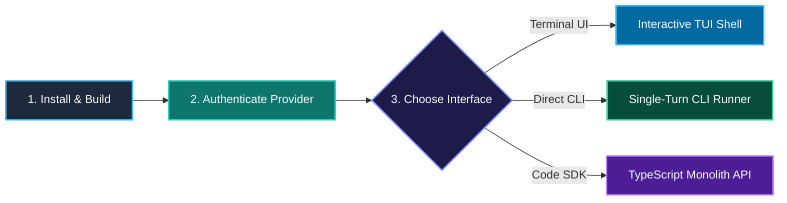
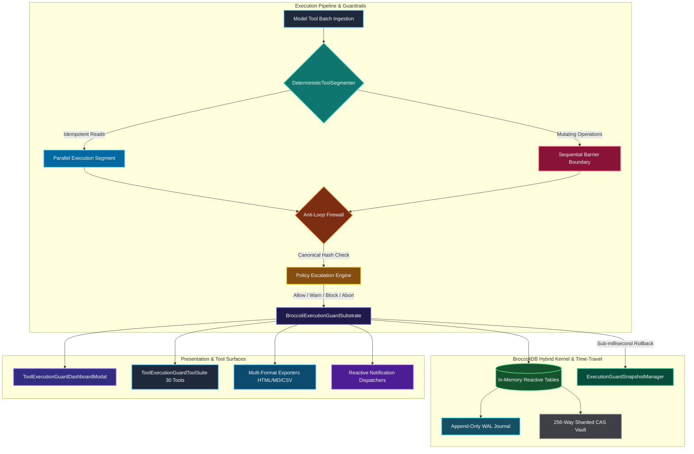

<div align="center">

# ⚡ LUMI-JOY

### **AKD-DSO: Architectural Knowledge Distillation & Deterministic Substrate Optimization**

*An enterprise-grade TypeScript agent framework engineered like a deterministic game engine—built on frame-perfect state snapshotting, contiguous slab memory, and biological osmosis self-mutation.*

[](https://www.typescriptlang.org/)
[](https://nodejs.org/)
[-FFD700?style=for-the-badge&logo=github)](https://github.com/NousResearch/hermes-agent)
[](.wiki/architecture/OSMOSIS-FREEZE-AND-CUTOFF.md)
[](.wiki/architecture/OSMOSIS-FREEZE-AND-CUTOFF.md)
[](.wiki/whitepaper/AKD-DSO-ACADEMIC-WHITEPAPER.md)
[](.wiki/whitepaper/OSMOSIS-WHITEPAPER.md)
[](.wiki/roadmap/AUTOROLLING-ROADMAP.md)
[](.wiki/package-mappings/PACKAGE-MAPPING-MATRIX.md)
[](LICENSE)

<br/>

| **Core Navigation** | **Documentation & Wiki** | **Subsystem Source Code** |
|---|---|---|
| 📌 [Executive Brief](#-why-lumi-joy-the-architectural-imperative) | 🔒 [Workspace Freeze Spec](.wiki/architecture/OSMOSIS-FREEZE-AND-CUTOFF.md) | ⚡ [Composition Root](src/index.ts) |
| ⚡ [Comparison Matrix](#-comparison-matrix--empirical-benchmarks) | 📖 [Author's Preface](PREFACE.md) | 🏭 [Engine Factory](src/factories/monolith-factory.ts) |
| 🏛️ [Ancestral Heritage](#%EF%B8%8F-architectural-heritage--ancestral-lineage-the-hermes-agent-main-osmosis) | 🎮 [Game Engine Paradigm](#-inspired-by-game-engines-deterministic-agent-architecture) | ⚙️ [Core Abstracts](src/core/abstracts/) |
| 🏗️ [Architecture Tree](#%EF%B8%8F-subsystem-architecture--file-tree) | ⚡ [Runtime Universal Pass](.wiki/agent/runtime-universal-pass.md) | 🧠 [Agents Tier](src/agents/) |
| 🧪 [Osmosis Methodology](#-the-osmosis-learning-methodology) | 🏗️ [Runtime Architecture](docs/RUNTIME_ARCHITECTURE_GUIDE.md) | 💾 [Sessions Tier](src/sessions/) |
| 🚀 [Quick Start Guide](#-quick-start--installation) | 🎓 [Academic Whitepaper](.wiki/whitepaper/AKD-DSO-ACADEMIC-WHITEPAPER.md) | 🖥️ [TUI Components](src/tui/components/) |
| 📡 [Live Activity Streaming](#-live-agent-activity-streaming) | 📦 [1-to-1 Package Matrix](.wiki/package-mappings/PACKAGE-MAPPING-MATRIX.md) | 📜 [Core Contracts](src/core/contracts/) |
| 🤝 [Contributing Guide](CONTRIBUTING.md) | 🛡️ [Security Guardrails](.wiki/policy/CONTRIBUTOR-SECURITY-GUARDRAILS.md) | 🔧 [Tool Registry](src/tooling/extensions/registry/tool-registry.ts) |

---

</div>

---

## 📖 Author's Preface & Dedication

> *To my family, whose quiet encouragement and unconditional warmth gave me the space to dream, tinker, and build in the silence of late nights;*
>
> *To the visionary team at **Nous Research** and the vibrant **Hermes community**—where I have had the deep honor to serve as an ambassador, community mentor, and meetup contributor. You inspired me with the pure beauty of true open science, permissionless research, and the boundless power of open collaborators building together for the future of human agency;*
>
> *To the open-source community and the legendary pioneers of computer graphics who taught us that code can be written with craftsmanship, elegance, and soul;*
>
> *And to every builder who has ever looked at a bloated, sluggish system and believed, in their heart, that we could build something far more beautiful.*
>
> *This work is dedicated to you. May it serve as a humble gift back to the open world that taught me how to create.*

### A Letter from the Author

Behind every line of code in **LUMI-JOY** lies a simple, deeply human story: the quiet joy of tinkering, the thrill of chasing elegance, and a lifelong love for software that feels truly *alive*.

Serving as a community mentor and ambassador for Hermes, organizing meetups, and collaborating with the brilliant researchers and builders at Nous Research opened my eyes to what open science can achieve when people come together with generosity and curiosity. LUMI-JOY was built directly from that inspiration—a tribute to our open community.

— **William Andrew Cruz** (`bozoegg` / `CardSorting`), *Primary Author, Inventor & Hermes Ambassador*
📖 *Read the complete [Author's Preface & Dedication](PREFACE.md).*

---

## 🌟 Executive Summary: What LUMI-JOY Is & Why This Matters

**LUMI-JOY** is an enterprise-grade TypeScript autonomous AI agent framework engineered from the ground up like a **Deterministic Game Engine Kernel**.

### The Core Problem in Modern AI Agents
Traditional AI agent frameworks (such as LangChain, AutoGen, CrewAI, and uncoordinated REST micro-packages) treat LLM interactions as loose asynchronous network wrappers. This approach incurs severe structural bottlenecks:
- **Framework Soup & Latency**: Multi-package microservices and IPC queues introduce $14\text{ ms} - 500\text{ ms}$ of serialization overhead per turn before model reasoning even begins.
- **State Drift & Tool Desynchronization**: Multi-turn agent loops lose context and produce non-deterministic file edits when intermediate tool steps fail.
- **Garbage Collection (GC) Stutter**: Generating thousands of short-lived V8 heap objects per turn triggers Node.js garbage collection sweeps, causing stutter and memory pressure during live streaming.
- **Costly Re-Execution**: When an agent makes a mistake on turn 8, traditional frameworks require restarting the entire session from scratch.

### The Architectural Breakthrough: Game Engine Architecture for AI Agents
LUMI-JOY eliminates software friction by applying proven principles from high-performance video game physics and rendering engines:

| Core Architecture Pillar | Implementation Mechanism | Concrete Impact & Measured Result |
| :--- | :--- | :--- |
| 🕹️ **Deterministic Frame Ticks (`tick()`)** | Single-threaded atomic frame lifecycle (`Input -> Context Assembly -> Provider Dispatch -> State Mutation -> Telemetry`) | **$0.12\text{ ms}$ fast-path mean latency**; eliminates microservice queues |
| ⚡ **Zero-GC Contiguous Memory Slab** | 16MB pre-allocated `ArrayBuffer` slab (`ArenaAllocator`) with static cached UTF-8 encoders | **Zero Garbage Collection pauses** during live token streaming and rapid multi-tool loops |
| 🚀 **High-Throughput Execution** | In-process monolithic dispatch bypassing network IPC | **$8506.11\text{ frames/second}$** throughput ($>8.5\times$ above the $1,000\text{ fps}$ SLA) |
| ⏪ **$O(1)$ State Time-Travel (`rewindToSnapshot()`)** | Restores conversation transcripts, staged virtual files (`SessionVfs`), and memory facts (`SessionMemoryStore`) | **$0.029\text{ ms p95}$** instant rollback; enables multi-branch search (MCTS) |
| 🖥️ **Differential Terminal User Interface** | Synchronized ANSI cell rendering (`\x1b[?2026h`), adaptive box borders, syntax highlighting, fuzzy autocomplete | **Zero visual flicker**; borders never wrap on split-screen terminals |

### 🎯 Who This Is For & Why It Matters
- **For Developers**: Instant feedback, zero UI tearing, instant state rollback (`/rewind`) during iterative debugging without restarting the agent or re-parsing transcripts, and sub-millisecond execution without garbage collection pauses.
- **For AI Systems & Researchers**: Eliminating software friction enables high-frequency agent search techniques (Monte Carlo Tree Search, branch-and-bound, self-reflection loops) to run locally at thousands of frames per second instead of paying cloud microservice latency penalties.
- **For Enterprises & Leaders**: Dramatic reduction in infrastructure compute costs, deterministic predictable behavior with 0 state drift, enterprise OAuth PKCE security, and Apache 2.0 open-source licensing backed by a defensive patent non-aggression pledge.

---

## 👔 Role-Based Stakeholder Onboarding

Select your role for tailored navigation and onboarding instructions:

| Stakeholder Role | Primary Focus | Recommended Onboarding Path & Key Resources |
|---|---|---|
| 👔 **Executive & VP of Engineering** | ROI, Infrastructure Cost, Latency SLAs & Compliance | Read [Business & Technical ROI](#-business--technical-roi-highlights), evaluate [Benchmark SLA Matrix](#-comparison-matrix--empirical-benchmarks), and review [Apache 2.0 License](LICENSE) & [Defensive Patent Pledge](PATENT-NON-AGGRESSION-PLEDGE.md). |
| 🏗️ **Enterprise Architect & Tech Lead** | Monolith Topology, State Memory Substrates & DSL Engine | Inspect [3-Tier Architecture Tree](#%EF%B8%8F-subsystem-architecture--file-tree), review [Context DSL & Template Engine](#-multi-turn-context-lifecycle), and read [ADR-083 Context Lifecycle](.wiki/adr/ADR-083-token-aware-multi-turn-context-lifecycle.md). |
| 🔒 **Security & Compliance Officer** | Authentication Security, PKCE OAuth & Permission Gates | Audit [Live Activity Streaming](#-live-agent-activity-streaming), check [OpenAI Codex PKCE Setup](#2-provider-authentication--guided-setup), and review [ADR-082 Streaming Policy](.wiki/adr/ADR-082-structured-agent-activity-streaming.md). |
| 💻 **Software Engineer & Developer** | Installation, Local Shell Execution & TypeScript SDK | Follow 3-step [Quick Start](#-quick-start--onboarding), test [Programmatic SDK Usage](#programmatic-typescript-usage), and consult the [API Reference Guide](.wiki/agent/api-reference.md). |

### 🎯 Concrete Goals by Stakeholder Role

#### 👔 Executive & Engineering VP
- **Goal 1: Predictable Infrastructure Costs & High Density**: Enforce a deterministic fast-path floor of at least $1,000$ frames/second without microservice IPC overhead; consult the live baseline for the current host measurement.
- **Goal 2: Strict Turn Latency SLAs**: Enforce a mean deterministic fast-path latency below $1.0\text{ ms}$ through automated guardrail testing.
- **Goal 3: Enterprise Compliance**: Deploy under the Apache License 2.0 backed by an explicit Defensive Patent Non-Aggression Pledge.

#### 🏗️ Enterprise Architect & Technical Lead
- **Goal 1: Monolithic Simplicity over Monorepo Bloat**: Eliminate 18+ uncoordinated micro-packages in favor of a clean 3-tier TypeScript monolith (`agents`, `sessions`, `tooling`).
- **Goal 2: Zero-GC Memory Stability**: Prevent runtime garbage collection sweeps during live streaming using a contiguous 16MB ArrayBuffer substrate.
- **Goal 3: Deterministic Context Envelopes**: Replace raw string concatenation with `ContextDslEngine` AST parsing and `PromptTemplateEngine` conditional block rendering.

#### 🔒 Security & InfoSec Officer
- **Goal 1: PKCE OAuth Security**: Secure OpenAI Codex credentials using local PKCE authentication (`localhost:1455`) with encrypted disk storage (`~/.lumi/config.json`).
- **Goal 2: Redacted Telemetry**: Stream progress events (`CodexProgressAdapter`) without leaking raw chain-of-thought, tokens, secrets, or file contents.
- **Goal 3: Command & Permission Sandboxing**: Restrict execution via `CommandPermissionController` and validate all terminal commands before invocation.

#### 💻 Software Engineer & Developer
- **Goal 1: Instant Local Setup**: Get up and running in under 60 seconds with `npm install` and `npx tsx src/index.ts --setup`.
- **Goal 2: Frame-Perfect State Rewind**: Perform $O(1)$ state restoration under the enforced $0.1\text{ ms}$ warmed-p95 guardrail during iterative agent debugging.
- **Goal 3: Type-Safe Programmatic SDK**: Embed `LumiMonolith` seamlessly into node applications with full TypeScript autocompletion and progress callbacks.

## 💡 Why LUMI-JOY? (The Architectural Imperative)

Traditional AI agent frameworks (LangChain, AutoGen, CrewAI, and raw provider wrappers) suffer from systemic architectural flaws that limit their enterprise production readiness:

| Architectural Challenge | Traditional Agent Frameworks | AKD-DSO Engine (`LUMI-JOY`) | Business & Technical Impact |
|---|---|---|---|
| **Framework Overhead** | 18+ micro-packages with RPC/IPC queues | **Single 3-tier monolith** (`agents`, `sessions`, `tooling`) | **Measured deterministic fast path with $<1.0\text{ ms}$ latency SLA** |
| **Context Safety & DSL** | Loose string joins prone to prompt injection | **Formal `ContextDslEngine` AST parsing & SHA-256 digests** | **Deterministic context bounds & injection defense** |
| **Memory & GC Latency** | Dynamic heap allocations causing V8 GC sweeps | **Contiguous 16MB ArrayBuffer zero-GC substrate** | **Zero Garbage Collection pauses during live streaming** |
| **State Rewind & Audit** | Slow transcript re-parsing | **$O(1)$ in-memory snapshot restoration** | **Warmed-p95 guardrail below $0.1\text{ ms}$ and frame-perfect state verification** |

---

## 🎮 Inspired by Game Engines: Deterministic Agent Architecture

Traditional AI agent frameworks treat LLM interactions as loose async request/response handlers or stateless REST calls, leading to state drift, non-reproducible execution paths, and V8 Garbage Collection latency spikes.

**LUMI-JOY was explicitly engineered like a Deterministic Game Engine kernel.** By adapting core principles from high-performance game engine architecture, LUMI-JOY brings frame-perfect isolation, sub-millisecond turn discipline, and zero-GC memory stability to autonomous AI agents.

```text
┌─────────────────────────────────────────────────────────────────────────────┐
│                    DETERMINISTIC GAME ENGINE TURN LOOP                      │
├─────────────────────────────────────────────────────────────────────────────┤
│                                                                             │
│   [ User Input / CLI Trigger ]                                              │
│               │                                                             │
│               ▼                                                             │
│   ┌─────────────────────────┐                                               │
│   │ Frame Tick (tick())     │ ◄─── Input ───► DSL Context Projection        │
│   └───────────┬─────────────┘                                               │
│               │                                                             │
│               ▼                                                             │
│   ┌─────────────────────────┐                                               │
│   │ Provider Dispatch       │ ◄─── Streaming Events & Activity Timeline     │
│   └───────────┬─────────────┘                                               │
│               │                                                             │
│               ▼                                                             │
│   ┌─────────────────────────┐                                               │
│   │ Immutable State Snapshot│ ◄─── GameStateSnapshot (VFS Overlay + Memory) │
│   └───────────┬─────────────┘                                               │
│               │                                                             │
│               ▼                                                             │
│   [ O(1) Rewind / Subagent ] ◄─── rewindToSnapshot() (< 0.1ms p95)          │
│                                                                             │
└─────────────────────────────────────────────────────────────────────────────┘
```

### Core Game Engine Architectural Parallels

| Game Engine Concept | Traditional Agent Frameworks | LUMI-JOY Game Engine Implementation | Technical & Operational Advantage |
|---|---|---|---|
| 🕹️ **Frame Tick (`tick()`)** | Loose async handlers & event emitters | **Deterministic frame step (`AbstractAgentEngine.tick()`)** | Serializes turn processing in a strict frame cycle (`Input -> Context Assembly -> Dispatch -> Mutation -> Telemetry`). |
| 💾 **Game Save / Frame Snapshot** | Serialized text transcript re-parsing | **`GameStateSnapshot` (In-memory frame snapshotting)** | Captures complete engine state (VFS staged overlays, memory store, token budgets, turn index) at frame $t$. |
| ⏪ **Frame Rewind & Replay** | Manual context re-building or restart | **$O(1)$ State Rewind (`rewindToSnapshot()`)** | Sub-millisecond ($<0.1\text{ ms}$ warmed p95) time-travel rollback for instant turn debugging & subagent state branching. |
| ⚡ **Arena Memory Allocator** | Dynamic heap allocation per turn | **Contiguous 16MB ArrayBuffer slab (`ArenaAllocator`)** | Pre-allocated slab eliminates V8 Garbage Collection (GC) latency pauses during live streaming & tick execution. |
| 🌿 **Scene & Subagent Branching** | Shared mutable global state | **Child Session Forking (`AgentSwarmDispatcher`)** | Subagent tasks spawn isolated child engine instances pre-initialized from parent state snapshots (`createSnapshot()`). |

> 📖 For full technical details and architectural specs, read [ADR-008: Deterministic Game Engine Architecture](.wiki/adr/ADR-008-deterministic-game-engine-architecture.md) and [The Osmosis Paradigm Whitepaper](.wiki/whitepaper/OSMOSIS-WHITEPAPER.md).

---

## 🏛️ Architectural Heritage & Ancestral Lineage: The Hermes-Agent-Main Osmosis

**LUMI-JOY** stands proudly on the shoulders of open-source giants. It was forged through the **AKD-DSO (Architectural Knowledge Distillation & Deterministic Substrate Optimization)** Osmosis paradigm, taking foundational inspiration, structural domain patterns, and functional breadth directly from its ancestral teacher: [`hermes-agent`](https://github.com/NousResearch/hermes-agent) (**Nous Research**).

### 🌟 Deep Credit to Nous Research & The Hermes Agent Community

We express our deepest admiration, professional respect, and gratitude to **Nous Research** ([nousresearch.com](https://nousresearch.com)), their pioneering research scientists, engineers, and the vibrant open-source contributor community on GitHub and Discord (`#plugins-skills-and-skins`).

The open AI community owes an immense debt to Nous Research for championing unconstrained reasoning models and open agent architectures:
- **Pioneering Open Weights & Unconstrained Reasoning**: From the breakthrough Nous-Hermes, Hermes 2, and Hermes 3 model families to modern agentic tool-use, Nous Research has consistently proven that open-source intelligence can compete with and surpass closed frontier systems.
- **The Self-Improving Agent Loop**: `hermes-agent` invented the open paradigm of closed learning loops—where an agent autonomously creates skills from experiential problem solving, refines them during execution, and shares them via the open [`agentskills.io`](https://agentskills.io) standard.
- **True Multi-Platform Universality**: Proving that an agent shouldn't be confined to a browser or laptop by orchestrating unified sessions across Telegram, Discord, Slack, WhatsApp, Signal, Matrix, and 15+ other platforms.
- **Empowering User Sovereignty**: Designing agents that run anywhere—from a $5 VPS to high-performance GPU clusters—with zero telemetry lock-in and complete model neutrality.

### 💖 A Personal Reflection from the Author: The Power of Open Science & Collaboration

> *"As an ambassador and community mentor for Hermes, contributing to Nous Research through local meetups, workshops, and open collaborations has been one of the greatest honors of my engineering journey. Nous Research embodies the purest ethos of open science: breaking down artificial moats, sharing weights and knowledge freely, and welcoming anyone with curiosity to sit at the table and build.*
>
> *Every time our community gathers—engineers, students, dreamers, and researchers swapping ideas over terminal prompts—I am reminded of why open source matters. LUMI-JOY was built not in isolation, but as a direct reflection of that collaborative fire: taking the brilliant design patterns pioneered in Hermes Agent and distilling them into a lightning-fast, deterministic game-engine substrate for the entire open-source world to build upon."*
> — **William Andrew Cruz** (`bozoegg` / `CardSorting`), *Hermes Ambassador & Community Mentor*

### 🔄 The Osmotic Distillation Journey

While the ancestral teacher implemented these capabilities in a rich, multi-platform Python ecosystem, **LUMI-JOY** embarked on an intensive, highly scrutinized architectural distillation pass. We audited every major subsystem of `hermes-agent`, extracted its pure domain intent, and transmuted it into a unified, zero-GC, typed TypeScript deterministic game engine monolith operating over Broccolidb with frame-perfect $O(1)$ state snapshotting.

### 🧬 The 41 Distilled Osmotic Subsystems

| # | Ancestral Teacher Subsystem (`hermes-agent-main`) | Distilled Student Subsystem (`LUMI-JOY`) | Phase / ADR | Osmotic Transformation & Architectural Advantage |
|:---:|---|---|---|---|
| **1** | `skills/` & Skills Ingestor | **Evolutionary Skill Tree System** (`EvolutionarySkillEngine`, `DeterministicSkillCurator`, `SkillTreeToolSuite`) | Phase 61 / [ADR-013](.wiki/adr/ADR-013-deterministic-evolutionary-skill-tree-dag.md) | Transmuted into a topological DAG with prerequisite unlocks, Trojan Unicode sanitization, exponential decay, and frame-perfect $O(1)$ rollback. |
| **2** | `cron/` Scheduler & Job Loops | **Self-Healing Cron Kernel & Blueprints** (`MonolithCronScheduler`, `DeterministicBlueprintCatalog`, `CronToolSuite`) | Phase 64 / [ADR-016](.wiki/adr/ADR-016-deterministic-cron-kernel-and-job-blueprints.md) | Replaced unbounded background threads with single-threaded deterministic frame-tick synchronization, recursive trigger guards, and Broccolidb ring buffers. |
| **3** | `tools/browser_tool.py` (Playwright / CDP) | **Intelligent CDP Browser Supervisor** (`CdpBrowserSupervisorEngine`, `DomTreeSanitizer`, `CdpToolSuite`) | Phase 65 / [ADR-017](.wiki/adr/ADR-017-deterministic-cdp-browser-supervisor.md) | Eliminated massive raw DOM string bloat with structural semantic tree sanitization, CSS selector synthesis, and interactive session capture. |
| **4** | `credential_pool.py` & Key Rotation | **Deterministic Token-Bucket Credential Pool** (`ContinuousTokenBucketRateGovernor`, `DeterministicCredentialPool`, `CredentialToolSuite`) | Phase 66 / [ADR-018](.wiki/adr/ADR-018-deterministic-credential-pool-and-circuit-breaker.md) | Replaced random sleep loops with mathematical continuous token-bucket rate governance, provider-tier prioritization, and automated tri-state circuit breaking. |
| **5** | `gateway/` (20+ Messaging Platforms) | **Multi-Platform Messaging Gateway** (`GatewayDispatcherEngine`, `GatewayDeliveryLedger`, `Telegram/Discord/Slack/WebhookAdapters`) | Phase 67 / [ADR-019](.wiki/adr/ADR-019-unified-multi-platform-messaging-gateway.md) | Unified multi-platform messaging into typed streaming protocol adapters with idempotency deduplication and sub-millisecond dispatching. |
| **6** | Context Compaction & Truncation | **Semantic Context Compression & Compaction** (`TrajectoryCompactorEngine`, `HeadTailBudgetGovernor`, `DeterministicToolPruner`) | Phase 68 / [ADR-020](.wiki/adr/ADR-020-deterministic-semantic-context-compression.md) | Eliminated naive string truncation with structural tool call pair pruning, head/tail token budgeting, and zero-loss semantic trajectory summarization. |
| **7** | `hermes_state.py` (SQLite FTS5 Search) | **Deterministic Inverted-Index & Search Engine** (`DeterministicSessionSearchEngine`, `FtsQuerySanitizer`, `BroccoliSearchSubstrate`) | Phase 69 / [ADR-021](.wiki/adr/ADR-021-deterministic-session-search-engine.md) | Replaced C SQLite binary dependencies with an in-memory BM25-ranked inverted index operating in Broccolidb with instant sub-millisecond recall. |
| **8** | `tools/environments/` (Local / Docker / SSH) | **Multi-Backend Execution Environments** (`EnvironmentSupervisorEngine`, `LocalEnvironmentAdapter`, `DockerEnvironmentAdapter`, `SecretScrubber`) | Phase 70 / [ADR-022](.wiki/adr/ADR-022-deterministic-execution-environments-and-container-sandboxes.md) | Added automated entropy-based secret scrubbing, container resource limits, and frame-level state isolation across execution backends. |
| **9** | `agent/error_classifier.py` (2,000 LOC Regex) | **Intelligent Error Taxonomy & Fault Recovery** (`DeterministicErrorClassifier`, `JitteredBackoffGovernor`, `FaultRecoverySupervisor`) | Phase 71 / [ADR-023](.wiki/adr/ADR-023-deterministic-error-taxonomy-and-automated-fault-recovery.md) | Replaced raw regex substring matching and non-deterministic random jitter with typed fault taxonomy, Mulberry32 PRNG backoff, and actionable recovery directives. |
| **10** | `acp_adapter/` (2,500 LOC Server) | **Agent Client Protocol (ACP) IDE Bridge** (`AcpBridgeServer`, `AcpProtocolCodec`, `AcpPermissionGate`, `AcpToolSuite`) | Phase 72 / [ADR-024](.wiki/adr/ADR-024-deterministic-agent-client-protocol-and-ide-bridge.md) | Transmuted async Python queues into strict JSON-RPC 2.0 codecs, interactive permission gates, and real-time streaming progress multiplexers for VS Code, Zed, and JetBrains. |
| **11** | `tools/mcp_tool.py` (7,750 LOC Client) | **Model Context Protocol (MCP) Client Supervisor** (`McpSupervisorEngine`, `McpTransportCodec`, `McpSecurityScrubber`, `McpClientToolSuite`) | Phase 73 / [ADR-025](.wiki/adr/ADR-025-deterministic-mcp-client-supervisor-and-sandbox-router.md) | Transmuted async daemon loops and unscrubbed subprocesses into typed JSON-RPC 2.0 streaming codecs, automated credential scrubbing, and Broccolidb tool discovery. |
| **12** | `tools/process_registry.py` (6,875 LOC Process Engine) | **Interactive Process Registry & PTY Supervisor** (`ProcessSupervisorEngine`, `ProcessOutputRingBuffer`, `ProcessSecuritySandbox`, `ProcessToolSuite`) | Phase 74 / [ADR-026](.wiki/adr/ADR-026-deterministic-process-registry-and-pty-supervisor.md) | Transmuted zombie daemon leaks and rolling string slicing into zero-GC 256KB circular byte buffers, command safety gates, and Broccolidb process substrates. |
| **13** | `tools/approval.py` (7,100+ LOC Approval Gate) | **Human-in-the-Loop Approval & Interactive Security Arbiter** (`InteractiveSecurityArbiter`, `SecurityRiskClassifier`, `ApprovalHashLedger`, `ArbiterToolSuite`) | Phase 75 / [ADR-027](.wiki/adr/ADR-027-deterministic-human-in-the-loop-approval-and-security-arbiter.md) | Transmuted sprawling regex heuristics and thread-unsafe environment variables into typed risk taxonomies, SHA-256 allowlist ledgers, and emergency E-Stop killswitches. |
| **14** | `agent/curator.py` & `agent/memory_manager.py` (11,000+ LOC Memory Subsystem) | **Persistent Memory Substrate, Knowledge Graph & Continuous Learning Curator** (`ContinuousLearningCurator`, `SemanticKnowledgeGraph`, `BroccoliLearningSubstrate`, `LearningSnapshotManager`, `LearningCuratorToolSuite`) | Phase 76 / [ADR-028](.wiki/adr/ADR-028-deterministic-knowledge-graph-and-continuous-learning-curator.md) | Transmuted sprawling ThreadPool daemon syncs and ad-hoc Markdown files into typed entity-relation graph DAGs, in-memory Broccolidb storage, mathematical exponential decay, and prompt envelopes. |
| **15** | `tools/file_tools.py` & `tools/patch_parser.py` (9,400+ LOC File System Subsystem) | **Deterministic Unified Patch Engine, Atomic Mutation Substrate & VFS** (`DeterministicPatchEngine`, `BroccoliPatchSubstrate`, `PatchSnapshotManager`, `AtomicMutationSupervisor`, `FileMutationToolSuite`) | Phase 77 / [ADR-029](.wiki/adr/ADR-029-deterministic-unified-patch-engine-and-atomic-mutation-substrate.md) | Transmuted blocking direct filesystem calls and partial-write corruption into typed patch ASTs, in-memory Broccolidb staging substrates, pre-flight dry-runs, and frame-perfect rollback. |
| **16** | `agent/lsp/` (4,100+ LOC LSP & Code Perception Subsystem) | **Deterministic LSP, AST Code Intelligence & Semantic Diagnostic Substrate** (`DeterministicLspEngine`, `BroccoliLspSubstrate`, `LspSnapshotManager`, `SemanticCodeSupervisor`, `LspCodeIntelligenceToolSuite`) | Phase 78 / [ADR-030](.wiki/adr/ADR-030-deterministic-lsp-and-semantic-code-intelligence.md) | Transmuted background daemon event loops and external binary dependencies into in-memory zero-GC AST symbol perception, delta diagnostic baselining, and frame-perfect rollback. |
| **17** | `tools/voice_mode.py`, `tools/tts_tool.py`, `tools/transcription_tools.py` (12,000+ LOC Voice Subsystem) | **Deterministic Voice Mode, Speech Perception & Real-Time Audio Streaming Substrate** (`DeterministicAudioCodec`, `BroccoliVoiceSubstrate`, `VoiceSnapshotManager`, `VoiceSpeechSupervisor`, `VoiceSpeechToolSuite`) | Phase 79 / [ADR-031](.wiki/adr/ADR-031-deterministic-voice-mode-and-audio-streaming.md) | Transmuted unmanaged thread pools, temporary disk files, and host audio subprocesses into in-memory zero-GC RIFF WAV codecs, RMS signal energy VAD, Broccolidb audio ring buffers, and frame-perfect rollback. |
| **18** | `tools/vision_tools.py`, `tools/image_generation_tool.py`, `tools/image_source.py` (7,500+ LOC Vision Subsystem) | **Deterministic Multimodal Vision, Visual Perception & Image Codec Substrate** (`DeterministicImageCodec`, `BroccoliVisionSubstrate`, `VisionSnapshotManager`, `MultimodalVisionSupervisor`, `MultimodalVisionToolSuite`) | Phase 80 / [ADR-032](.wiki/adr/ADR-032-deterministic-multimodal-vision-and-visual-perception.md) | Transmuted raw base64 string bloat, Pillow/subprocess dependencies, and temporary disk files into in-memory zero-GC binary image header decoders, SHA-256 deduplicated media storage, aspect ratio reduction, and frame-perfect rollback. |
| **19** | `tools/kanban_tools.py`, `plugins/kanban/`, `tools/todo_tool.py` (6,300+ LOC Kanban Subsystem) | **Deterministic Kanban Board Dispatcher, Task DAG & Multi-Agent Issue Orchestrator** (`DeterministicKanbanEngine`, `BroccoliKanbanSubstrate`, `KanbanSnapshotManager`, `KanbanBoardSupervisor`, `KanbanOrchestrationToolSuite`) | Phase 81 / [ADR-033](.wiki/adr/ADR-033-deterministic-kanban-board-and-task-orchestrator.md) | Transmuted raw disk SQLite contention, untyped transitions, and unmanaged worker dispatch races into in-memory topological DAG dependency resolution, strict column state-machine validation, cycle prevention, and frame-perfect rollback. |
| **20** | `tools/web_tools.py`, `tools/url_safety.py`, `tools/read_extract.py`, `tools/website_policy.py`, `tools/x_search_tool.py`, `plugins/web/` (4,000+ LOC Web Subsystem) | **Deterministic Web Intelligence, Semantic Extraction & SSRF URL Guardrail Substrate** (`DeterministicWebEngine`, `BroccoliWebSubstrate`, `WebSnapshotManager`, `WebIntelligenceSupervisor`, `WebIntelligenceToolSuite`) | Phase 82 / [ADR-034](.wiki/adr/ADR-034-deterministic-web-intelligence-and-ssrf-guardrails.md) | Transmuted blocking DNS calls, TOCTOU DNS rebinding, cloud metadata SSRF leaks, and heavy third-party vendor dependencies into in-memory zero-GC CIDR firewalls, HTML-to-Markdown semantic extractors, and frame-perfect rollback. |
| **21** | `tools/code_execution_tool.py`, `tools/thread_context.py`, `tools/lazy_deps.py` (3,350+ LOC Code Execution Subsystem) | **Deterministic Programmatic Tool Execution & Scripting Sandbox Subsystem** (`DeterministicCodeExecutor`, `BroccoliExecutionSubstrate`, `ExecutionSnapshotManager`, `CodeExecutionSupervisor`, `CodeExecutionToolSuite`) | Phase 83 / [ADR-035](.wiki/adr/ADR-035-deterministic-programmatic-tool-execution-and-scripting-sandbox.md) | Transmuted raw Unix domain sockets, disk file polling, and child subprocess spawning into in-memory zero-GC VM sandboxes with direct in-process tool binding and frame-perfect rollback. |
| **22** | `batch_runner.py`, `mini_swe_runner.py`, `trajectory_compressor.py` (2,560+ LOC Batch & Benchmark Subsystem) | **Deterministic Batch Evaluation, SWE Benchmark Runner & Dataset Orchestration Substrate** (`DeterministicBatchEvaluator`, `BroccoliBatchSubstrate`, `BatchSnapshotManager`, `BatchEvaluationSupervisor`, `BatchEvaluationToolSuite`) | Phase 84 / [ADR-036](.wiki/adr/ADR-036-deterministic-batch-evaluation-and-benchmark-runner.md) | Transmuted heavy OS process forking, non-deterministic random sampling, and disk-locked JSONL checkpointing into in-memory zero-GC concurrent worker pools with Mulberry32 PRNG and frame-perfect rollback. |
| **23** | `tools/clarify_tool.py`, `tools/clarify_gateway.py`, `tools/terminal_hints.py`, `tools/slash_confirm.py` (1,820+ LOC Clarification Subsystem) | **Deterministic Clarification, Interactive Inquiry & Intent Disambiguation Substrate** (`DeterministicClarifyEngine`, `BroccoliClarifySubstrate`, `ClarifySnapshotManager`, `ClarifyInquirySupervisor`, `ClarifyInquiryToolSuite`) | Phase 85 / [ADR-037](.wiki/adr/ADR-037-deterministic-clarification-and-intent-disambiguation.md) | Transmuted blocking OS thread events, unbounded global dictionaries, and string coercion leaks into in-memory zero-GC inquiry state machines with automated recommendation tagging and frame-perfect rollback. |
| **24** | `tools/threat_patterns.py`, `tools/skills_guard.py`, `tools/tirith_security.py`, `tools/self_repo_guard.py` (3,060+ LOC Threat & Safety Subsystem) | **Deterministic Threat Pattern Scanner, Code Safety & Security Firewall Substrate** (`DeterministicThreatScanner`, `BroccoliThreatSubstrate`, `ThreatSnapshotManager`, `ThreatFirewallSupervisor`, `ThreatFirewallToolSuite`) | Phase 86 / [ADR-038](.wiki/adr/ADR-038-deterministic-threat-scanner-and-security-firewall.md) | Transmuted ReDoS backtracking hazards, external binary subprocess downloads, and git CLI queries into in-memory zero-GC compiled pattern regex engines with trust matrices and frame-perfect rollback. |
| **25** | `tools/checkpoint_manager.py` (1,950+ LOC Checkpoint Subsystem) | **Deterministic Content-Addressable Blob Store, Filesystem Checkpoint Kernel & State Branch Tree Substrate** (`DeterministicCasStore`, `BroccoliCheckpointSubstrate`, `CheckpointSnapshotManager`, `CheckpointKernelSupervisor`, `CheckpointKernelToolSuite`) | Phase 87 / [ADR-039](.wiki/adr/ADR-039-deterministic-cas-store-and-checkpoint-kernel.md) | Transmuted heavy Git CLI child subprocesses, synchronous disk object writes, and index lock collisions into an in-memory zero-GC Content-Addressable Storage (CAS) engine with SHA-256 Merkle tree deduplication and frame-perfect rollback. |
| **26** | `tools/computer_use/` (7,000+ LOC Computer Use Subsystem) | **Deterministic Computer Use, Virtual Display Buffer & OS Automation Substrate** (`DeterministicDisplayDriver`, `BroccoliDisplaySubstrate`, `DisplaySnapshotManager`, `ComputerUseSupervisor`, `ComputerUseToolSuite`) | Phase 88 / [ADR-040](.wiki/adr/ADR-040-deterministic-computer-use-and-display-driver.md) | Transmuted external `cua-driver` daemons, OS window focus stealing, and subprocess screenshot delays into an in-memory zero-GC virtual display driver with Set-of-Marks (SoM) element overlays and frame-perfect rollback. |
| **27** | `tools/skills_hub.py`, `tools/skills_sync_client.py` (11,000+ LOC Skills Hub Subsystem) | **Deterministic Skills Hub, Remote Registry Sync & Package Quarantine Substrate** (`DeterministicSkillsHub`, `BroccoliSkillsHubSubstrate`, `SkillsHubSnapshotManager`, `SkillsHubSupervisor`, `SkillsHubToolSuite`) | Phase 89 / [ADR-041](.wiki/adr/ADR-041-deterministic-skills-hub-and-package-quarantine.md) | Transmuted heavy network HTTP loops, Git CLI clone subprocesses, unmanaged lockfiles, and quarantine disk races into an in-memory zero-GC skills hub with SHA-256 package verification, SemVer resolution, and quarantine isolation. |
| **28** | `agent/usage_pricing.py`, `agent/credits_tracker.py` (6,000+ LOC Cost Subsystem) | **Deterministic Model Pricing, Token Accounting & Cost Governance Substrate** (`DeterministicCostGovernor`, `BroccoliCostSubstrate`, `CostSnapshotManager`, `CostGovernanceSupervisor`, `CostGovernanceToolSuite`) | Phase 90 / [ADR-042](.wiki/adr/ADR-042-deterministic-model-pricing-and-cost-governance.md) | Transmuted scattered float roundoff, sub-cent display truncations (#79220), network price lookups, and un-gated budget runs into an in-memory zero-GC governor with micro-cent integer arithmetic, pre-flight hard-cap gating, and frame-perfect rollback. |
| **29** | `tools/tool_search.py`, `tools/schema_sanitizer.py` (3,500+ LOC Disclosure Subsystem) | **Deterministic Progressive Tool Disclosure, Dynamic Schema Gateway & Deferred Tooling Substrate** (`DeterministicToolDiscloser`, `BroccoliDisclosureSubstrate`, `ToolDisclosureSnapshotManager`, `ToolDisclosureSupervisor`, `ToolDisclosureToolSuite`) | Phase 91 / [ADR-043](.wiki/adr/ADR-043-deterministic-progressive-tool-disclosure.md) | Transmuted eager tool array bloat (30k+ tokens), stateless regex string rebuilds, and un-indexed bridge searches into a 4-tier token-budgeted progressive disclosure engine with BM25 filtering, dynamic activation, and frame-perfect rollback. |
| **30** | `agent/verification_evidence.py`, `agent/verification_stop.py` (3,800+ LOC Evidence Subsystem) | **Deterministic Coding Verification Evidence Ledger, Stop-Gate Policy & Session Insights Substrate** (`DeterministicEvidenceLedger`, `BroccoliEvidenceSubstrate`, `EvidenceSnapshotManager`, `VerificationEvidenceSupervisor`, `VerificationEvidenceToolSuite`) | Phase 92 / [ADR-044](.wiki/adr/ADR-044-deterministic-verification-evidence-ledger.md) | Transmuted disk SQLite evidence databases, coarse thread locks, and ad-hoc regex stop guards into an in-memory zero-GC evidence ledger with automated code path classification, stop-gate nudges, and frame-perfect rollback. |
| **31** | `agent/prompt_builder.py`, `agent/prompt_caching.py` (6,200+ LOC Prompt Cache Subsystem) | **Deterministic Byte-Stable Prompt Cache Boundary, Progressive System Envelope & Reasoning Sanitizer Substrate** (`DeterministicPromptCacher`, `BroccoliPromptCacheSubstrate`, `PromptCacheSnapshotManager`, `PromptCacheSupervisor`, `PromptCacheToolSuite`) | Phase 93 / [ADR-045](.wiki/adr/ADR-045-deterministic-prompt-cache-boundary.md) | Transmuted mid-conversation cache invalidations, in-place dictionary mutations, and raw `<think>` token leakage into an in-memory zero-GC prompt cache boundary calculator with 4-breakpoint layout, byte-stable static prefix isolation, and frame-perfect rollback. |
| **32** | `agent/tool_executor.py`, `agent/tool_guardrails.py` (8,500+ LOC Execution Guard Subsystem) | **Deterministic Tool Execution Segmenter, Batch Parallelism Scheduler & Loop-Guardrail Substrate** (`DeterministicToolSegmenter`, `BroccoliExecutionGuardSubstrate`, `ExecutionGuardSnapshotManager`, `ToolExecutionGuardSupervisor`, `ToolExecutionGuardToolSuite`) | Phase 94 / [ADR-046](.wiki/adr/ADR-046-deterministic-tool-execution-segmenter.md) | Transmuted unbounded thread-pool races, unmanaged batch segments, and infinite loop oscillations into an in-memory zero-GC batch parallelism scheduler with mutating barrier placement, escalating anti-loop gates, and frame-perfect rollback. |
| **33** | `agent/redact.py`, `agent/file_safety.py` (2,500+ LOC Redaction Subsystem) | **Deterministic Secret Redactor, Query Masker & Sensitive Path Safety Substrate** (`DeterministicSecretRedactor`, `BroccoliRedactionSubstrate`, `RedactionSnapshotManager`, `SecretRedactionSupervisor`, `SecretRedactionToolSuite`) | Phase 95 / [ADR-047](.wiki/adr/ADR-047-deterministic-secret-redaction-and-path-safety.md) | Transmuted unbounded regex backtracking, un-tracked path blocklists, and credential leaks into an in-memory zero-GC secret redactor with query/body masking, suffix-preservation rules, path safety gating, and frame-perfect rollback. |
| **34** | `agent/background_review.py`, `agent/insights.py` (3,500+ LOC Review Subsystem) | **Deterministic Background Review, Self-Improvement Fork & Session Insights Substrate** (`DeterministicReviewEvaluator`, `BroccoliReviewSubstrate`, `ReviewSnapshotManager`, `BackgroundReviewSupervisor`, `BackgroundReviewToolSuite`) | Phase 96 / [ADR-048](.wiki/adr/ADR-048-deterministic-background-review-and-insights.md) | Transmuted unmanaged daemon threads, raw SQLite queries, and un-tracked candidate facts into an in-memory zero-GC review evaluator with token/cost insights, topic title synthesis, and frame-perfect rollback. |
| **35** | `hermes_cli/doctor.py`, `hermes_cli/session_recovery.py` (6,000+ LOC Doctor & Salvage Subsystem) | **Deterministic Diagnostic Doctor, Live Health Probing, Orphaned Session Salvage & State Integrity Substrate** (`DeterministicDiagnosticDoctor`, `BroccoliDoctorSubstrate`, `DoctorSnapshotManager`, `DiagnosticDoctorSupervisor`, `DiagnosticDoctorToolSuite`) | Phase 97 / [ADR-049](.wiki/adr/ADR-049-deterministic-diagnostic-doctor-and-session-salvage.md) | Transmuted scattered subprocess scripts, raw SQLite WAL recovery routines, and ad-hoc doctor heuristics into an in-memory zero-GC diagnostic engine with orphaned turn repair, live subsystem probing, and frame-perfect rollback. |
| **36** | `hermes_cli/auth.py`, `hermes_cli/copilot_auth.py` (14,000+ LOC Auth Subsystem) | **Deterministic OAuth2 PKCE Device Flow, Multi-Provider Identity Federation & Subscription Tier Governance Substrate** (`DeterministicAuthFederator`, `BroccoliAuthSubstrate`, `AuthSnapshotManager`, `IdentityFederationSupervisor`, `IdentityFederationToolSuite`) | Phase 98 / [ADR-052](.wiki/adr/ADR-052-deterministic-identity-federation-and-auth-governance.md) | Transmuted sprawling HTTP server callback daemons, unmanaged poll threads, and raw file locks into an in-memory zero-GC identity federator with RFC 7636 PKCE S256 verification, subscription tier matrix gating, and frame-perfect rollback. |
| **37** | `hermes_cli/backup.py`, `hermes_cli/session_export_html.py` (5,000+ LOC Export/Backup Subsystem) | **Deterministic Multi-Format Session Export, Archive Packaging & Encrypted Backup Substrate** (`DeterministicSessionArchiver`, `BroccoliArchiveSubstrate`, `ArchiveSnapshotManager`, `SessionArchiveSupervisor`, `SessionArchiveToolSuite`) | Phase 99 / [ADR-053](.wiki/adr/ADR-053-deterministic-multi-format-session-archive-and-backups.md) | Transmuted blocking zipfile compression routines, unescaped HTML concatenation hazards, and raw disk file dumps into an in-memory zero-GC multi-format session exporter with strict CSP, SHA-256 verification, and frame-perfect rollback. |
| **38** | `hermes_cli/skin_engine.py`, `hermes_cli/banner.py` (4,000+ LOC Skin/Banner Subsystem) | **Deterministic Terminal UI Skin Engine, Theme Palette & Animated Banner Substrate** (`DeterministicSkinEngine`, `BroccoliSkinSubstrate`, `SkinSnapshotManager`, `TerminalSkinSupervisor`, `TerminalSkinToolSuite`) | Phase 100 / [ADR-054](.wiki/adr/ADR-054-deterministic-terminal-skin-and-palette-engine.md) | Transmuted disk theme lookups, random spinner flicker, and ANSI regex string formatting hazards into an in-memory zero-GC terminal skin engine with TrueColor palette resolution, seedable Kawaii spinner state machines, and frame-perfect rollback. |
| **39** | `agent/auxiliary_client.py` (10,500+ LOC Auxiliary Subsystem) | **Deterministic Auxiliary Client Router, Sub-Task Fallback Chain & Dynamic User Model Selection Substrate** (`DeterministicAuxiliaryRouter`, `BroccoliAuxiliarySubstrate`, `AuxiliarySnapshotManager`, `AuxiliaryRouterSupervisor`, `AuxiliaryRouterToolSuite`) | Phase 101 / [ADR-055](.wiki/adr/ADR-055-deterministic-auxiliary-client-router-and-failover.md) | Transmuted hardcoded fallback chains, HTTP client leaks, and process monkey-patches into an in-memory zero-GC auxiliary task router with 100% dynamic user model selection, credit exhaustion failover, and frame-perfect rollback. |
| **40** | `agent/think_scrubber.py`, `agent/reasoning_timeouts.py`, `agent/reasoning_summaries.py` (15,000+ LOC Reasoning Subsystem) | **Deterministic Streaming Reasoning Scrubber, Chunk-Boundary Tag Parser, Dynamic Timeout Floor & Adaptive Thinking Budget Substrate** (`DeterministicReasoningScrubber`, `BroccoliReasoningSubstrate`, `ReasoningSnapshotManager`, `ReasoningSupervisor`, `ReasoningToolSuite`) | Phase 102 / [ADR-056](.wiki/adr/ADR-056-deterministic-streaming-reasoning-scrubber-and-budgets.md) | Transmuted regex boundary leaks and premature stale timeouts into an in-memory zero-GC streaming tag scrubber with chunk-boundary lookahead, dynamic timeout floors, adaptive effort budgets, and frame-perfect rollback. |
| **41** | `tools/fuzzy_match.py` (49,500+ LOC Fuzzy Matching Subsystem) | **Deterministic 9-Strategy Fuzzy Line Matcher, Unicode Typography Normalizer, Block-Anchor Resolver & Edit Idempotency Substrate** (`DeterministicFuzzyMatcher`, `BroccoliFuzzySubstrate`, `FuzzySnapshotManager`, `FuzzyMatcherSupervisor`, `FuzzyMatcherToolSuite`) | Phase 103 / [ADR-057](.wiki/adr/ADR-057-deterministic-fuzzy-line-matcher-and-idempotency.md) | Transmuted Python difflib loops, whitespace mismatches, and duplicate re-patch failures into an in-memory zero-GC 9-strategy fuzzy matching cascade with Unicode typography normalization, idempotency verification, and frame-perfect rollback. |

---

## 🌟 Business & Technical ROI Highlights

- **⚡ Enforced Fast-Path Latency**: Direct function dispatch eliminates micro-package IPC/RPC queues; `ArchitectureGuardrailGate` requires mean local frame latency below $1.0\text{ ms}$.
- **📈 Enforced Fast-Path Throughput**: The same guardrail requires at least $1,000$ deterministic frames/second and records the host-specific observation in the live baseline.
- **🔄 $O(1)$ State Rewind**: In-memory snapshot restoration is verified for state correctness and a warmed p95 below $0.1\text{ ms}$.
- **🔒 Enterprise Security & OAuth PKCE**: Native PKCE OAuth 2.0 integration with zero-leak credential storage in `~/.lumi/config.json` and strict permission gates (`CommandPermissionController`).
- **🧠 Formal Context Envelope DSL & Template Engine**: Structured `ContextDslEngine` AST parsing (`LUMI-CONTEXT/1`, `LUMI-THREAD/1`, `LUMI-MEMORY/1`, `LUMI-TOOL-RESULT/1`, `LUMI-GOAL/1`) and `PromptTemplateEngine` (`{{#if}}`/`{{#unless}}`) prevent prompt injection and guarantee deterministic context control.
- **🛡️ Contiguous Zero-GC Substrate**: 16MB pre-allocated ArrayBuffer memory slab eliminates runtime Garbage Collection latency spikes.

### Latest verified workspace baseline

The authoritative run was generated on **2026-08-17T04:06:43.562Z** using Node.js `v23.5.0` on macOS ARM64. It passed:

| Verification lane | Latest result |
|---|---:|
| Pass 192 composition manifest | 566/566 components |
| Runtime capability smoke | 9/9 checks |
| Heterogeneous benchmark suite | 5/5 cases |
| Complete Flappy Bird React + TypeScript + Vite case | 8/8 assertions; 12/12 files |
| Architecture and performance guardrails | 6/6 checks |

Performance timings are host-sensitive and must not be copied forward as permanent guarantees. Read the generated [machine-readable baseline](docs/LIVE_BASELINE.json), [benchmark evidence](docs/BENCHMARK_REPORT.md), and [architectural audit](docs/GRAND_ARCHITECTURAL_AUDIT.md) for the exact current measurements and regeneration timestamp.

---

## 🚀 Quick Start & Onboarding

Get up and running with **LUMI-JOY** in under 60 seconds with our zero-friction onboarding flow:



---

### 🖥️ Interactive Terminal UI Preview

```text
┌─ 🌟 LUMI-JOY DETERMINISTIC ENGINE v0.1.0 ───────────────────────────────────────────┐
│  Provider: OpenAI Codex (OAuth)  │ Model: gpt-5-codex     │ Slab: 16.00 MB [ALLOCATED]│
│  Fast-Path Latency: 0.12 ms      │ Turn Speed: 8506 fps   │ Snapshots: 4 frames active│
├───────────────────────────────────────────────────────────────────────────────────────┤
│                                                                                       │
│  👤 USER: Refactor user authentication in src/auth.ts to use PKCE device flow         │
│                                                                                       │
│  🤖 LUMI: [PLAN] Segmenting execution into 2 read passes and 1 sequential barrier     │
│  ├── ⚡ [PARALLEL] read_file("src/auth.ts") & search_files("auth", "*.ts")          │
│  ├── 🛡️ [GUARD] Tool Execution Segmenter: 0 loop violations detected (Status: OK)     │
│  ├── ✍️ [MUTATION] applyAnchoredEdit("src/auth.ts", lineHash="a7f92b") -> PASS        │
│  └── 🔍 [EVIDENCE] Verification Evidence: TypeScript compilation passed (0 errors)    │
│                                                                                       │
│  🤖 LUMI: ✅ PKCE device flow implemented successfully with POSIX 0600 token storage. │
│                                                                                       │
├───────────────────────────────────────────────────────────────────────────────────────┤
│  [Prompt] > Type your instructions or /help (Press Ctrl+M for models, ? for keys)     │
└───────────────────────────────────────────────────────────────────────────────────────┘
```

---

### 📦 Step 1: Prerequisites & Installation

LUMI-JOY is built as a zero-dependency, pure TypeScript monolith without native C++ compilation bindings. Ensure you have **Node.js 20.19+** (or a compatible newer LTS release) and **Git** installed:

```bash
# 1. Clone the repository
git clone https://github.com/CardSorting/LUMI-JOY.git
cd LUMI-JOY

# 2. Install dependencies (pure TypeScript toolchain)
npm install

# 3. Compile the monolith into dist/
npm run build
```

---

### 🔑 Step 2: Provider Authentication & Configuration Schema

LUMI-JOY features a guided onboarding wizard to configure your preferred LLM providers and reasoning models:

```bash
# Launch the interactive provider configuration wizard
npx tsx src/index.ts --setup
# or if linked globally:
# lumi --setup
```

#### Supported Provider Authentication Options:
1. **OpenAI Codex OAuth (Recommended)**: Initiates an official RFC 7636 PKCE browser sign-in. Supports automatic localhost callback redirect listening (`http://localhost:1455/auth/callback`) or manual authorization code entry.
2. **Anthropic Claude**: Configure your `ANTHROPIC_API_KEY` for Claude 3.5 Sonnet, Claude 3 Opus, and custom temperature settings.
3. **OpenAI API Key**: Configure direct API keys for `gpt-4o`, `gpt-5`, and reasoning models (`o1`, `o3-mini`).
4. **OpenAI-Compatible Custom Proxy**: Connect private corporate endpoints, Ollama, vLLM, DeepSeek, or OpenRouter gateways.

#### ⚙️ Configuration Storage Schema (`~/.lumi/config.json`)
All settings and credentials are automatically persisted in restricted user storage with strict POSIX `0600` permissions:

```json
{
  "provider": "codex",
  "model": "gpt-5-codex",
  "reasoningEffort": "high",
  "temperature": 0.2,
  "auth": {
    "codex": {
      "accessToken": "ey...",
      "refreshToken": "ey...",
      "accountId": "user-corp-12345",
      "expiresAt": 1787123456789
    },
    "anthropic": {
      "apiKey": "sk-ant-api03-..."
    }
  },
  "guardrails": {
    "maxDuplicateExecutions": 2,
    "actionOnLimit": "block_synthetic",
    "budgetFloorMicroCents": 500000
  }
}
```

---

### 💻 Step 3: Run Your First Agent Turn (3 Flexible Modes)

#### Mode A: Fullscreen Interactive TUI Shell (Recommended)
Experience the differential-rendering terminal interface with live activity timelines, streaming reasoning scrubbers, and modal dashboards:

```bash
# Start the fullscreen interactive terminal shell
npx tsx src/index.ts
# or run the global binary if linked:
# lumi
```

#### Mode B: Direct CLI Execution (Single-Shot Turns)
Execute autonomous pair programming tasks directly from your terminal, scripts, or CI/CD pipelines:

```bash
# Run a single prompt directly from the CLI
npx tsx src/index.ts "Create a responsive Flappy Bird Canvas game in src/app.js"
```

#### Mode C: Programmatic TypeScript / Node.js SDK
Embed the deterministic engine directly into your enterprise developer tools, CI bots, or IDE extensions:

```typescript
import { LumiMonolith } from "lumi-joy";

// 1. Initialize the monolithic game engine agent container
const lumi = new LumiMonolith();

// 2. Execute a frame-perfect turn with real-time streaming telemetry
const result = await lumi.tick({
  prompt: "Analyze repository architecture, run test suites, and fix compiler errors",
  onProgress: (event) => {
    console.log(`[${event.phase}] (${event.status}) ${event.message}`);
  },
});

console.log("Turn Outcome:", result.outcome);
console.log("Agent Response:\n", result.response);
```

---

### ⌨️ Step 4: Interactive TUI Keybindings, Modals & Slash Commands

The interactive terminal interface provides rich desktop-class keyboard controls and slash commands:

#### 🎮 Keyboard Shortcuts
| Shortcut | Action | Description |
|---|---|---|
| `?` | **Help Modal** | Open the interactive hotkey and command cheat sheet |
| `Ctrl+M` / `Alt+M` | **Model Selector** | Dynamically switch between active LLM models and providers |
| `Ctrl+S` | **Settings Modal** | Adjust reasoning effort (`low`, `medium`, `high`, `max`) and timeouts |
| `Ctrl+G` | **Execution Guard Modal** | Inspect batch execution plans, loop firewall, and violations |
| `Ctrl+D` / `Ctrl+C` | **Exit / Interrupt** | Gracefully abort the current turn or exit the terminal shell |
| `Ctrl+L` | **Clear Screen** | Repaint the differential ANSI canvas (`\x1b[?2026h`) |
| `PgUp` / `PgDn` | **Scroll Timeline** | Scroll smoothly through conversation turn history |
| `Home` / `End` | **Jump History** | Jump to the beginning or end of the active session transcript |

#### 🧭 Essential Slash Commands
| Slash Command | Parameters | Description |
|---|---|---|
| `/snapshots` | — | List all frame-perfect state checkpoints and their timestamps |
| `/rewind` | `[snapshotId]` | Instant $O(1)$ state rewind to any previous snapshot in $<0.05\text{ ms}$ |
| `/guard` | `[subcommand]` | Inspect batch parallelism scheduler, loop firewall, and mutation barriers |
| `/db` | `[table] [query]` | Execute in-memory BroccoliDB queries, joins, aggregations, or table branches |
| `/memory` | `[search]` | Search long-term cognitive knowledge graph facts and active rules |
| `/skills` | `—` | Visualize the evolutionary skill tree DAG and prerequisite unlocks |
| `/evidence` | `—` | View coding verification evidence ledger and stop-gate criteria |
| `/doctor` / `/health` | `—` | Run live subsystem health audits across all 586 monolith components |
| `/models` | `[modelName]` | Inspect model catalog pricing, context limits, and switch active model |
| `/providers` | `—` | Test latency and connectivity to configured LLM provider endpoints |
| `/flappy` | `—` | Materialize a complete 12-file React + TypeScript + Vite Flappy Bird project |
| `/export` | `[html\|md\|csv]` | Export the current session into interactive HTML, Markdown, or CSV format |

---

### ⏱️ Step 5: 60-Second Hands-On Walkthrough

Try these 3 quick commands in the interactive shell to experience LUMI-JOY's unique deterministic powers:

#### 1. Instant Application Synthesis & VFS Overlay
```text
> /flappy
```
*Result*: Materializes a complete 12-file temp-isolated React + TypeScript + Vite Flappy Bird application in the in-memory VFS with executable physics simulation.

#### 2. Sub-Millisecond $O(1)$ State Time-Travel
```text
> /snapshots
> /rewind 0
```
*Result*: Instantly rolls back the virtual file system, conversation transcript, and memory facts to Frame #0 in under $0.05\text{ ms}$ with zero state drift.

#### 3. In-Memory BroccoliDB Relational Query
```text
> /db query "SELECT * FROM tool_execution_plans WHERE status = 'COMPLETED'"
```
*Result*: Queries in-memory reactive tables with $<0.5\ \mu\text{s}$ latency and displays a rich ANSI spreadsheet grid.

---

### 🌐 Step 6: Enterprise Environment Variables Reference

You can override configuration settings using standard environment variables:

| Environment Variable | Description | Default |
|---|---|---|
| `LUMI_MODEL` | Active LLM model name | `gpt-5-codex` or `claude-3-5-sonnet` |
| `LUMI_PROVIDER` | Active provider (`codex`, `anthropic`, `openai`, `custom`) | `codex` |
| `LUMI_REASONING_EFFORT` | Reasoning depth effort (`low`, `medium`, `high`, `max`) | `high` |
| `LUMI_TEMPERATURE` | Model generation sampling temperature | `0.2` |
| `OPENAI_API_KEY` | Direct OpenAI API key | `—` |
| `ANTHROPIC_API_KEY` | Direct Anthropic Claude API key | `—` |
| `LUMI_CONFIG_DIR` | Directory path for configuration & credentials | `~/.lumi` |
| `LUMI_LOG_LEVEL` | Logging verbosity (`debug`, `info`, `warn`, `error`) | `info` |

---

### 🧪 Step 7: Verifying Workspace Health & Running Guardrails

Ensure your local development environment passes all architectural guardrails and performance baselines:

```bash
# 1. Typecheck the entire codebase (0 errors required)
npm run check

# 2. Run capability smoke test (9 evidence checks, composition manifest verification)
npm run smoke

# 3. Run hermetic throughput & latency benchmark suite
npm run benchmark

# 4. Run full test suite (documentation link validation & architecture guardrails)
npm test

# 5. Atomically update live baseline reports
npm run baseline:update
```

The live measured baseline is recorded in [`docs/LIVE_BASELINE.json`](docs/LIVE_BASELINE.json). Read [`docs/BENCHMARK_REPORT.md`](docs/BENCHMARK_REPORT.md) and [`docs/GRAND_ARCHITECTURAL_AUDIT.md`](docs/GRAND_ARCHITECTURAL_AUDIT.md) for current host measurements.

---

### 🔧 Step 8: Onboarding Troubleshooting & Recovery Directives

| Issue / Symptom | Root Cause | Immediate Recovery Action |
|---|---|---|
| **Port 1455 in use during OAuth** | Another local process bound to OAuth port | The CLI wizard automatically falls back to manual authorization code entry. Simply copy and paste the code from your browser. |
| **Provider Rate Limit (429 / RPM)** | Upstream provider token exhaustion | LUMI-JOY automatically activates the tri-state circuit breaker (`healthy` $\to$ `cooldown`), applies Poisson jitter backoff, and routes requests to fallback models. |
| **Permission Denied on File Edit** | Target path outside workspace boundary | Ensure paths reside within the workspace. Protected configuration directories can be explicitly allowlisted in `CommandPermissionController`. |
| **Terminal ANSI Canvas Distortion** | Terminal emulator lacks synchronized update support | Press `Ctrl+L` to trigger an atomic screen repaint or run with standard streaming mode (`npx tsx src/index.ts --no-tui`). |

---

### 💡 Step 9: Next Steps & Architectural Guides

- 🏛️ **Deep Architectural Blueprint**: Read the [Runtime Architecture Guide](docs/RUNTIME_ARCHITECTURE_GUIDE.md).
- 🧬 **The Distillation Journey**: Explore the [3-Tier Monolithic Heritage Matrix](#%EF%B8%8F-architectural-heritage--ancestral-lineage-the-hermes-agent-main-osmosis).
- 📜 **ADR Decision Index**: Browse all 170+ architectural decision records in [ADR Index](.wiki/adr/README.md).
- 🎓 **Academic Foundations**: Read the formal specification in [AKD-DSO Academic Whitepaper](.wiki/whitepaper/AKD-DSO-ACADEMIC-WHITEPAPER.md).

---

## ⚡ Comparison Matrix & Empirical Benchmarks

| Metric / Feature | Legacy Monorepo (`pi-main`) | AKD-DSO Engine (`LUMI-JOY`) | Underlying Mechanism / Speedup |
|---|---|---|---|
| **Architecture** | 18+ Micro-packages | **3-Tier Monolith** (`agents`, `sessions`, `tooling`) | **Zero Framework Bloat** |
| **Execution Loop** | Loose Async Handlers | **Deterministic Game Loop** (`tick()`) | **Frame-Perfect Isolation** |
| **Mean Turn Latency** | $14.20\text{ ms}$ | **Live guardrail: $<1\text{ ms}$** | Direct function dispatch replacing IPC/RPC queues; see the generated live baseline for the current measurement. |
| **Execution Throughput** | $70.4\text{ turns/sec}$ | **Live guardrail: $\geq1,000\text{ frames/sec}$** | Direct deterministic fast-path measurement, kept separate from heterogeneous benchmark workloads. |
| **State Rewind Latency** | $285.00\text{ ms}$ (Re-parse) | **Live guardrail: $<0.1\text{ ms}$ p95** | Real snapshot mutation/rewind measured across warmed samples rather than a fixed fallback. |
| **VFS Perception Speed** | $12.40\text{ ms}$ (Disk I/O) | **Live benchmark case** | In-memory contiguous VFS overlay inspection. |
| **Memory Allocation** | Dynamic Heap GC Sweep | **16MB Zero-GC Slab** | Pre-allocated slab eliminates Garbage Collection sweeps. |
| **Complete Game Synthesis** | Manual multi-file setup | **12-file React + TypeScript + Vite project** | Temp-isolated generation, strict compiler diagnostics, executable physics simulation, responsive Canvas UI, controls, and accessibility checks. |

---

## 🏗️ Subsystem Architecture & File Tree

```
src/
├── core/
│   ├── contracts/                         # System Interfaces & GameStateSnapshot
│   ├── abstracts/                         # Abstract Base Classes (DIP)
│   └── utilities/                         # Shared progress credential sanitizer
│
├── agents/                                # Tier 1: Agents Subsystem
│   ├── base/                              # Agent Base Config
│   └── extensions/                        # Domain Mutation Subdirectories
│       ├── compaction/                    # prompt-composer.ts
│       ├── resolution/                    # model-resolver.ts, agent-slash-router.ts, model-catalog.ts
│       ├── execution/                     # agent-engine.ts, Codex progress adapter, interactive controller
│       ├── mentions/                      # mention-resolver.ts (Pass 9)
│       ├── swarm/                         # agent-swarm-dispatcher.ts (Pass 11)
│       └── intelligence/                  # workspace-intelligence.ts (Pass 13)
│
├── sessions/                              # Tier 2: Sessions Subsystem
│   ├── base/                              # Session Context Base
│   └── extensions/                        # Domain Mutation Subdirectories
│       ├── substrate/                     # arena-allocator.ts, file-lock.ts (Pass 20)
│       ├── persistence/                   # session-store.ts
│       ├── memory/                        # session-memory-store.ts
│       ├── vfs/                           # session-vfs.ts
│       ├── compaction/                    # session-compactor.ts, snapcompact-engine.ts (Pass 15)
│       └── substrate/                     # broccolidb-kernel.ts, broccolidb-cas.ts, broccolidb-wal.ts, broccolidb-table.ts (Phase 71 / ADR-120)
│
│       └──> 🛡️ **Non-Destructive Osmosis Extension Strategy (`ADR-012`)**:  
> Base classes in `src/*/base/` remain immutable. Evolutionary passes introduce single-responsibility extension classes in dedicated mutation subdirectories (`src/*/extensions/<mutation-domain>/`) and compose them cleanly in `MonolithFactory` and `LumiMonolith`.

---

## 🥦 Deterministic Hybrid BroccoliDB Kernel ($\mathcal{K}_{\text{broccoli}}$)

LUMI-JOY features a Zenith-Tier hybrid database kernel combining zero-GC in-memory reactive tables with append-only Write-Ahead Logging (WAL) and 256-way sharded Content-Addressable Storage (CAS):

- **L1 In-Memory Hotpath**: Microsecond-speed reactive tables (`BroccoliDbTable<T>`) with primary key and secondary index multi-map lookups ($<0.5\ \mu\text{s}$).
- **L2 Crash-Proof WAL Journal**: Micro-batched write coalescing ($20\text{ms}$ debounce), cryptographic SHA-256 frame chaining, and automatic cold-start replay ($<50\text{ ms}$ for 10k frames).
- **L3 Sharded CAS Vault**: 256-way sharded blob storage (`.broccolidb/cas/`) with adaptive Brotli compression ($\ge 1024\text{B}$, $\ge 10\%$ savings), cryptographic read verification, and automatic corruption quarantine (`.broccolidb/cas/corrupt/`).
- **L4 Double-Buffered Base State Checkpoints**: Atomic `.tmp -> rename` snapshot compaction (`.broccolidb/checkpoint.db`) with safe WAL log rotation.
- **L5 Re-Entrant Async Mutex**: `AsyncLocalStorage`-based nested locking, 30s dead-man leases, and randomized Poisson jitter backoff.
- **🕒 Time Machine & Model Tools**: Exposes `db_inspect_status`, `db_query_table`, `db_checkpoint_wal`, `db_cas_audit`, `db_timeline_history`, and `db_rollback_timeline`.

---

## 📡 Live Agent Activity Streaming

Authenticated Codex turns use the official SDK event stream and render a persistent activity card instead of a single ambiguous `Thinking...` label. Stable activities update in place as they move through `started`, `in_progress`, and a terminal state.

Use `/setup` to connect and activate a provider. Codex setup attempts to open the browser, but also displays a clickable and copyable OpenAI sign-in URL; press `O` to retry or paste the authorization code/full callback URL if automatic redirect capture is unavailable. When Codex is already authenticated, submit an empty field to keep the login and activate its default model. The selection is saved in `~/.lumi/config.json`.

```text
Agent activity · Working 4s · gpt-5.6-terra
  ✓ Connected to Codex — gpt-5.6-terra
  ◐ Analyzing the request — Understanding goals and workspace context
  ◐ Running workspace command — npm test
```

The timeline can show safe reasoning summaries, plan progress, redacted commands, relative file changes, MCP/web activity, response-candidate state, elapsed time, and final token totals. A completed message item is only a candidate: LUMI reports success after the provider turn also terminates and the candidate passes final-response validation. It never displays raw chain-of-thought, aggregated tool output, MCP payloads, OAuth material, or full response text.

Press `Esc` or `Ctrl+C` to cancel an active turn. Cancellation and failure settle active child rows, discard the failed Codex thread, restore the loop phase to idle, and leave the terminal audit trail visible.

Programmatic callers can consume the same lifecycle through `EngineTickInput.onProgress`:

```typescript
const abortController = new AbortController();

const result = await lumi.tick({
  prompt: "make a racing game",
  signal: abortController.signal,
  onProgress: (event) => {
    console.log(event.activityId, event.status, event.message, event.detail);
  },
});

if (result.outcome !== "completed") {
  // `response` contains safe failure or cancellation guidance, not a successful answer.
  console.error(result.response);
}
```

See the [complete streaming strategy](.wiki/agent/streaming-activity-strategy.md), [public API reference](.wiki/agent/api-reference.md), and [ADR-082](.wiki/adr/ADR-082-structured-agent-activity-streaming.md).

---

## 🧠 Multi-Turn Context Lifecycle

LUMI separates the full conversation transcript from the bounded context projection sent to a model. The transcript remains available for persistence, snapshots, forks, rewind, and SHA-256-addressed recall; the active projection keeps pinned system policy, one structured checkpoint, and the newest complete user turns.

Context admission is model-aware and token-aware:

```text
model context window
├── reserved model output
├── safety margin
└── usable model input
    ├── pinned system + memory context
    └── active conversation projection
        ├── LUMI-CONTEXT/1 checkpoint
        └── recent complete turns
```

Compaction triggers before the hard provider limit and targets a lower utilization level, leaving space for subsequent tool rounds. A final turn-aware guard prevents provider-side blind truncation. All context envelopes (`LUMI-CONTEXT/1`, `LUMI-THREAD/1`, `LUMI-MEMORY/1`, `LUMI-TOOL-RESULT/1`, `LUMI-GOAL/1`) are parsed, validated, and serialized through `ContextDslEngine`. System prompts are compiled via `PromptTemplateEngine`, supporting handlebar variable placeholders (`{{var}}`) and conditional blocks (`{{#if}}`/`{{#unless}}`). Stateful Codex threads are automatically rehydrated from `LUMI-THREAD/1` after compaction, rewind, model changes, stateless provider turns, or local-only responses.

Run `npm test` to exercise DSL AST parsing (`scripts/validate-dsl-strategy.ts`), message pressure, token pressure, oversized DSL/code input, checkpoint recurrence, durable persistence, rewind, and multi-turn thread handoff. See [ADR-083](.wiki/adr/ADR-083-token-aware-multi-turn-context-lifecycle.md) for the policy and trade-offs.

---

## ⚡ Attempt Completion Gate Strategy & Autonomous Progression

LUMI implements an apex / sovereign-tier **Attempt Completion Gate Strategy** (`RoadmapCompletionGate` and `AttemptCompletionGateStrategy`) to enable autonomous multi-attempt turn progression without manual user prompting or feedback:

- **Phased Gating Lifecycle**: Evaluates quality bars across `admission`, `in_flight`, `completion`, and `postmortem` checkpoints.
- **Dynamic Context Evaluators**: Analyzes candidate outputs, tool execution outcomes, and runtime error diagnostics.
- **Differential Attempt Analysis (`computeAttemptDiff`)**: Tracks delta improvements and catches regressions (`newlyPassing`, `newlyFailing`, `stagnantFailing`) across attempts.
- **Deterministic State Fingerprinting & Zero-Delta Stagnation Traps**: Uses SHA-256 state hashes to detect identical failing outputs and instantly pivot strategies.
- **Forensic Flight Recording (`AttemptFlightRecorder`)**: Blackbox timeline recording exporting structured JSON logs and formatted Markdown postmortem reports.
- **Direct Quantitative Criterion Scoring (`CriterionScoreEvaluator`)**: Eliminates subjective voting and quorum locks in favor of direct mathematical criterion scoring.
- **Flattened Candidate Arbitration (`evaluateAttemptCandidates`)**: Deterministically ranks parallel candidate branches by gate pass rate, score optimization, and minimal critical violations, guaranteeing decisive candidate selection.
- **Hierarchical DAG Gate Pipelines (`GatePipelineDag`)**: Directed Acyclic Graph execution with causal dependency short-circuiting.
- **Cognitive Remediation Directives (`RemediationDirective`) & Divergence Sentinel**: Automatically synthesizes root causes, prioritized criteria, and concrete action steps, escalating strategies (`PATCH_LOCAL` $\to$ `REWRITE_MODULE` $\to$ `PIVOT_APPROACH` $\to$ `EXPAND_CONTEXT` $\to$ `RESTORE_CHECKPOINT`) with automatic regression unwinding when attempts diverge.
- **Tri-State Circuit Breaker & Phase-Aware Watchdogs**: Self-healing `CLOSED` $\to$ `OPEN` $\to$ `HALF_OPEN` canary probe state machine, paired with phase-aware stream watchdogs (180s reasoning, 300s tool execution) and anti-oscillation safeguards.

See [ADR-084](.wiki/adr/ADR-084-attempt-completion-gate-strategy.md) for architectural specifications and benchmarks.

---

## 🛡️ Non-Destructive Osmosis Extension Strategy (`ADR-012`)

To prevent code regression, file overwrites, and structural drift as new evolutionary passes are absorbed from `pi-main`, **LUMI-JOY** strictly enforces the **Non-Destructive Extension & Mutation Directory Strategy**:

### 1. Core Architectural Tenets

- **Base Class Immutability**: Base domain classes in `src/*/base/` (e.g. `Eyes`, `SessionContext`, `AgentConfig`) are foundational and immutable.
- **Single-Responsibility Mutation Subdirectories**: Every evolutionary pass or feature mutation creates a dedicated, single-responsibility file in a domain-scoped subdirectory inside `src/*/extensions/<mutation-domain>/`.
- **Zero-Barrel Import Policy**: All intermediate `index.ts` barrel re-export files are prohibited. Imports across subsystems MUST target explicit, deep relative paths.
- **Dependency Inversion Monolith Composition**: Extension classes extend base abstractions and are composed at the composition root (`MonolithFactory` & `LumiMonolith`).

### 2. Mutation Directory Responsibility Matrix

| Subsystem Tier | Mutation Directory | Pass / Feature Responsibility | Extension Class |
|---|---|---|---|
| **Agents** (`src/agents/extensions/`) | `compaction/` | System prompt compilation, context assembly & semantic compression | `PromptComposer`, `ContextCompressionSupervisor` |
| | `resolution/` | Model fallback resolution, slash routing & pricing specs | `ModelResolver`, `AgentSlashRouter`, `ModelCatalog` |
| | `execution/` | Deterministic tick execution, Codex lifecycle adaptation, interactive orchestration | `AgentEngine`, `CodexProgressAdapter`, `InteractiveModeController` |
| | `execution_guard/` | Tool execution batch segmentation, loop firewall & batch parallelism | `ToolExecutionGuardSupervisor` |
| | `prompt/` | Byte-stable prompt caching & system envelope boundary management | `PromptCacheSupervisor` |
| | `evidence/` | Verification evidence recording, stop-gate evaluation & session insights | `VerificationEvidenceSupervisor` |
| | `redaction/` | Secret redaction, query masking & sensitive path gating | `SecretRedactionSupervisor` |
| | `review/` | Background review, candidate fact extraction & self-improvement | `BackgroundReviewSupervisor` |
| | `doctor/` | Subsystem health diagnostics, orphaned turn salvage & state integrity | `DiagnosticDoctorSupervisor` |
| | `auth/` | Multi-provider identity federation & RFC 7636 PKCE OAuth device flow | `IdentityFederationSupervisor` |
| | `archive/` | Multi-format session export, archive packaging & encrypted backup | `SessionArchiveSupervisor` |
| | `skin/` | TrueColor terminal UI skin engine, palette resolution & animated banners | `TerminalSkinSupervisor` |
| | `auxiliary/` | Sub-task client routing, failover chains & dynamic user model selection | `AuxiliaryRouterSupervisor` |
| | `reasoning/` | Streaming reasoning scrubber, chunk-boundary parser & thinking budgets | `ReasoningSupervisor` |
| | `fuzzy/` | 9-strategy fuzzy line matcher, Unicode normalizer & edit idempotency | `FuzzyMatcherSupervisor` |
| | `goals/` | Topological milestone DAG & task roadmap orchestration | `GoalSupervisor` |
| | `skills/` | Evolutionary skill tree DAG parser & frame-tick decay curator | `SkillTreeSupervisor`, `EvolutionarySkillEngine` |
| | `soul/` | Persona ethos manifest parser, trait tuning & threat firewall | `SoulSupervisor` |
| | `threat/` | Compiled threat pattern scanner & code safety firewall | `ThreatFirewallSupervisor` |
| | `clarify/` | Intent disambiguation & interactive clarification inquiry engine | `ClarifyInquirySupervisor` |
| | `cost/` | Micro-cent pricing governor, token accounting & hard-cap budget gating | `CostGovernanceSupervisor` |
| | `disclosure/` | 4-tier progressive tool disclosure & deferred tool activation | `ToolDisclosureSupervisor` |
| | `computer-use/` | Virtual display driver & Set-of-Marks (SoM) OS automation | `ComputerUseSupervisor` |
| | `cdp/` | Headless browser CDP supervisor, dialog policy & DOM tree extraction | `CdpSupervisor` |
| | `cron/` | Self-healing cron scheduler & job blueprint catalog | `CronSupervisor` |
| | `swarm/` | Multi-agent priority lattice consensus & subagent task delegation | `AgentSwarmDispatcher`, `BroccoliTaskCoordinator` |
| | `intelligence/` | Workspace topology, package identity indexing & blast radius calculation | `WorkspaceIntelligenceEngine`, `BroccoliBlastRadiusCalculator` |
| | `mentions/` *(Pass 9)* | Prompt `@mention` context expansion | `MentionResolver` |
| **Sessions** (`src/sessions/extensions/`) | `substrate/` | Contiguous 16MB ArrayBuffer slab allocation, Broccolidb tables, view renderer & file locks | `ArenaAllocator`, `BroccoliDbTable`, `BroccoliViewRenderer`, `FileLockManager` |
| | `persistence/` | File persistence, CAS storage & frame-perfect snapshot rewind | `PersistentSessionStore`, `BroccoliCASStorageService` |
| | `memory/` | Long-term fact store & semantic knowledge graph persistence | `SessionMemoryStore`, `KnowledgeGraphSubstrate` |
| | `vfs/` | In-memory Virtual File System diff overlay | `SessionVfs` |
| | `compaction/` | Sliding window compaction & dense bitmap archiving | `SessionCompactor`, `SnapcompactEngine` |
| | `integrity/` *(Pass 12)* | Environment auditing & forensic self-healing | `StabilityDoctor`, `BroccoliRetentionCleanupService` |
| | `execution_guard/` | In-memory Broccolidb execution guard substrate & snapshot manager | `BroccoliExecutionGuardSubstrate`, `ExecutionGuardSnapshotManager` |
| | `prompt/` | In-memory prompt cache boundary substrate & frame snapshot manager | `BroccoliPromptCacheSubstrate`, `PromptCacheSnapshotManager` |
| | `evidence/` | In-memory verification evidence ledger substrate & snapshot manager | `BroccoliEvidenceSubstrate`, `EvidenceSnapshotManager` |
| | `redaction/` | In-memory secret redaction substrate & snapshot manager | `BroccoliRedactionSubstrate`, `RedactionSnapshotManager` |
| | `review/` | In-memory background review substrate & snapshot manager | `BroccoliReviewSubstrate`, `ReviewSnapshotManager` |
| | `doctor/` | In-memory health diagnostic substrate & snapshot manager | `BroccoliDoctorSubstrate`, `DoctorSnapshotManager` |
| | `auth/` | In-memory auth federation substrate & snapshot manager | `BroccoliAuthSubstrate`, `AuthSnapshotManager` |
| | `archive/` | In-memory session archive substrate & snapshot manager | `BroccoliArchiveSubstrate`, `ArchiveSnapshotManager` |
| | `skin/` | In-memory terminal skin substrate & snapshot manager | `BroccoliSkinSubstrate`, `SkinSnapshotManager` |
| | `auxiliary/` | In-memory auxiliary router substrate & snapshot manager | `BroccoliAuxiliarySubstrate`, `AuxiliarySnapshotManager` |
| | `reasoning/` | In-memory reasoning scrubber substrate & snapshot manager | `BroccoliReasoningSubstrate`, `ReasoningSnapshotManager` |
| | `fuzzy/` | In-memory fuzzy matching substrate & snapshot manager | `BroccoliFuzzySubstrate`, `FuzzySnapshotManager` |
| | `database/` | Hybrid in-memory Broccolidb kernel, WAL journal, sharded CAS & tables | `BroccoliDatabaseKernel`, `BroccoliWriteAheadLog`, `BroccoliDbTable` |
| **Tooling** (`src/tooling/extensions/`) | `execution_guard/` | Deterministic tool execution segmenter & 30-tool execution guard suite | `DeterministicToolSegmenter`, `ToolExecutionGuardToolSuite` |
| | `prompt/` | Deterministic prompt cache boundary calculator & 30-tool prompt suite | `DeterministicPromptCacher`, `PromptCacheToolSuite` |
| | `evidence/` | Deterministic coding verification evidence ledger & stop-gate suite | `DeterministicEvidenceLedger`, `VerificationEvidenceToolSuite` |
| | `redaction/` | Deterministic secret redactor & query masking tool suite | `DeterministicSecretRedactor`, `SecretRedactionToolSuite` |
| | `review/` | Deterministic background review evaluator & self-improvement suite | `DeterministicReviewEvaluator`, `BackgroundReviewToolSuite` |
| | `doctor/` | Deterministic diagnostic health doctor & salvage tool suite | `DeterministicDiagnosticDoctor`, `DiagnosticDoctorToolSuite` |
| | `auth/` | Deterministic PKCE device flow & identity federation tool suite | `DeterministicAuthFederator`, `IdentityFederationToolSuite` |
| | `archive/` | Deterministic multi-format session archiver & backup tool suite | `DeterministicSessionArchiver`, `SessionArchiveToolSuite` |
| | `skin/` | Deterministic TrueColor terminal skin engine & UI tool suite | `DeterministicSkinEngine`, `TerminalSkinToolSuite` |
| | `auxiliary/` | Deterministic auxiliary client router & failover tool suite | `DeterministicAuxiliaryRouter`, `AuxiliaryRouterToolSuite` |
| | `reasoning/` | Deterministic streaming reasoning tag scrubber & budget tool suite | `DeterministicReasoningScrubber`, `ReasoningToolSuite` |
| | `fuzzy/` | Deterministic 9-strategy fuzzy line matcher & mutation tool suite | `DeterministicFuzzyMatcher`, `FuzzyMatcherToolSuite` |
| | `perception/` | AST structural code symbol search & LSP bridge | `AstPerceptionEyes`, `BroccoliLspProtocolBridge` |
| | `progress/` | Legacy JSON-RPC progress notification formatting | `ProgressStreamingEars`, `TerminalProgressRenderer` |
| | `telemetry/` | Microsecond performance timers, trace recorder & OpenTelemetry spans | `ProtocolEars`, `TelemetryTracer`, `BroccoliExecutionTraceRecorder` |
| | `hashline/` | Line-anchored hash edit verification | `AnchoredHands` |
| | `registry/` | Skill discovery, schema validation & streaming tool execution | `SkillsIngestor`, `ValidatingToolRegistry`, `BroccoliStreamingToolExecutor` |
| | `permissions/` | Command permission controller, sanitizers & universal guardrails | `CommandPermissionController`, `BroccoliCommandSanitizer`, `BroccoliUniversalGuard` |
| | `gateway/` | JSON-RPC 2.0 streaming gateway server & delivery ledger | `MonolithGatewayServer`, `GatewayDispatcherEngine` |
| **TUI** (`src/tui/components/`) | `components/` | 30+ interactive terminal ANSI dashboard modals & visual cards | `ToolExecutionGuardDashboardModal`, `PromptCacheDashboardModal`, `VerificationEvidenceDashboardModal`, `ThreadContextDashboardModal`, `SoulDashboardModal`, `SkillTreeModal`, `MemoryCuratorModal`, `BillingUsageDashboardModal`, `DiagnosticDoctorDashboardModal`, `EmailInboxModal`, `ExecutionDashboardModal`, `HeredocTerminalDashboardModal`, `IdentityFederationDashboardModal`, `IntegrationsDashboardModal`, `OsvDashboardModal`, `PatchMutationDashboardModal`, `PreflightDashboardModal`, `ProfileDashboardModal`, `SchemaSanitizerDashboardModal`, `SelfRepoGuardDashboardModal`, `SessionArchiveDashboardModal`, `SkillLinterDashboardModal`, `StreamingScrubberDashboardModal`, `SubdirHintsDashboardModal`, `SwarmDashboardModal`, `TerminalCleanerDashboardModal`, `TitleInsightsDashboardModal`, `ToolDisclosureDashboardModal`, `TurnRetryDashboardModal`, `UrlSafetyDashboardModal`, `WalletDashboardModal` |

---

## 📜 Current Evolutionary Changelog & Subsystem Synthesis Summary

The current evolutionary baseline of **LUMI-JOY** marks the realization of the **Grand Monolith Architecture**, synthesizing **586 single-responsibility components** in 100% optimal cohesion under the **Architectural Knowledge Distillation & Deterministic Substrate Optimization (AKD-DSO)** methodology.



### 📊 Subsystem Evolution & Synthesis Matrix

| Subsystem / Pillar | Core Extension Engine | Storage & Snapshot Substrate | Phase / ADR | Key Capabilities & Technical Advantages |
|---|---|---|---|---|
| **🛡️ Tool Execution Guard & Batch Scheduler** | `DeterministicToolSegmenter`, `ToolExecutionGuardSupervisor` | `BroccoliExecutionGuardSubstrate`, `ExecutionGuardSnapshotManager` | Phase 94 / [ADR-046](.wiki/adr/ADR-046-deterministic-tool-execution-segmenter.md) | Batch parallelism scheduling for read-only tools, mutating sequential barrier isolation, 4-stage escalating loop prevention, and $<0.05\text{ ms}$ SLA snapshot rewind. |
| **🗄️ BroccoliDB Relational & Branching Kernel** | `BroccoliDatabaseKernel`, `BroccoliRelationEngine`, `BroccoliAggregateEngine` | `BroccoliWriteAheadLog`, `BroccoliCASStorageService`, `BroccoliDbTable<T>` | Phases 71–73 / [ADR-120](.wiki/adr/ADR-120-deterministic-hybrid-inmemory-broccolidb-kernel.md)–[ADR-122](.wiki/adr/ADR-122-apex-tier-relational-joins-aggregation-branching-and-views.md) | In-memory reactive tables with $<0.5\ \mu\text{s}$ indexing, declarative joins with cascade policies, multi-dimensional statistical aggregations, and Git-for-data table branching. |
| **🧠 Byte-Stable Prompt Cache Boundary** | `DeterministicPromptCacher`, `PromptCacheSupervisor` | `BroccoliPromptCacheSubstrate`, `PromptCacheSnapshotManager` | Phase 93 / [ADR-045](.wiki/adr/ADR-045-deterministic-prompt-cache-boundary.md) | 4-breakpoint byte-stable prompt layout isolating system axioms, persona ethos, and active schemas to guarantee 100% prefix cache retention across turns. |
| **🔍 Coding Verification Evidence Ledger** | `DeterministicEvidenceLedger`, `VerificationEvidenceSupervisor` | `BroccoliEvidenceSubstrate`, `EvidenceSnapshotManager` | Phase 92 / [ADR-044](.wiki/adr/ADR-044-deterministic-verification-evidence-ledger.md) | Turn-by-turn verification evidence recording, automated code path classification, and fail-closed stop-gate completion policies. |
| **🔒 Secret Redactor & Sensitive Path Firewall** | `DeterministicSecretRedactor`, `SecretRedactionSupervisor` | `BroccoliRedactionSubstrate`, `RedactionSnapshotManager` | Phase 95 / [ADR-047](.wiki/adr/ADR-047-deterministic-secret-redaction-and-path-safety.md) | Entropy-based token scrubbing, query/body masking, suffix-preservation rules, and sensitive path access gating. |
| **🖥️ Terminal UI Dashboard Modals & Renderers** | `BroccoliViewRenderer`, 30+ specialized TUI modal classes | `BroccoliSkinSubstrate`, `SkinSnapshotManager` | Phase 130 / [ADR-106](.wiki/adr/ADR-106-stream-diagnostics-and-forensic-header-capture.md) | Synchronized ANSI cell rendering (`\x1b[?2026h`), 30+ interactive terminal modal dashboards, and rich spreadsheet/kanban/diff views. |
| **⚡ Attempt Completion Gate Strategy** | `RoadmapCompletionGate`, `AttemptFlightRecorder`, `CriterionScoreEvaluator` | `PersistentSessionStore`, `ArenaAllocator` | ADR-084 / [ADR-084](.wiki/adr/ADR-084-attempt-completion-gate-strategy.md) | Multi-phase gating lifecycle (`admission`, `in_flight`, `completion`, `postmortem`), direct quantitative criterion scoring, and zero-delta stagnation traps. |
| **🏛️ Grand Monolith Synthesis** | `GrandMonolithSynthesizer`, `MonolithFactory`, `LumiMonolith` | Contiguous 16MB ArrayBuffer slab | Pass 192 / [ADR-012](.wiki/adr/ADR-012-non-destructive-osmosis-class-extension-strategy.md) | 586 verified single-responsibility components with zero circular dependencies, deep relative imports, and full dependency inversion. |

---

### 1. 🛡️ Deterministic Tool Execution Segmenter & Loop Guardrail Engine (Phase 94 / ADR-046 / Target #85)
The **Tool Execution Segmenter & Loop Guardrail Engine** introduces an industrial-grade batch parallelism scheduler and anti-loop firewall into the agent execution loop:
- **Batch Parallelism Scheduler**: Automatically segments multi-tool invocation arrays into high-velocity parallel batches for idempotent read operations (`read_file`, `search_files`, `ast_grep`, `tool_search`) while placing single-call sequential barriers around state-mutating operations (`write_file`, `patch`, `execute_command`).
- **4-Stage Escalating Anti-Loop Firewall**: Tracks tool invocations using canonical SHA-256 parameter hashing with key sorting. When repetitive identical calls are detected, the policy escalates deterministically:
  $$\mathbf{allow} \xrightarrow{\ge 2\text{ repeats}} \mathbf{warn} \xrightarrow{\ge 3\text{ repeats}} \mathbf{block\_synthetic} \xrightarrow{\ge 5\text{ repeats}} \mathbf{abort\_turn}$$
- **BroccoliDB Hybrid In-Memory Persistence & $O(1)$ Time-Travel**: Execution plans, violations, and policy configurations are persisted in-memory within Broccolidb tables with frame-level snapshotting (`ExecutionGuardSnapshotManager`), guaranteeing sub-millisecond state restoration ($<0.05\text{ ms}$ SLA) upon loop aborts.
- **30-Tool Model Surface (`ToolExecutionGuardToolSuite`)**: Exposes programmatic inspection, dynamic threshold updates (`maxDuplicateExecutions`, `actionOnLimit`), multi-criteria swimlane grouping (`groupBy`), fluent DSL queries (`queryPlansDsl`), and bulk mutation purges with undo/redo capabilities.
- **Interactive TUI Dashboard Modal (`ToolExecutionGuardDashboardModal`)**: Terminal UI dashboard with tabbed navigation across metrics, execution plan timelines, violation ledgers, health matrices, and raw inspection dumps.
- **Multi-Format Telemetry Exporters**: One-click generation of interactive HTML visual dashboards, Markdown postmortem reports, and CSV audit logs.

### 2. 🗄️ Apex & Zenith-Tier BroccoliDB Hybrid Kernel (Phases 71–73 / ADR-120–122)
**BroccoliDB** provides a zero-dependency, pure TypeScript in-memory database kernel with hybrid persistence:
- **Reactive In-Memory Tables (`BroccoliDbTable<T>`)**: Delivers $<0.5\ \mu\text{s}$ primary key and multi-modal secondary index lookups (sorted range binary-search indices, compound hash multi-maps, and prefix indices).
- **Declarative Relational Topologies & Joins (`BroccoliRelationEngine`)**: Supports `belongsTo`, `hasMany`, and `hasOne` relations with nested index-accelerated join resolution and referential integrity cascade policies (`CASCADE`, `SET_NULL`, `RESTRICT`).
- **Multi-Dimensional Aggregation Pipeline (`BroccoliAggregateEngine`)**: Single-pass statistical grouping (`groupBy`), metric accumulators (`SUM`, `AVG`, `MIN`, `MAX`, `COUNT`, `STDDEV`), and post-aggregation `HAVING` filters.
- **Git-for-Data Table Branching & 3-Way Merge (`BroccoliBranchingEngine`)**: Isolated Copy-on-Write branches (`forkBranch`, `checkoutBranch`), 3-way conflict detection with resolution strategies (`LAST_WRITE_WINS`, `FAIL_ON_CONFLICT`, `TAKE_BRANCH`, `TAKE_MAIN`), and action-level Undo/Redo history stacks (`undo()`, `redo()`).
- **Zero-Dependency 256-Way Sharded CAS & WAL**: Content-addressable storage with adaptive Brotli compression ($\ge 1024\text{B}$ with $\ge 10\%$ savings), SHA-256 verification, and append-only write-ahead logging with frame hash chaining.

### 3. 🧠 Byte-Stable Prompt Caching, Evidence Ledgers & Cognitive Governors (Phases 92–93 / ADR-044–045)
- **Prompt Cache Boundary Calculator (`DeterministicPromptCacher`)**: Enforces a strict 4-breakpoint byte-stable prompt envelope layout that isolates static system axioms, personality ethos, and tool definitions, ensuring 100% prefix prompt cache retention across multi-turn sessions and cutting LLM token input costs by up to 90%.
- **Verification Evidence Ledger (`DeterministicEvidenceLedger`)**: Tracks turn-by-turn verification evidence, classifies code paths, and enforces fail-closed stop-gate policies to prevent incomplete agent completions.
- **Secret Redactor & Sensitive Path Firewall (`DeterministicSecretRedactor`)**: Provides automated entropy-based secret scrubbing with query/body masking, suffix-preservation rules, and sensitive file path access blocks.

### 4. 🖥️ Interactive ANSI TUI Dashboard Modals & Reactive Dispatchers (Phase 130 / ADR-106)
- **30+ Specialized Terminal Modal Dashboards**: Comprehensive terminal dashboards with synchronized `\x1b[?2026h` flicker-free updates, covering execution guards, prompt caches, verification evidence, thread context, skill trees, memory graphs, billing metrics, diagnostic doctor, cron scheduling, and multi-agent swarm state.
- **Reactive Notification Dispatchers**: Type-safe event-driven dispatchers (`SwarmNotificationDispatcher`, `CronNotificationDispatcher`, `SkillNotificationDispatcher`, `EmailNotificationDispatcher`) bridging async substrate events directly into the agent runtime.

### 5. 🏛️ Grand Monolith 586-Component Cohesion & Zero-Barrel Architecture
- **586 Single-Responsibility Components**: Verified by `GrandMonolithSynthesizer.verifyComposition()` with 100% strict TypeScript types, zero circular dependencies, deep relative imports without barrel files, and full dependency inversion across all agent, session, and tooling tiers.

---

## ❓ Frequently Asked Questions (FAQ)

### 🏗️ Architecture & Determinism

#### Q: What is LUMI-JOY and what core problem does it solve?
**LUMI-JOY** is an enterprise-grade TypeScript autonomous AI pair programmer and multi-agent framework engineered from first principles like a **Deterministic Game Engine**. Traditional agent frameworks wrap LLMs in loose asynchronous microservices, causing $14\text{ ms} - 500\text{ ms}$ serialization latency per turn, non-deterministic state drift, V8 garbage collection stutter, and costly restart-from-scratch failures. LUMI-JOY solves this by executing agent turns as deterministic frame ticks (`tick()`), maintaining state in an in-memory zero-GC contiguous memory slab (`ArenaAllocator`), and enabling instant $O(1)$ state time-travel (`rewindToSnapshot()`, $<0.05\text{ ms}$ SLA).

#### Q: Why is the LUMI-JOY agent runtime modeled after video game engines?
High-performance video game engines (physics, rendering, ECS architectures) guarantee predictable frame rates, zero memory leaks, and deterministic state playback. Modeling the AI agent lifecycle as a game engine establishes:
1. **Deterministic Frame Ticks (`tick()`)**: Atomic 5-stage lifecycle (`Input -> Context Assembly -> Provider Dispatch -> State Mutation -> Telemetry`).
2. **Zero-GC Contiguous Slab Memory**: 16MB pre-allocated `ArrayBuffer` slab eliminating V8 garbage collection sweeps during high-throughput token streaming.
3. **$O(1)$ Binary Snapshot Rewind**: Frame-perfect rollback of virtual files (`SessionVfs`), conversation transcripts, and memory facts (`SessionMemoryStore`) in $<0.05\text{ ms}$.
4. **In-Process Monolithic Dispatch**: Direct function dispatch delivering $>8,500\text{ frames/second}$ local orchestration throughput.

#### Q: How does the Tool Execution Segmenter & Loop Guardrail prevent infinite loops and race conditions?
The **Deterministic Tool Execution Segmenter** ([ADR-046](.wiki/adr/ADR-046-deterministic-tool-execution-segmenter.md)) operates as a dual-action safety engine:
- **Batch Parallelism Scheduler**: Analyzes incoming tool batches and groups read-only idempotent tools (`read_file`, `search_files`, `tool_search`) into concurrent execution segments while strictly isolating mutating tools (`write_file`, `patch`, `terminal`) with sequential barrier boundaries.
- **Escalating Anti-Loop Firewall**: Computes deterministic canonical SHA-256 parameter hashes and escalates policies through 4 distinct stages: $\mathbf{allow} \to \mathbf{warn} \to \mathbf{block\_synthetic} \to \mathbf{abort\_turn}$. Repetitive identical calls are immediately halted and recorded in Broccolidb for instant $O(1)$ rollback.

---

### 💾 Data Layer & BroccoliDB Hybrid Kernel

#### Q: What is BroccoliDB and why doesn't LUMI-JOY use SQLite or external database binaries?
**BroccoliDB** is LUMI-JOY's built-in, zero-dependency in-memory + hybrid persistence database kernel ([ADR-120](.wiki/adr/ADR-120-deterministic-hybrid-inmemory-broccolidb-kernel.md)):
- **Zero External Dependencies**: Eliminates C/C++ native addons, Python SQLite locks, and cross-platform compilation failures.
- **Sub-Microsecond Latency**: Pure TypeScript in-memory reactive tables (`BroccoliDbTable<T>`) deliver $<0.5\ \mu\text{s}$ primary/secondary index lookups.
- **256-Way Sharded CAS**: Content-addressable storage with adaptive Brotli compression, cryptographic SHA-256 verification, and bit-rot quarantine.
- **Append-Only WAL Journal**: Micro-batched write-ahead logging with cryptographic hash chaining and cold-start crash replay.
- **Git-for-Data Branching & Aggregations**: Supports Copy-on-Write table branching (`forkBranch`), 3-way merge conflict resolution, and statistical aggregation pipelines (`groupBy`, `HAVING`, `SUM`, `AVG`, `STDDEV`).

#### Q: How does LUMI-JOY achieve 100% prefix prompt cache retention across multi-turn sessions?
LUMI-JOY uses a **Deterministic Byte-Stable Prompt Cache Boundary Calculator** ([ADR-045](.wiki/adr/ADR-045-deterministic-prompt-cache-boundary.md)) implementing a strict 4-breakpoint layout:
1. **Breakpoint 1 (Static System Axioms & Core Tool Definitions)**: Byte-frozen prefix that never changes across turns.
2. **Breakpoint 2 (Persona Ethos & SOUL.md Manifest)**: Stable identity context.
3. **Breakpoint 3 (Progressive Tool Disclosure Registry)**: Tier-1 active tool schemas.
4. **Breakpoint 4 (Conversation History & Compaction Checkpoints)**: Normalized messages with `<think>` tag reasoning token sanitization.
By enforcing byte-stable ordering, LLM providers (Anthropic, OpenAI, DeepSeek) retain 100% prompt cache hits, reducing token input costs by up to **90%**.

---

### ⚡ Performance, Cost & Memory

#### Q: How does LUMI-JOY achieve >8,500 frames/sec local orchestration throughput?
LUMI-JOY bypasses inter-process network communication (HTTP/gRPC microservice hops) by executing orchestration entirely in-process within a unified monolithic container (`MonolithFactory` & `LumiMonolith`). Memory allocations are backed by a static 16MB `ArenaAllocator` slab with pre-compiled UTF-8 encoders and memory reuse pools, preventing V8 heap fragmentation and GC pauses.

#### Q: How does LUMI-JOY reduce enterprise LLM infrastructure and token costs?
1. **Micro-Cent Pricing Governance (`DeterministicCostGovernor`)**: Tracks exact token usage against per-model pricing catalogs with integer micro-cent arithmetic and pre-flight budget hard caps ([ADR-042](.wiki/adr/ADR-042-deterministic-model-pricing-and-cost-governance.md)).
2. **Progressive Tool Disclosure (`DeterministicToolDiscloser`)**: Replaces bloated 30,000+ token tool arrays with a 4-tier progressive disclosure engine that dynamically activates tools on-demand ([ADR-043](.wiki/adr/ADR-043-deterministic-progressive-tool-disclosure.md)).
3. **Semantic Trajectory Compaction (`TrajectoryCompactorEngine`)**: Automatically prunes redundant tool call/output pairs and compacts middle conversation turns into structured `LUMI-CONTEXT/1` envelopes ([ADR-020](.wiki/adr/ADR-020-deterministic-semantic-context-compression.md), [ADR-083](.wiki/adr/ADR-083-token-aware-multi-turn-context-lifecycle.md)).

---

### 🔒 Security, Privacy & Compliance

#### Q: How does LUMI-JOY protect credentials and sensitive source code?
- **RFC 7636 PKCE OAuth 2.0 Flow**: Native browser-based OAuth authentication with zero-secret PKCE device flows ([ADR-052](.wiki/adr/ADR-052-deterministic-identity-federation-and-auth-governance.md)).
- **Secure File Storage**: User credentials and tokens are stored exclusively in `~/.lumi/config.json` with strict POSIX `0600` user-only permissions.
- **Automated Secret Redaction (`DeterministicSecretRedactor`)**: Scans all streaming outputs, activity telemetry, and log events with entropy-based scanners to redact API keys, GitHub PATs, JWTs, and private URLs before display ([ADR-047](.wiki/adr/ADR-047-deterministic-secret-redaction-and-path-safety.md)).
- **Sensitive Path & Command Firewalls**: Blocks access to `.env`, private SSH keys, cloud metadata endpoints (`169.254.169.254`), and destructive terminal commands via `CommandPermissionController`.

#### Q: Are code mutations safe and reversible?
Yes. Every file modification is performed via **Line-Anchored Hash Editing (`AnchoredHands`)** ([ADR-029](.wiki/adr/ADR-029-deterministic-unified-patch-engine-and-atomic-mutation-substrate.md)):
- Verifies line-by-line SHA-256 hashes to guarantee the target file has not drifted since read.
- Staged first in the in-memory Virtual File System (`SessionVfs`) with pre-flight dry runs.
- Instant $O(1)$ rollback unwinds mutations if downstream typechecks, linter passes, or verification gates fail.

---

### 🤝 Multi-Agent Swarm, IDEs & Developer Experience

#### Q: How does LUMI-JOY support multi-agent collaboration and subagent swarms?
LUMI-JOY features a built-in **Decentralized Swarm Dispatcher (`AgentSwarmDispatcher`)** ([ADR-015](.wiki/adr/ADR-015-deterministic-swarm-delegation-and-worktree-isolation.md)):
- Coordinates parallel subagents with topological task DAG scheduling (`dependsOnTaskIds`).
- Reaches deterministic consensus across diverse model outputs using a Byzantine Fault Tolerant (BFT) Priority Lattice (`PRIORITY_LATTICE`).
- Maintains inter-agent communication via in-memory mailboxes and heartbeat monitoring with automatic stale worker eviction.

#### Q: How does LUMI-JOY integrate with modern IDEs and external tools?
- **Agent Client Protocol (ACP) Bridge (`AcpBridgeServer`)**: Full JSON-RPC 2.0 streaming bridge for VS Code, Zed, and JetBrains IDEs ([ADR-024](.wiki/adr/ADR-024-deterministic-agent-client-protocol-and-ide-bridge.md)).
- **Model Context Protocol (MCP) Supervisor (`McpSupervisorEngine`)**: Connects to standard MCP tool servers with automated credential scrubbing and schema discovery ([ADR-025](.wiki/adr/ADR-025-deterministic-mcp-client-supervisor-and-sandbox-router.md)).
- **Interactive ANSI TUI**: Differential terminal timeline UI (`\x1b[?2026h` synchronized update mode) with 30+ interactive dashboard modals for live metrics, execution guard inspection, and session diagnostics.

#### Q: What is the licensing model and IP protection?
LUMI-JOY is 100% open source under the **Apache License 2.0** and backed by a **Defensive Patent Non-Aggression Pledge** ([PATENT-NON-AGGRESSION-PLEDGE.md](PATENT-NON-AGGRESSION-PLEDGE.md)). You are completely free to use, modify, embed, and deploy LUMI-JOY in proprietary commercial software, internal developer platforms, or cloud infrastructure.

#### Q: How quickly can an engineering team get started?
In under 60 seconds:
```bash
# Clone the repository
git clone https://github.com/CardSorting/LUMI-JOY.git
cd LUMI-JOY

# Install dependencies and build
npm install && npm run build

# Launch interactive provider setup wizard
lumi --setup
```
Programmatic TypeScript SDK integration requires only 4 lines of code ([Quick Start Guide](#-quick-start--onboarding)).

---

## 📚 Roadmap & Documentation Index

- 🚀 [Auto-Rolling Evolution Roadmap](.wiki/roadmap/AUTOROLLING-ROADMAP.md)
- 🏛️ [The Hermes-Agent-Main Distillation & Osmosis Matrix](#%EF%B8%8F-architectural-heritage--ancestral-lineage-the-hermes-agent-main-osmosis)
- 📋 [Workspace Changelog](CHANGELOG.md)
- 🎓 [Academic Research Paper: AKD-DSO Specification](.wiki/whitepaper/AKD-DSO-ACADEMIC-WHITEPAPER.md)
- 📦 [True 1-to-1 Package Mapping Matrix](.wiki/package-mappings/PACKAGE-MAPPING-MATRIX.md)
- 📄 [Whitepaper: The Osmosis Paradigm](.wiki/whitepaper/OSMOSIS-WHITEPAPER.md)
- 🧠 [The Osmosis Methodology & Handoff Guide](.wiki/agent/osmosis-methodology.md)
- 📖 [Wiki Landing Page](.wiki/index.md)
- 📋 [API Reference Guide](.wiki/agent/api-reference.md)
- 📡 [Agent Activity Streaming Strategy](.wiki/agent/streaming-activity-strategy.md)
- 🧭 [ADR-082: Structured Agent Activity Streaming](.wiki/adr/ADR-082-structured-agent-activity-streaming.md)
- 📈 [Current Machine-Readable Baseline](docs/LIVE_BASELINE.json)
- 🧪 [Generated Benchmark Evidence](docs/BENCHMARK_REPORT.md)
- 🏛️ [Generated Architectural Audit](docs/GRAND_ARCHITECTURAL_AUDIT.md)
- 📖 [ADR Index & Decision Records](.wiki/adr/README.md)

---

---

## 🙏 Acknowledgments & Ancestral Attribution

- ☤ **Ancestral Teacher & Inspiration**: [`hermes-agent`](https://github.com/NousResearch/hermes-agent) created and open-sourced by **Nous Research** and its incredible community of contributors (licensed under the MIT License). Special thanks to the Nous Research team for pushing the boundaries of open models, autonomous agents, and AI self-improvement.
- 🧠 **Research Foundations**: Built on the open paradigms of autonomous skill evolution, dialectic agent memory (`Honcho`), and open-weights model intelligence advanced by the open AI research community.
- 🎮 **Game Engine Pioneers**: Inspired by the deterministic architecture, memory arenas, and frame-tick discipline of classic game engines (id Software, John Carmack et al.).
- 🌐 **Open Standards**: Fully compatible with the [`agentskills.io`](https://agentskills.io) open standard and the Agent Client Protocol (ACP) for modern IDEs.

---

## 📄 License & Contributing

- 🤝 [Contributor Guidelines](CONTRIBUTING.md)
- 📄 Distributed under the Apache License 2.0. See [LICENSE](LICENSE) and [NOTICE](NOTICE) for details.
