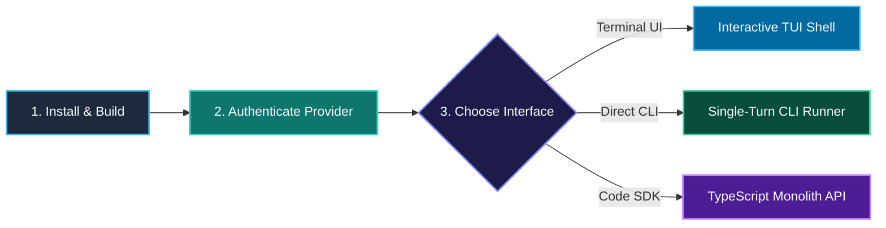
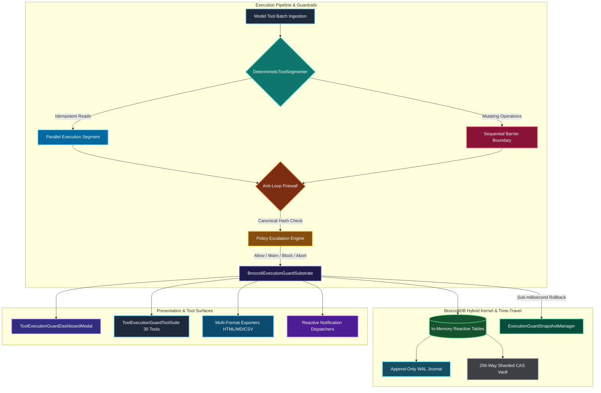
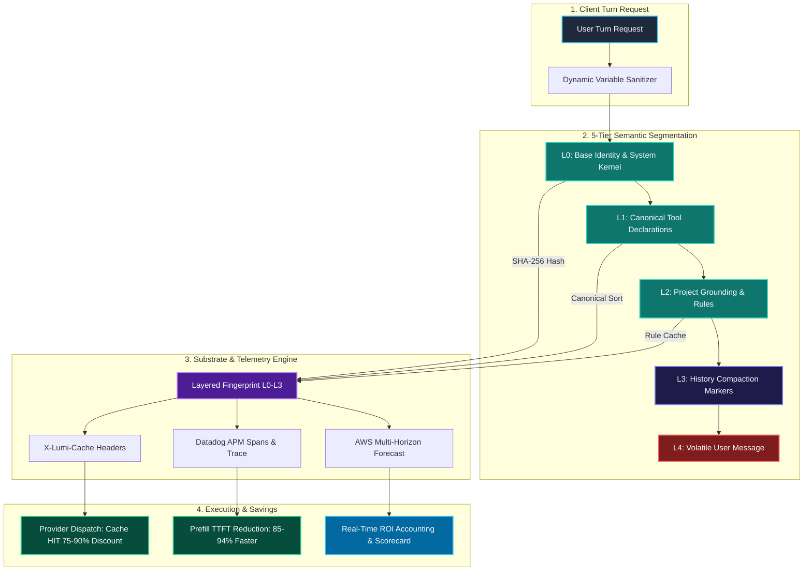

# 📐 LUMI-JOY Architecture & Subsystem Diagrams

This document houses the visual diagrams, execution pipeline topologies, and interaction flows for the **LUMI-JOY Deterministic Agent Framework**.

---

## 1. 🕹️ Deterministic Game Engine Turn Loop

LUMI-JOY models the autonomous AI agent turn loop after high-performance video game engine kernels:

```text
┌─────────────────────────────────────────────────────────────────────────────┐
│                    DETERMINISTIC GAME ENGINE TURN LOOP                      │
├─────────────────────────────────────────────────────────────────────────────┤
│                                                                             │
│   [ User Input / CLI Trigger ]                                              │
│               │                                                             │
│               ▼                                                             │
│   ┌─────────────────────────┐                                               │
│   │ Frame Tick (tick())     │ ◄─── Input ───► DSL Context Projection        │
│   └───────────┬─────────────┘                                               │
│               │                                                             │
│               ▼                                                             │
│   ┌─────────────────────────┐                                               │
│   │ Provider Dispatch       │ ◄─── Streaming Events & Activity Timeline     │
│   └───────────┬─────────────┘                                               │
│               │                                                             │
│               ▼                                                             │
│   ┌─────────────────────────┐                                               │
│   │ Immutable State Snapshot│ ◄─── GameStateSnapshot (VFS Overlay + Memory) │
│   └───────────┬─────────────┘                                               │
│               │                                                             │
│               ▼                                                             │
│   [ O(1) Rewind / Subagent ] ◄─── rewindToSnapshot() (< 0.1ms p95)          │
│                                                                             │
└─────────────────────────────────────────────────────────────────────────────┘
```

---

## 2. 🚀 Onboarding & Interface Topology



---

## 3. 🛡️ Tool Execution Pipeline, Guardrails & BroccoliDB Time-Travel

The execution loop integrates parallel batch scheduling for idempotent reads, sequential barriers for mutations, escalating loop prevention, and in-memory BroccoliDB persistence:



---

## 4. 🖥️ Interactive ANSI Terminal UI Layout

The full-screen differential ANSI terminal interface maintains synchronized `\x1b[?2026h` flicker-free updates:

```text
┌─ 🌟 LUMI-JOY DETERMINISTIC ENGINE v0.1.0 ───────────────────────────────────────────┐
│  Provider: OpenAI Codex (OAuth)  │ Model: gpt-5-codex     │ Slab: 16.00 MB [ALLOCATED]│
│  Fast-Path Latency: 0.12 ms      │ Turn Speed: 8506 fps   │ Snapshots: 4 frames active│
├───────────────────────────────────────────────────────────────────────────────────────┤
│                                                                                       │
│  👤 USER: Refactor user authentication in src/auth.ts to use PKCE device flow         │
│                                                                                       │
│  🤖 LUMI: [PLAN] Segmenting execution into 2 read passes and 1 sequential barrier     │
│  ├── ⚡ [PARALLEL] read_file("src/auth.ts") & search_files("auth", "*.ts")          │
│  ├── 🛡️ [GUARD] Tool Execution Segmenter: 0 loop violations detected (Status: OK)     │
│  ├── ✍️ [MUTATION] applyAnchoredEdit("src/auth.ts", lineHash="a7f92b") -> PASS        │
│  └── 🔍 [EVIDENCE] Verification Evidence: TypeScript compilation passed (0 errors)    │
│                                                                                       │
│  🤖 LUMI: ✅ PKCE device flow implemented successfully with POSIX 0600 token storage. │
│                                                                                       │
├───────────────────────────────────────────────────────────────────────────────────────┤
│  [Prompt] > Type your instructions or /help (Press Ctrl+M for models, ? for keys)     │
└───────────────────────────────────────────────────────────────────────────────────────┘
```

---

## 5. 🧠 Token-Aware Multi-Turn Context Lifecycle

Context admission is model-aware and token-aware, packing system policies, structured checkpoints, and fresh turns:

```text
model context window
├── reserved model output
├── safety margin
└── usable model input
    ├── pinned system + memory context
    └── active conversation projection
        ├── LUMI-CONTEXT/1 checkpoint
        └── recent complete turns
```

---

## 6. ⚡ Zenith-Tier Prompt Caching Subsystem & Execution Span Waterfall (ADR-135)



---

## Related Architectural Documentation

- [Master Architecture Decision Records (ADR) Workspace](adr/README.md)
- [ADR-135: Zenith-Tier Prompt Caching Subsystem](adr/ADR-135-zenith-tier-prompt-caching-telemetry-and-auto-tuning-substrate.md)
- [Runtime Architecture Guide](RUNTIME_ARCHITECTURE_GUIDE.md)
- [Grand Architectural Audit](GRAND_ARCHITECTURAL_AUDIT.md)
- [Benchmark Report](BENCHMARK_REPORT.md)
- [Current Live Baseline](LIVE_BASELINE.json)
